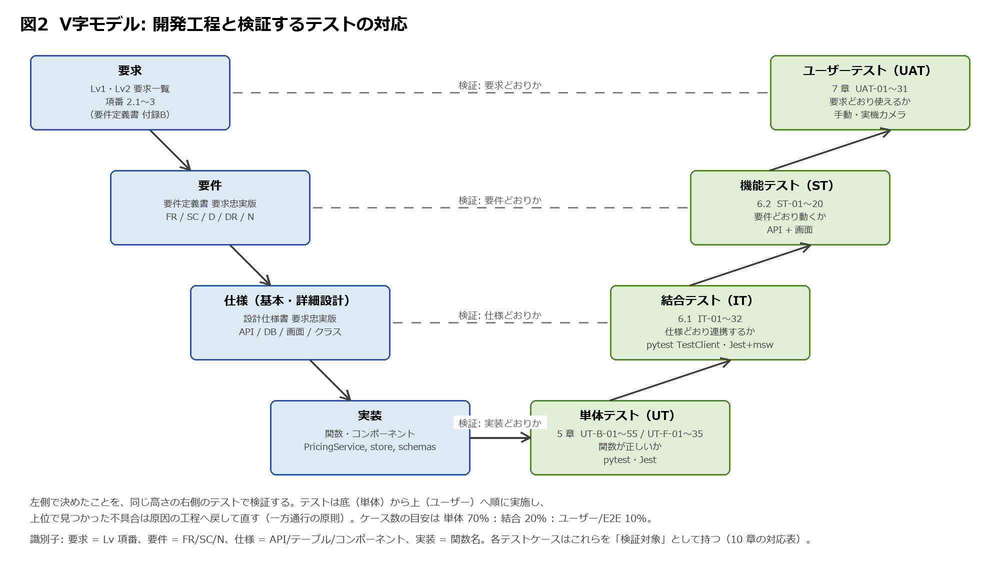
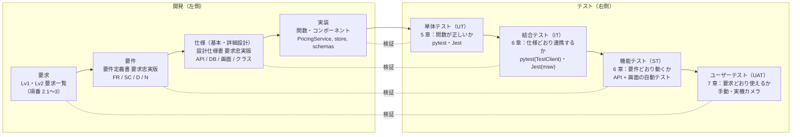

# テスト仕様書（要求忠実版）: 簡易POSアプリ（Lv1 + Lv2）

> 本書は「要件定義書 要求忠実版」と「設計仕様書 要求忠実版」を入力とし、V 字モデルに従って
> 要求・要件・仕様の各段階を、対応するテストレベルで検証する計画とテストケースを定める。
> 単体テストは Frontend を Jest、Backend を pytest で自動化する。
> 要求一覧に明文がなく確定していない挙動（要件定義書 Q-1〜Q-21）は期待値を決めず、
> 設計仕様書で ★ として仮置きした値に基づく場合はケースにも ★ を付ける。

---

## 1. はじめに

### 1.1 目的と入力

| 項目 | 内容 |
|---|---|
| 目的 | 実装が要求・要件・仕様どおりであることを、工程ごとに対応するテストで検証する。期待値はすべて上流文書から引く |
| 入力 | Lv1・Lv2 要求一覧（要件定義書 付録 B）、要件定義書 要求忠実版 v1.0、設計仕様書 要求忠実版 v1.1、講義資料「ユニット（単体）テストについて」 |
| 出力 | 本書（テスト計画・テスト設計・テストケース）。実施結果と不具合は 9 章の様式で別途記録する |
| 読者 | 課題の評価者、実装者（テストコードを書く人） |

### 1.2 方針

| # | 方針 | 根拠 |
|---|---|---|
| TP-1 | **V 字モデル**: 要求↔ユーザーテスト、要件↔機能テスト、仕様↔結合テスト、実装↔単体テストを対応させ、各ケースに検証対象の識別子（Lv 項番 / FR / API / 関数名）を付ける | 講義資料 p.2 |
| TP-2 | **テストピラミッド**: 単体を最も厚くし（目安 70%）、結合 20%、ユーザー／E2E 10% | 講義資料 p.7 |
| TP-3 | **観点 × 技法**でケースを作る。観点＝何を確かめるか（正常系・異常系・制御フロー・状態遷移・インターフェース）、技法＝どの値で確かめるか（同値分割・境界値分析・デシジョンテーブル・状態遷移・エラー推測）。単体で確認した観点は結合で繰り返さない | 講義資料 p.10 |
| TP-4 | **期待値は人が決める**。テスト目的・観点・因子と水準・期待値は本書で人が定め、テストコードの生成は AI に任せてよい。期待値が未定（Q-n）のケースは自動テストにしない | 講義資料 p.24 |
| TP-5 | **正常系と異常系をセットで**書く。異常系は「型の混同」「欠損」「範囲外」「表記揺れ」「特殊値」の分類で漏れを防ぐ | 講義資料 p.13, 21, 22 |
| TP-6 | **組み合わせ**は単一障害仮説（異常値は 1 ケースに 1 つ）で絞る。因子が 3 つ以上のときはペアワイズを使う | 講義資料 p.23 |
| TP-7 | 日付・時刻に依存する判定は、時計を注入（`Clock`）して境界を自動テストする | 設計仕様書 6.1, 9 章 |

### 1.3 識別子

| 接頭辞 | 意味 | 章 |
|---|---|---|
| UT-B-nn | 単体テスト（Backend / pytest） | 5.1 |
| UT-F-nn | 単体テスト（Frontend / Jest） | 5.2 |
| IT-nn | 結合テスト（API・BFF・DB の連携） | 6.1 |
| ST-nn | 機能テスト（要件単位の振る舞い） | 6.2 |
| UAT-nn | ユーザーテスト（要求単位のシナリオ） | 7 |
| ★ | 設計仕様書の仮置き値に基づくケース。出題者の回答で変わり得る | — |
| （Q-n） | 期待値が未確定のため実施しない、または確認後に追加するケース | — |

---

## 2. V 字モデルとテストレベル



| 開発工程 | 成果物（左側） | 検証するテスト（右側） | 検証対象の識別子 | 本書の章 | 主な観点 | 実施方法 |
|---|---|---|---|---|---|---|
| 要求 | Lv1・Lv2 要求一覧 | ユーザーテスト（UAT） | Lv1 2.1〜3、Lv2 2.1〜3 | 7 | 要求どおりに使えるか。実機・カメラ・手操作 | 手動（チェックリスト） |
| 要件定義 | 要件定義書（FR / SC / N） | 機能テスト（ST） | FR-01〜FR-09、N-01〜N-05 | 6.2 | 要件単位の振る舞い、画面遷移、非機能 | 自動（API）＋一部手動 |
| 設計（基本・詳細） | 設計仕様書（API / DB / 画面コンポーネント / クラス） | 結合テスト（IT） | API-01〜07、テーブル、BFF | 6.1 | インターフェース、状態遷移、DB 永続化、エラー伝播 | 自動（pytest TestClient、Jest + msw） |
| 実装 | 関数・コンポーネント | 単体テスト（UT） | PricingService 等の関数、store、schemas、コンポーネント | 5 | 正常系・異常系・制御フロー・境界値 | 自動（pytest、Jest） |

テストは 単体 → 結合 → 機能 → ユーザー の順に実施し、下位レベルが合格してから上位レベルへ進む。
上位レベルで見つかった不具合は、原因となった工程（要件・設計・実装）へ戻して修正する（一方通行の原則）。

---

## 3. テスト計画

### 3.1 テストレベルごとの計画

| 項目 | 単体（UT） | 結合（IT） | 機能（ST） | ユーザー（UAT） |
|---|---|---|---|---|
| 目的 | 関数・コンポーネントが仕様どおりの値を返す／描画する | API・BFF・DB が仕様どおりに連携する | 要件が満たされている | 要求一覧の各項目が実機で成立する |
| 対象 | Backend: PricingService, AuthService, TransactionService, Pydantic スキーマ／Frontend: `lib/pricing.ts`, `features/cart/store.ts`, `lib/schemas.ts`, 各コンポーネント | API-01〜07、BFF の中継と Cookie、DB の保存内容 | FR-01〜FR-09、SC-01〜02、N-01〜05 | Lv1 2.1〜3、Lv2 2.1〜3 |
| 環境 | ローカル。DB は不要（モック／固定データ） | ローカル。テスト用 MySQL（Docker）または SQLite。FastAPI TestClient、Jest + msw | ローカルまたは Azure 検証環境。ブラウザ自動操作は任意 | Azure 検証環境。カメラ付き端末（タブレット／ノートPC）、印刷したバーコード |
| 実施者 | 実装者 | 実装者 | 実装者＋レビュアー | 実装者以外（レジ担当者役） |
| ツール | pytest、Jest、React Testing Library | pytest、Jest、msw | pytest、手動 | チェックリスト（7 章） |
| 合否 | 全ケース合格。カバレッジ: Statements / Lines 80% 以上、Branches 70% 以上、Functions 90% 以上（Jest のカバレッジ 4 指標） | 全ケース合格 | 全ケース合格 | 全シナリオ合格。★ケースは仮置き値での合格を記録し、確認後に再実施 |
| 自動化 | CI で毎コミット実行 | CI で毎コミット実行 | CI（API 部分） | 手動。リリース前に 1 回 |

### 3.2 テスト対象外

要件定義書 2.3 の対象外（ログアウト、管理画面、現金決済、監査ログ等）はテストしない。
設計仕様書で「★ 提案」とした挙動のうち、期待値が出題者の回答に依存するもの（Q-1〜Q-21）は、
確定した挙動のみをテストし、未確定の挙動は 8 章に「保留ケース」として残す。

### 3.3 因子と水準

ケースを作るときの共通の因子（入力）と水準（同値クラス・境界）を先に定める。

| 因子 | 有効同値クラス | 境界値 | 無効同値クラス | 出所 |
|---|---|---|---|---|
| 数量 | 1〜99 の整数 | 0 / 1 / 2、98 / 99 / 100 | 0、100、負数、小数、文字列、None、bool | FR-05-6, 05-7（要求） |
| 単価 | 0〜9,999,999 の整数 | 0 / 1、9,999,999 / 10,000,000 ★ | 負数、小数、文字列、None | 設計 PRICE_MAX ★ |
| 商品コード | 13 桁の数字 ★ | 12 / 13 / 14 桁 | 英字を含む、空、記号、None | Q-21 ★ |
| 会員ID | 1〜32 文字の英数字 ★、または未入力（会員なし） | 0 / 1 / 32 / 33 文字 | 記号、None（手入力欄が空は正常：FR-02-7） | Q-21 ★、FR-02-5, 02-7 |
| 税率 | 0.00〜100.00 | 0.00 / 0.01、99.99 / 100.00 / 100.01 | 負数、文字列、None、税率未設定 | D-06、TAX_RATE_NOT_CONFIGURED ★ |
| 値引き方式 | percent / amount | — | 大文字、空、未定義（'STANDARD' 型の表記揺れ） | FR-06-2, 06-3 |
| 値引き値（percent） | 0.01〜100.00 | 0 / 0.01、100 / 100.01 | 負数 | D-07 |
| 値引き値（amount） | 1〜PRICE_MAX ★ | 0 / 1、単価×数量と同額 / 超過 | 負数 | D-07 |
| 値引き期間 | start_date ≤ 取引日 ≤ end_date | start_date = 取引日、end_date = 取引日、前日、翌日 | end_date < start_date | FR-06-4、設計 6.1 |
| 取引日（JST） | UTC 現在時刻 → Asia/Tokyo の日付 | UTC 14:59:59（JST 23:59:59）／15:00:00（JST 翌 0:00:00） | — | 設計 6.1 |
| 明細行数 | 1〜100 行 ★ | 0 / 1、100 / 101 | 0 行（Q-4） | CART_MAX_LINES ★ |
| 担当者ID | 1〜32 文字 ★ | 0 / 1 / 32 / 33 | 空、存在しない ID | FR-01 |
| パスワード | 8〜64 文字 ★ | 7 / 8 / 64 / 65 | 空、不一致 | Q-11 ★ |
| 会員の有無 | あり／なし | — | 存在しない会員ID | FR-02-5, 02-6 |

---

## 4. テスト観点と技法

| 観点 | 何を確かめるか | 主な技法 | 適用レベル |
|---|---|---|---|
| 正常系 | 有効な入力に対して仕様どおりの戻り値・表示・保存になるか | 同値分割、境界値分析 | UT, IT, UAT |
| 異常系 | 無効な入力で、仕様どおりのエラー（コード・文言）になり、状態を壊さないか | 同値分割（型の混同・欠損・範囲外・表記揺れ・特殊値）、エラー推測 | UT, IT, UAT |
| 制御フロー | if / 分岐をすべて通したか（会員あり／なし、値引きあり／なし、同一商品あり／なし） | デシジョンテーブル | UT |
| 状態遷移 | 購入リストの状態（idle → editing → committed → idle）、画面遷移 | 状態遷移テスト | IT, UAT |
| インターフェース | BFF ⇄ FastAPI の型・ヘッダ・ステータス、DB の保存列 | 同値分割 | IT |
| 照合 | Frontend の値と Backend の再計算の一致・不一致 | デシジョンテーブル | IT |
| 日付境界 | JST 0:00 前後で値引き期間の判定が切り替わる | 境界値分析（時計注入） | UT, IT |

デシジョンテーブル（値引き判定。UT-B-10〜 の期待値の根拠）:

| 条件 | ケース A | B | C | D | E |
|---|---|---|---|---|---|
| 会員IDあり | N | Y | Y | Y | Y |
| 対象商品の値引き設定あり | — | N | Y | Y | Y |
| 取引日が期間内 | — | — | N | Y | Y |
| 値引き方式 | — | — | — | percent | amount |
| **結果: 値引き額** | 0 | 0 | 0 | floor(line_gross × value / 100) ★ | value × quantity ★ |

---

## 5. 単体テスト（UT）

### 5.1 Backend（pytest）

対象は設計仕様書 9 章のサービス層。DB に依存しない純粋関数として実装し、税率・値引き・時刻は引数または注入で与える。

**準備**

```bash
pip install pytest pytest-cov
pytest --cov=app --cov-report=term-missing
```

**共通フィクスチャ**: `fixed_clock(utc_iso)` は `Clock.now()` が固定時刻を返す。`product(price)`、`discount(type, value, start, end)` は値オブジェクトを返す。

#### UT-B-01〜 PricingService.calc_line（明細の小計）

正常系（単価・数量: 同値分割と境界値分析）

| No. | 分類 | 技法 | 単価 | 数量 | 値引き | 期待 line_total | 観点 |
|---|---|---|---|---|---|---|---|
| UT-B-01 | 下限境界 | 境界値 | 0 | 1 | なし | 0 | 0 円でも壊れない |
| UT-B-02 | 下限境界 | 境界値 | 1 | 1 | なし | 1 | 正の最小値 |
| UT-B-03 | 数量下限 | 境界値 | 150 | 1 | なし | 150 | 数量の最小値（FR-05-6） |
| UT-B-04 | 数量上限 | 境界値 | 150 | 99 | なし | 14,850 | 数量の最大値（FR-05-7） |
| UT-B-05 | 代表値 | 同値分割 | 150 | 2 | なし | 300 | 要件定義書 図1 の例 |
| UT-B-06 | 桁の境界 | 境界値 | 999 / 1000 / 1001 | 1 | なし | 999 / 1000 / 1001 | 桁上がりの前後 |
| UT-B-07 | 上限境界 ★ | 境界値 | 9,999,999 | 99 | なし | 989,999,901 | PRICE_MAX × QTY_MAX でオーバーフローしない（INT 範囲内） |
| UT-B-08 | 金額値引き | 同値分割 | 150 | 2 | amount 20 | 260 | 20 円 × 2 個 = 40 円引き ★ |
| UT-B-09 | 割合値引き | 同値分割 | 150 | 2 | percent 20 | 240 | 300 × 20% = 60 円引き |
| UT-B-10 | 端数 ★ | 境界値 | 15 | 1 | percent 10 | 14 | 1.5 円 → 切り捨て 1 円（★ 仮置き。Q-7） |
| UT-B-11 | 端数なし | 境界値 | 50 | 1 | percent 8 | 46 | 4.0 円ちょうど |
| UT-B-12 | 100% | 境界値 | 150 | 1 | percent 100 | 0 | 全額値引き |
| UT-B-13 | 値引き ＝ 行金額 | 境界値 | 150 | 1 | amount 150 | 0 | 行金額と同額の金額値引き |
| UT-B-14 | 値引き ＞ 行金額 | 境界値 | 100 | 1 | amount 150 | （Q-7） | 行金額を超える金額値引きの扱いは未確定。保留（8 章） |

異常系（型の混同・欠損・範囲外）

| No. | 分類 | 技法 | 入力 | 期待 | 観点 |
|---|---|---|---|---|---|
| UT-B-15 | 範囲外 | 境界値 | 数量 0 | `QuantityOutOfRange` | FR-05-6 の直下 |
| UT-B-16 | 範囲外 | 境界値 | 数量 100 | `QuantityOutOfRange` | FR-05-7 の直上 |
| UT-B-17 | 範囲外 | 同値分割 | 数量 -1 | `QuantityOutOfRange` | 負数 |
| UT-B-18 | 型の混同 | 同値分割 | 数量 1.5 | `TypeError` | float |
| UT-B-19 | 型の混同 | 同値分割 | 数量 "2" | `TypeError` | 数字に見える文字列。暗黙変換しない |
| UT-B-20 | 型の混同 | 境界値（型） | 数量 True | `TypeError` | bool は int のサブクラス。1 として計算しない |
| UT-B-21 | 欠損 | 同値分割 | 数量 None | `TypeError` | 欠損値 |
| UT-B-22 | 範囲外 | 境界値 | 単価 -1 | `ValueError` | 負の単価 |
| UT-B-23 | 特殊値 | 同値分割 | 単価 nan / inf | `TypeError` | float 特殊値 |
| UT-B-24 | 表記揺れ | 同値分割 | 値引き方式 'PERCENT' / ' percent' / '' / 'ratio' | `ValueError` | 大文字・空白・空・未定義（講義資料 p.22 の分類） |

#### UT-B-25〜 PricingService.applicable_discount（値引き期間の判定）

`fixed_clock` で取引日を作り、期間判定を境界値で確認する。設計仕様書 6.1「end_date は当日を含む」。

| No. | 分類 | 技法 | 期間 | 取引時刻（UTC） | 取引日（JST） | 期待 | 観点 |
|---|---|---|---|---|---|---|---|
| UT-B-25 | 期間内 | 同値分割 | 9/1〜9/30 | 2026-09-15T03:00:00 | 9/15 | 適用 | 代表値 |
| UT-B-26 | 開始日当日 | 境界値 | 9/10〜9/30 | 2026-09-10T00:00:00 | 9/10 | 適用 | start_date = 取引日 |
| UT-B-27 | 開始前日 | 境界値 | 9/10〜9/30 | 2026-09-09T03:00:00 | 9/9 | 非適用 | start_date の直前 |
| UT-B-28 | 終了日当日 | 境界値 | 9/1〜9/9 | 2026-09-09T03:00:00 | 9/9 | 適用 | end_date = 取引日（当日を含む） |
| UT-B-29 | 終了翌日 | 境界値 | 9/1〜9/9 | 2026-09-10T03:00:00 | 9/10 | 非適用 | end_date の直後 |
| UT-B-30 | **JST 日付境界（前）** | 境界値 | 9/1〜9/9 | **2026-09-09T14:59:59** | 9/9 23:59:59 | **適用** | UTC ではまだ 9 日。JST でも 9 日 |
| UT-B-31 | **JST 日付境界（後）** | 境界値 | 9/1〜9/9 | **2026-09-09T15:00:00** | 9/10 0:00:00 | **非適用** | UTC ではまだ 9 日だが JST は 10 日。`date.today()` だと誤って適用される（講師指摘） |
| UT-B-32 | 開始の JST 境界 | 境界値 | 9/10〜9/30 | 2026-09-09T15:00:00 | 9/10 0:00:00 | 適用 | 上記の逆 |
| UT-B-33 | 会員なし | デシジョン A | 9/1〜9/30 | 期間内 | — | 非適用 | 会員なしは値引きしない（FR-06-1） |
| UT-B-34 | 対象外商品 | デシジョン B | 別商品の設定のみ | 期間内 | — | 非適用 | 対象商品でない |
| UT-B-35 | 複数該当 ★ | 同値分割 | 20% と 50 円が重なる | 期間内 | — | 値引き額が大きい 1 件 ★ | Q-8 の仮置き |

#### UT-B-36〜 PricingService.calc_totals（税抜・税額・税込）

| No. | 分類 | 技法 | 税抜合計 | 税率 | 期待 税額 / 税込 | 観点 |
|---|---|---|---|---|---|---|
| UT-B-36 | 代表値 | 同値分割 | 1,098 | 10.00 | 109 / 1,207 ★ | 要件定義書 図1 の例。109.8 → 切り捨て（Q-6 仮置き） |
| UT-B-37 | 0 円 | 境界値 | 0 | 10.00 | 0 / 0 | 空リスト相当 |
| UT-B-38 | 端数境界 ★ | 境界値 | 5 / 9 / 10 | 10.00 | 0/5、0/9、1/11 | 0.5、0.9 は切り捨て、1.0 は 1（講義資料 p.18 の観点） |
| UT-B-39 | 税率 0 | 境界値 | 1,000 | 0.00 | 0 / 1,000 | 非課税相当 |
| UT-B-40 | 税率 8 | 同値分割 | 15 | 8.00 | 1 / 16 | 1.2 → 1 |
| UT-B-41 | 税率上限 | 境界値 | 100 | 100.00 | 100 / 200 | 上限値 |
| UT-B-42 | 税率範囲外 | 境界値 | 100 | 100.01 / -0.01 | `ValueError` | 異常系 |
| UT-B-43 | 税率未設定 | エラー推測 | 100 | なし | `TaxRateNotConfigured` | 設定データが空のとき |

#### UT-B-44〜 AuthService

| No. | 分類 | 技法 | 入力 | 期待 | 観点 |
|---|---|---|---|---|---|
| UT-B-44 | 正常 | 同値分割 | 正しい ID・パスワード | トークン発行、`sub` = staff.id、`exp` = 発行 + 8h ★ | FR-01-1 |
| UT-B-45 | 異常 | 同値分割 | 存在しない ID | `InvalidCredentials` | FR-01-4 |
| UT-B-46 | 異常 | 同値分割 | パスワード不一致 | `InvalidCredentials`（UT-B-45 と同じ例外・同じ文言） | 区別しない（FR-01-4） |
| UT-B-47 | 境界 ★ | 境界値 | パスワード 7 / 8 / 64 / 65 文字 | 7・65 は検証エラー、8・64 は通る | PASSWORD_MIN/MAX ★ |
| UT-B-48 | 異常 | 同値分割 | 空文字、None | 検証エラー | 欠損 |
| UT-B-49 | 正常 | 同値分割 | 有効なトークン | `verify_token` が claims を返す | SEC-02 |
| UT-B-50 | 異常 | 境界値 | `exp` の 1 秒前 / 1 秒後 | 前は有効、後は `TokenExpired` | 期限の境界 |
| UT-B-51 | 異常 | エラー推測 | 署名を改ざんしたトークン | `InvalidToken` | 改ざん検知 |

#### UT-B-52〜 TransactionService.verify_against_client（照合）

| No. | 分類 | 技法 | Frontend 値 vs Backend 再計算 | 期待 | 観点 |
|---|---|---|---|---|---|
| UT-B-52 | 一致 | 同値分割 | 全項目一致 | 通過 | 正常 |
| UT-B-53 | 不一致 | 境界値 | 税込合計が 1 円だけ違う | `PriceMismatch`（details に server 値） | 1 円単位（SEC-05） |
| UT-B-54 | 不一致 | 同値分割 | 明細の値引き額が違う | `PriceMismatch` | 明細レベルの照合 |
| UT-B-55 | 不一致 | 同値分割 | 明細の行数が違う | `PriceMismatch` | 行の欠落・追加 |

**テスト関数の命名**: `test_<関数>_<値や分類>_<期待>`。例: `test_calc_line_qty_100_raises_out_of_range`、`test_applicable_discount_utc_1500_is_next_day_jst_not_applied`。

```python
# tests/test_pricing.py（抜粋）
import pytest
from datetime import datetime, timezone
from app.services.pricing import PricingService, QuantityOutOfRange

@pytest.mark.parametrize("qty", [0, 100, -1])
def test_calc_line_qty_out_of_range(qty, product):
    with pytest.raises(QuantityOutOfRange):
        PricingService().calc_line(product(150), qty, None)

@pytest.mark.parametrize("utc, applied", [
    ("2026-09-09T14:59:59+00:00", True),    # JST 9/9 23:59:59
    ("2026-09-09T15:00:00+00:00", False),   # JST 9/10 00:00:00
])
def test_applicable_discount_jst_boundary(utc, applied, fixed_clock, product, discount):
    svc = PricingService(clock=fixed_clock(utc))
    d = discount("percent", 10, start="2026-09-01", end="2026-09-09")
    assert (svc.applicable_discount(product(100), [d]) is not None) == applied
```

### 5.2 Frontend（Jest + React Testing Library）

**準備**

```bash
npm install -D jest @testing-library/react @testing-library/jest-dom jest-environment-jsdom ts-jest
npx jest --coverage
```

カバレッジは % Stmts / % Branch / % Funcs / % Lines の 4 指標を見る（講義資料 p.12）。

#### UT-F-01〜 `lib/pricing.ts` recalcTotals（API-05 の結果からの再集計）

値引きの判定は持たないため、入力は API-05 の応答形式（明細ごとの値引き額と税率）。

| No. | 分類 | 技法 | 入力 | 期待 | 観点 |
|---|---|---|---|---|---|
| UT-F-01 | 代表値 | 同値分割 | 図1 の 4 行（270 + 188 + 480 + 160）、税率 10 | 税抜 1,098、税込 1,207 ★ | Backend と同じ結果 |
| UT-F-02 | 空 | 境界値 | 0 行 | 0 / 0 / 0 | 空リスト |
| UT-F-03 | 1 行 | 境界値 | 1 行 | その行の値 | 最小 |
| UT-F-04 | 端数 ★ | 境界値 | 税抜 5、税率 10 | 税額 0 | Backend（UT-B-38）と一致 |
| UT-F-05 | 異常 | 同値分割 | 数量に NaN / 文字列 | 例外または NaN を返さない | 型の混同 |

#### UT-F-06〜 `features/cart/store.ts`（購入リストの状態）

| No. | 分類 | 技法 | 操作 | 期待 | 観点・要件 |
|---|---|---|---|---|---|
| UT-F-06 | 正常 | 同値分割 | 空に商品 A を追加 | 1 行、数量 1、status = editing | FR-04-1, 04-5 |
| UT-F-07 | 正常 | 同値分割 | A を追加後、再び A | 1 行のまま数量 2 | FR-04-4（Lv2 が Lv1 を上書き） |
| UT-F-08 | 正常 | 同値分割 | A, B を追加 | 2 行 | FR-04-5 |
| UT-F-09 | 境界 | 境界値 | A を 99 回追加 | 数量 99 | FR-05-7 |
| UT-F-10 | 境界 | 境界値 | A を 100 回追加 | 100 回目は加算されない（Q-2。仮置き: 拒否） ★ | FR-05-7 |
| UT-F-11 | 正常 | 境界値 | 数量を 1 → 99 に変更 | 99 | FR-05-5 |
| UT-F-12 | 異常 | 境界値 | 数量を 0 に変更 | 変更されない（0 は削除で行う） | FR-05-6 |
| UT-F-13 | 異常 | 境界値 | 数量を 100 に変更 | 変更されない ★（Q-2） | FR-05-7 |
| UT-F-14 | 正常 | 状態遷移 | 行を選択 → 削除 | 行が消え、選択が解除される | FR-05-4 |
| UT-F-15 | 正常 | 状態遷移 | 全行削除 | status = idle | 4 章の状態 |
| UT-F-16 | 正常 | 同値分割 | 会員を設定 | member が入る。quote の再取得が要求される | FR-02, FR-06-7 |
| UT-F-17 | 正常 | 状態遷移 | 確定成功 → 閉じる | status = idle、lines / member / pendingProduct が空 | FR-08-4 |
| UT-F-18 | 正常 | 同値分割 | 手入力で読み込み → 追加 | pendingProduct が null に戻る | FR-04-2 |

#### UT-F-19〜 `lib/schemas.ts`（Zod。型・形式の検証）

| No. | 分類 | 技法 | 入力 | 期待 | 観点 |
|---|---|---|---|---|---|
| UT-F-19 | 正常 | 同値分割 | 13 桁の数字 ★ | 通る | 商品コード |
| UT-F-20 | 境界 | 境界値 | 12 桁 / 14 桁 | 弾く ★ | 桁数（Q-21） |
| UT-F-21 | 異常 | 同値分割 | 英字混じり、空、全角数字 | 弾く | 文字種 |
| UT-F-22 | 正常 | 境界値 | 会員ID 1 文字 / 32 文字 | 通る ★ | 長さ |
| UT-F-23 | 異常 | 境界値 | 会員ID 33 文字、記号 | 弾く ★ | 長さ・文字種 |
| UT-F-24 | 正常 | 同値分割 | 数量 1（整数） | 通る | 型のみ検証（範囲は Backend） |
| UT-F-25 | 異常 | 同値分割 | 数量 "2"、1.5、true | 弾く | 型の混同（Zod は暗黙変換しない） |

#### UT-F-26〜 コンポーネント（表示）

| No. | 分類 | 対象 | 操作・状態 | 期待表示 | 要件 |
|---|---|---|---|---|---|
| UT-F-26 | 正常 | `MessageBar` | PRODUCT_NOT_FOUND | 「商品がマスタ未登録です」 | FR-03-5（文言は要求どおり） |
| UT-F-27 | 正常 | `MessageBar` | MEMBER_NOT_FOUND | 該当する会員が見つからない旨 | FR-02-6 |
| UT-F-28 | 正常 | `CartTable` | 行を選択 | 選択行に強調クラスが付く | FR-05-2 |
| UT-F-29 | 正常 | `CartTable` | 値引きあり行 | 値引き額（例: −30円）が表示される | FR-06-5 |
| UT-F-30 | 正常 | `SelectedItemPanel` | 行を選択 | 名称・単価・数量が表示される | FR-05-3 |
| UT-F-31 | 正常 | `TotalsPanel` | quote あり | 税抜・税込の合計が表示される | FR-05-8 |
| UT-F-32 | 正常 | `ResultPopup` | commitResult あり | 税込・税抜の両方が表示される | FR-07-1, FR-08-3 |
| UT-F-33 | 正常 | `ProductEntryPanel` | 追加成功 | 「1件追加」のフィードバックが出る | FR-03-6 |
| UT-F-34 | 正常 | `PosHeader` | staff あり | 担当者名が表示される | FR-01-5, SC-02-01 |
| UT-F-35 | 正常 | `LoginForm` | 401 | エラー文言が表示され画面に留まる | FR-01-4 |

```ts
// __tests__/store.test.ts（抜粋）
import { createCartStore } from "@/features/cart/store";

describe("購入リスト", () => {
  it("同じ商品を続けて追加すると行を増やさず数量を加算する (FR-04-4)", () => {
    const s = createCartStore();
    s.addProduct(teaProduct); s.addProduct(teaProduct);
    expect(s.state.lines).toHaveLength(1);
    expect(s.state.lines[0].quantity).toBe(2);
  });
  it("数量を 0 に変更できない (FR-05-6)", () => {
    const s = createCartStore(); s.addProduct(teaProduct);
    s.changeQuantity(1, 0);
    expect(s.state.lines[0].quantity).toBe(1);
  });
});
```

---

## 6. 結合テスト・機能テスト

### 6.1 結合テスト（IT）: API・BFF・DB の連携

環境: FastAPI TestClient ＋ テスト用 DB（各テスト前にシードを投入しロールバック）。BFF は Jest + msw で FastAPI をモック。
単体で確認した計算の中身は繰り返さず、**インターフェース・状態遷移・永続化・エラー伝播**を見る。

| No. | 対象 | 区分 | 前提・入力 | 期待結果 | 検証する仕様 |
|---|---|---|---|---|---|
| IT-01 | API-01 | 正常 | 正しい ID・パスワード | 200、`access_token` と `staff` を返す | API-01 |
| IT-02 | API-01 | 異常 | 存在しない ID／パスワード不一致 | どちらも 401 AUTH_INVALID_CREDENTIALS、同じ本文 | FR-01-4 |
| IT-03 | API-01 | 異常 | 本文に `login_id` がない、型が数値 | 400 VALIDATION_ERROR | API-P4 |
| IT-04 | BFF ログイン | 正常 | API-01 が 200 | `Set-Cookie: pos_session` に HttpOnly・Secure・SameSite=Strict・Path=/。本文に `access_token` を含まない | BFF-2, SEC-02 |
| IT-05 | BFF 中継 | 正常 | Cookie あり | FastAPI へ `Authorization: Bearer` が付く | BFF-2 |
| IT-06 | 認証 | 異常 | Cookie なし／期限切れ／改ざん | 401 AUTH_REQUIRED | SEC-03 |
| IT-07 | API-02 | 正常 | 有効なトークン | 200、`StaffInfo` | FR-01-5 |
| IT-08 | API-03 | 正常 | 登録済みコード | 200、名称・単価 | FR-03-4 |
| IT-09 | API-03 | 異常 | 未登録コード | 404 PRODUCT_NOT_FOUND | FR-03-5 |
| IT-10 | API-03 | 境界 ★ | 12 桁／14 桁／英字 | BFF で 400（FastAPI へ届かない）、FastAPI 直でも 400 | SEC-07 の 2 段検証 |
| IT-11 | API-04 | 正常 | 登録済み会員ID | 200、氏名のみ（電話・住所を含まない） | FR-02-4 |
| IT-12 | API-04 | 異常 | 未登録会員ID | 404 MEMBER_NOT_FOUND | FR-02-6 |
| IT-13 | API-05 | 正常 | 会員なし、3 行 | 値引き 0、税抜・税額・税込が UT の規則と一致 | FR-05-8, FR-07 |
| IT-14 | API-05 | 正常 | 会員あり、期間内の値引き対象商品を含む | 該当行に `discount`、合計に反映 | FR-06-1〜5 |
| IT-15 | API-05 | 境界 | 値引き end_date = 本日（JST） | 適用される | FR-06-4、設計 6.1 |
| IT-16 | API-05 | 境界 | `Clock` を UTC 14:59:59 / 15:00:00 に固定（テスト用の時刻上書き） | 前は適用、後は非適用 | 設計 6.1（日付の生成元が Backend であることの確認） |
| IT-17 | API-05 | 異常 | 数量 0 / 100 | 422 QUANTITY_OUT_OF_RANGE | FR-05-6, 05-7 |
| IT-18 | API-05 | 異常 | 数量 "2"（文字列） | 400 VALIDATION_ERROR（422 ではない） | API-P4: 型は 400、範囲は 422 |
| IT-19 | API-05 | 境界 ★ | 100 行 / 101 行 | 100 は 200、101 は 422 | CART_MAX_LINES ★ |
| IT-20 | API-05 | 異常 | 税率が 1 件も登録されていない | 422 TAX_RATE_NOT_CONFIGURED ★ | FR-07-2 |
| IT-21 | API-06 | 正常 | API-05 の結果をそのまま送る | 201。`transactions` 1 行、`transaction_items` n 行、値引き行に `discount_applications` | FR-08-1, FR-08-2 |
| IT-22 | API-06 | 永続化 | IT-21 の保存内容 | `transacted_at`・`staff_id`（ログイン中の担当者）・`member_id`（会員なしは NULL）・税抜/税額/税込・明細の `unit_price` が保存されている | FR-01-5, FR-02-5, FR-08-2, DR-2, DR-3 |
| IT-23 | API-06 | 照合 | 送信する税込合計を +1 円 | 409 PRICE_MISMATCH、`details.server` に再計算値。**DB に行が増えない** | SEC-05 |
| IT-24 | API-06 | 照合 | 明細の単価を改ざん（安くする） | 409、保存されない | SEC-05（改ざん防止） |
| IT-25 | API-06 | 不変性 | 確定後に商品マスタの単価を変更し、取引を再取得 | 明細の `unit_price` と合計が変わらない | FR-08-5, DR-1 |
| IT-26 | API-06 | 異常 | 0 行 | 422 CART_EMPTY ★（Q-4 の仮置き） | FR-08-1 |
| IT-27 | API-06 | 原子性 | 明細 INSERT 中に例外を発生させる（モック） | ロールバックされ `transactions` にも行がない | N-02 |
| IT-28 | API-07 | 正常／異常 | DB 接続あり／なし | 200 `{db:"ok"}` ／ 503 | N-03 ★ |
| IT-29 | CORS | 異常 | 別オリジンから FastAPI を直接呼ぶ（Origin ヘッダを偽装） | CORS ヘッダが返らず、ブラウザでは拒否される | SEC-04 |
| IT-30 | Swagger | 異常 | `APP_ENV=production` で `/docs` `/openapi.json` | 404 | SEC-06 |
| IT-31 | SQLi | 異常 | 商品コードに `' OR '1'='1`、会員IDに `'; DROP TABLE` | 400（型検証で弾く）。DB は無事 | SEC-07 |
| IT-32 | BFF | 異常 | FastAPI が 500 を返す | BFF は INTERNAL_ERROR に正規化し、スタックトレースを含まない | BFF-4 |

### 6.2 機能テスト（ST）: 要件単位の振る舞い

要件（FR）ごとに、API と画面をつないだ振る舞いを確認する。自動化できるものは API 経由、画面遷移は手動または Playwright（任意）。

| No. | 要件 | 区分 | 手順 | 期待結果 |
|---|---|---|---|---|
| ST-01 | FR-01-1〜2 | 正常 | ログイン画面で正しい ID・パスワード | POS 画面へ遷移、担当者名が表示される |
| ST-02 | FR-01-4 | 異常 | 誤ったパスワード／存在しない ID | 同じエラー文言。画面に留まる |
| ST-03 | FR-02-3 | 状態遷移 | 商品を 3 点登録した後に会員IDを読み込む | 会員名が表示され、対象商品に値引きが遡って付く（FR-06-7） |
| ST-04 | FR-02-5, 02-7 | 正常 | 会員IDを入れずに読み込みボタン → 商品登録 → 購入 | エラーなく会員なしの取引が保存される |
| ST-05 | FR-02-6 | 異常 | 存在しない会員ID | その旨が表示される。会員は未設定のまま（その後の操作は Q-3） |
| ST-06 | FR-03-3〜5 | 正常／異常 | 手入力で登録済み／未登録コードを読み込み | 名称・単価が表示される／「商品がマスタ未登録です」 |
| ST-07 | FR-04-2〜5 | 正常 | 同一商品を 2 回、別商品を 1 回追加 | 2 行、先頭行の数量 2。追加後に入力欄がクリアされる |
| ST-08 | FR-05-1〜4 | 正常 | 行を選択 → 情報表示 → 削除 | 選択行が強調され、情報が表示され、削除で消える |
| ST-09 | FR-05-5〜8 | 境界 | 数量を 1 → 99、99 → 100、1 → 0 | 99 は反映、100 と 0 は変更されない（100 は Q-2 ★）。小計・合計が即時更新 |
| ST-10 | FR-06-1〜5 | 正常 | 会員あり、対象商品を登録 | 値引き額が行に表示され、合計が減る |
| ST-11 | FR-06-4 | 境界 | 値引きの end_date を昨日に変更して登録 | 値引きが付かない |
| ST-12 | FR-07-1, FR-08-3 | 正常 | 購入確定 | ポップアップに税込と税抜の両方 |
| ST-13 | FR-08-4 | 状態遷移 | ポップアップを閉じる | 入力欄・購入リスト・会員がクリアされ、次の会員ID読み込みから始められる |
| ST-14 | FR-08-2 | 永続化 | 確定後に DB を参照 | いつ・何を・いくつ・いくらで・誰が買い・誰が処理したかが読める |
| ST-15 | FR-08-5 | 不変性 | 確定後に単価を変更し、取引を参照 | 過去の取引の金額は変わらない |
| ST-16 | FR-09-1〜2 | 正常 | 税率・値引き設定を SQL で変更し、アプリを再デプロイせずに会計 | 新しい税率・値引きが適用される（コードの変更なし） |
| ST-17 | N-01 | 構成 | ブラウザの通信を観察 | 検索・購入の処理が BFF 経由で API に届いている（画面内で計算を完結していない） |
| ST-18 | N-02 | 保全 | 確定直後にサーバを再起動 | 取引が残っている |
| ST-19 | N-03, N-04 | 性能 | 30 分放置後に商品検索 | 初回だけ極端に遅くならない（Always On） |
| ST-20 | N-05 | デバイス | タブレット・スマートフォン・ノートPCで SC-02 を開く | 操作できる。カメラが起動する |

---

## 7. ユーザーテスト（UAT）

要求一覧の項目ごとに、レジ担当者役が実機（カメラ付き端末、印刷したバーコード）で行う。
期待結果は要求一覧の文言をそのまま用いる。正常値・異常値・境界値を各要求に対して用意する。

### 7.1 テストデータ（バーコード）

| 種類 | 値 | 用途 |
|---|---|---|
| 商品 A（登録済み、値引き対象） | 4901234567894 | 正常。20% 引き（期間: 本日を含む） |
| 商品 B（登録済み、値引きなし） | 4902345678901 | 正常 |
| 商品 C（登録済み、期間切れ値引き） | 4903456789018 | 境界（end_date = 昨日） |
| 商品 X（未登録） | 4909999999990 | 異常 |
| 会員 M1（登録済み） | MEMBER0001 | 正常 |
| 会員 M9（未登録） | MEMBER9999 | 異常 |
| 破損バーコード | 一部を塗りつぶした印刷 | 読み取れない（連続スキャンが止まらないこと） |

### 7.2 シナリオ

| No. | 要求 | 区分 | 手順 | 期待結果（要求一覧の文言） |
|---|---|---|---|---|
| UAT-01 | Lv1 2.5 | 正常 | ログイン画面で担当者ID・パスワードを入力 | 正常にログインすると POS アプリ画面に遷移する |
| UAT-02 | Lv1 2.5 | 異常 | 誤ったパスワード | ログインさせずエラーであることを伝える |
| UAT-03 | Lv1 2.5 | 異常 | 存在しない担当者ID | 同上。UAT-02 と同じ伝え方 |
| UAT-04 | Lv1 2.5 | 境界 ★ | パスワード 7 文字 / 8 文字 | 7 文字は弾かれ、8 文字は認証に進む（Q-11 仮置き） |
| UAT-05 | Lv1 2.1 | 正常 | ログイン後の画面 | レジ担当者の情報が表示されている |
| UAT-06 | Lv2 2.8 | 正常 | 会員証 M1 をスキャン | 会員名が表示される |
| UAT-07 | Lv1 2.6 | 正常 | 会員ID を手入力して読み込み | 会員名が表示される |
| UAT-08 | Lv1 2.6 | 正常 | 会員IDを入れずに読み込みボタン | エラーにならず商品登録へ進める |
| UAT-09 | Lv1 2.6 / Lv2 2.8 | 異常 | 会員 M9（未登録）をスキャン | 該当会員がいない旨が伝えられる（その後の操作は Q-3） |
| UAT-10 | Lv2 2.8 | 境界 | 商品を 3 点登録した**後**に会員証をスキャン | 登録済みの対象商品に値引きが付く（購入までにいつでも読み込める） |
| UAT-11 | Lv2 2.1 | 正常 | 商品 A をスキャン | 「1件追加された」フィードバック。リストに 1 行 |
| UAT-12 | Lv2 2.1 | 正常 | 続けて商品 B、A をスキャン（スキャンを終了させない） | 連続して読める。A は行が増えず数量 2 |
| UAT-13 | Lv1 2.2 / Lv2 2.1 | 正常 | 商品コードを手入力して読み込み → 追加 | 名称・単価が表示され、追加でリストに入る。入力欄がクリアされる |
| UAT-14 | Lv1 2.2 | 異常 | 商品 X（未登録）をスキャン／手入力 | 「商品がマスタ未登録です」旨が伝えられる。リストは変わらない |
| UAT-15 | Lv2 2.1 | 異常 | 破損バーコードをかざす | 読み取れないだけで、次の正常なバーコードは読める |
| UAT-16 | Lv2 2.2 | 正常 | リストの行をタップ | 強調表示され、名称・単価・数量が表示される |
| UAT-17 | Lv2 2.3 | 正常 | 選択した行を削除 | リストから消える。合計が減る |
| UAT-18 | Lv2 2.4 | 境界 | 数量を 1 → 99 | 99 になり、小計・合計が反映される |
| UAT-19 | Lv2 2.4 | 境界 | 数量を 100 にしようとする | 99 を超えない（挙動の詳細は Q-2） |
| UAT-20 | Lv2 2.4 | 境界 | 数量を 0 にしようとする | 0 にはできない（0 にするには削除） |
| UAT-21 | Lv2 2.5 | 正常 | 会員ありで商品 A | 値引き額がリスト上で分かる |
| UAT-22 | Lv2 2.5 | 境界 | 会員ありで商品 C（期間切れ） | 値引きが付かない |
| UAT-23 | Lv2 2.5 | 正常 | 会員なしで商品 A | 値引きが付かない（会員に限る） |
| UAT-24 | Lv1 2.7 / 2.4 | 正常 | 購入ボタン | ポップアップに税込と税抜の両方の合計 |
| UAT-25 | Lv1 2.4 | 正常 | ポップアップを閉じる | 入力欄・購入リストがクリアされ、次の会員ID登録から再開できる |
| UAT-26 | Lv1 2.4 | 永続化 | 確定後に管理者が DB を確認 | いつ・何を・いくつ・いくらで・誰が買い・誰がレジ処理したかが分かる |
| UAT-27 | Lv2 2.6 | 不変性 | 確定後に商品 A の単価を SQL で変更し、過去の取引を確認 | 購入当時の単価のまま |
| UAT-28 | Lv1 2.8 / Lv2 2.5 | 設定変更 | 税率・値引き設定を SQL で変更 | プログラムを変えずに新しい税率・値引きで会計できる |
| UAT-29 | Lv1 3 / Lv2 3 | 性能 | 営業時間中を想定し、30 分間隔で 3 回会計 | 応答速度が極端に変わらない |
| UAT-30 | Lv2 1 | デバイス | タブレットとスマートフォンで UAT-11 を実施 | どちらでもカメラで読める |
| UAT-31 | Lv1 2.4 | 異常 | 何も登録せずに購入ボタン | （Q-4。期待値未確定のため観察のみ記録） |

---

## 8. 保留ケース（期待値が未確定）

要件定義書 9.3 の確認事項に依存し、期待値を決められないケース。出題者の回答後に期待値を入れて実施する。
設計仕様書で ★ の仮置き値があるものは、仮置き値での結果を「参考」として記録する。

| Q | 内容 | 関係するケース | 現状の扱い |
|---|---|---|---|
| Q-1 | 数量変更の操作方式 | UT-F-11〜13、UAT-18〜20 | 方式に依存しない部分のみ検証 |
| Q-2 | 数量 99 超の挙動 | UT-F-10, 13、IT-17、UAT-19 | ★ 拒否して直前値維持、で実施 |
| Q-3 | 会員不存在の後の操作 | ST-05、UAT-09 | 「伝える」までを検証 |
| Q-4 | 空リストで購入 | IT-26、UAT-31 | ★ 422 CART_EMPTY で実施 |
| Q-5 | スキャンで追加ボタンを要するか | UAT-11, 12 | 実装した方式で記録 |
| Q-6〜Q-8 | 端数処理、課税順序、値引き重複 | UT-B-10, 14, 35, 36, 38、UT-F-04 | ★ 切り捨て・値引き後課税・最大額 1 件で実施。UT-B-14（行金額超の金額値引き）は期待値なしのため未実施 |
| Q-11 | パスワード規則 | UT-B-47、UAT-04 | ★ 8〜64 文字で実施 |
| Q-21 | バーコード規格 | UT-F-19〜23、IT-10 | ★ 13 桁で実施 |

---

## 9. 実施と報告

### 9.1 実施順序と合否

1. 単体（pytest / Jest）が全件合格し、カバレッジ基準を満たす
2. 結合（IT-01〜32）が全件合格
3. 機能（ST-01〜20）が全件合格
4. ユーザー（UAT-01〜31）を実機で実施。★ケースは仮置き値での結果を記録

不合格が出た場合は、原因が実装／設計／要件のどこにあるかを判定し、上流の文書を先に直してからコードを直す。

### 9.2 テスト結果報告（様式）

| 項目 | 内容 |
|---|---|
| 実施日・実施者・環境（コミット SHA） | |
| レベル別の件数（計画／実施／合格／不合格／保留） | |
| カバレッジ（Stmts / Branch / Funcs / Lines） | |
| 不具合一覧（9.3 の番号） | |
| 判定と残課題 | |

### 9.3 不具合報告（様式）

| 項目 | 内容 |
|---|---|
| 不具合番号・発見日・発見テスト（ケース番号） | |
| 再現手順・入力値 | |
| 期待結果（上流文書の識別子）／実際の結果 | |
| 原因の工程（要件／設計／実装）と該当識別子 | |
| 重要度（致命／重大／軽微）、対応状況 | |

---

## 10. 要求・要件・仕様とテストの対応表

### 10.1 要件 → テストケース

| 要件 | 単体（UT） | 結合（IT） | 機能（ST） | ユーザー（UAT） |
|---|---|---|---|---|
| FR-01 ログイン | UT-B-44〜51、UT-F-35 | IT-01〜07 | ST-01, 02 | UAT-01〜05 |
| FR-02 会員IDの読み込み | UT-F-16 | IT-11, 12 | ST-03〜05 | UAT-06〜10 |
| FR-03 商品の検索 | UT-F-19〜21, 26, 33 | IT-08〜10 | ST-06 | UAT-11〜15 |
| FR-04 購入リストへの追加 | UT-F-06〜08, 18 | — | ST-07 | UAT-12, 13 |
| FR-05 購入リストの操作 | UT-B-01〜04, 15〜17、UT-F-09〜15, 28, 30, 31 | IT-17 | ST-08, 09 | UAT-16〜20 |
| FR-06 値引き | UT-B-08〜14, 25〜35、UT-F-29 | IT-14〜16 | ST-10, 11 | UAT-21〜23 |
| FR-07 消費税 | UT-B-36〜43、UT-F-01〜04, 32 | IT-13, 20 | ST-12 | UAT-24 |
| FR-08 購入の確定 | UT-B-52〜55、UT-F-17 | IT-21〜27 | ST-12〜15 | UAT-24〜27 |
| FR-09 設定の変更可能性 | — | — | ST-16 | UAT-28 |
| N-01〜N-05 | — | IT-28 | ST-17〜20 | UAT-29, 30 |
| 設計 SEC-02〜07 | UT-B-49〜51、UT-F-19〜25 | IT-04〜06, 23, 24, 29〜32 | — | — |
| 設計 6.1 取引日（JST） | UT-B-30〜32 | IT-16 | ST-11 | UAT-22 |

### 10.2 要求（Lv1・Lv2 項番）→ ユーザーテスト

| 項番 | 要求（要約） | UAT |
|---|---|---|
| Lv1 2.1 | 画面要素（担当者情報、会員ID表示、コード入力、名称・単価、追加、購入リスト、購入） | UAT-05, 06, 13, 16, 24 |
| Lv1 2.2 | 商品検索（存在／未登録） | UAT-13, 14 |
| Lv1 2.3 | 追加後クリア、繰り返し | UAT-13, 12 |
| Lv1 2.4 | 確定で DB 保存、記録内容、ポップアップ、閉じてクリア | UAT-24〜26, 31 |
| Lv1 2.5 | ログイン、失敗時エラー | UAT-01〜04 |
| Lv1 2.6 | 会員ID 手入力、会員なしで進む、不存在の扱い | UAT-07〜09 |
| Lv1 2.7 | 税込・税抜の両方 | UAT-24 |
| Lv1 2.8 | 税率をデータで変更 | UAT-28 |
| Lv1 3 | 役割分担、永続化、応答速度、接続維持 | UAT-26, 29 |
| Lv2 1 | カメラ付きデバイス | UAT-30 |
| Lv2 2.1 | スキャン、連続、数量加算、新規行、手入力 | UAT-11〜13, 15 |
| Lv2 2.2〜2.4 | 選択、削除、数量変更（1〜99、0 不可） | UAT-16〜20 |
| Lv2 2.5 | 会員限定・期間限定の値引き、表示、データ化 | UAT-21〜23, 28 |
| Lv2 2.6 | 過去取引の単価不変 | UAT-27 |
| Lv2 2.8 | いつでも読み込める、遡り適用、会員なし正常、不存在 | UAT-08〜10 |
| Lv2 2.9 | 消費税（継続） | UAT-24 |
| Lv2 3 | 非機能 | UAT-29 |

### 10.3 対応の確認

- FR-01〜FR-09 のすべてに、単体・結合・機能・ユーザーのいずれか複数のレベルでケースがある
- Lv1・Lv2 要求一覧の各項番はすべて UAT に対応する
- 期待値が未確定の事項（Q-n）は 8 章に保留ケースとして分離し、確定した期待値だけを合否判定に用いる

---

## 11. 変更履歴

| 版 | 日付 | 内容 |
|---|---|---|
| v1.0 | 2026-09-12 | 初版。要件定義書・設計仕様書（要求忠実版）を入力に、V 字モデルでテストレベルを対応させ、単体（pytest 55 件・Jest 35 件）、結合 32 件、機能 20 件、ユーザー 31 件のケースと、因子・水準、デシジョンテーブル、保留ケース、対応表を定めた |

---

## 付録 A. 図のソース

図2（V 字モデル）は V 字の形を保つため Python（Pillow）で作図した（スクリプト `draw_v.py`）。
参考として、同じ対応関係を Mermaid で表したソースを以下に置く（Mermaid では横一列に平坦化される）。

### A.1 V 字モデル（Mermaid 版）


