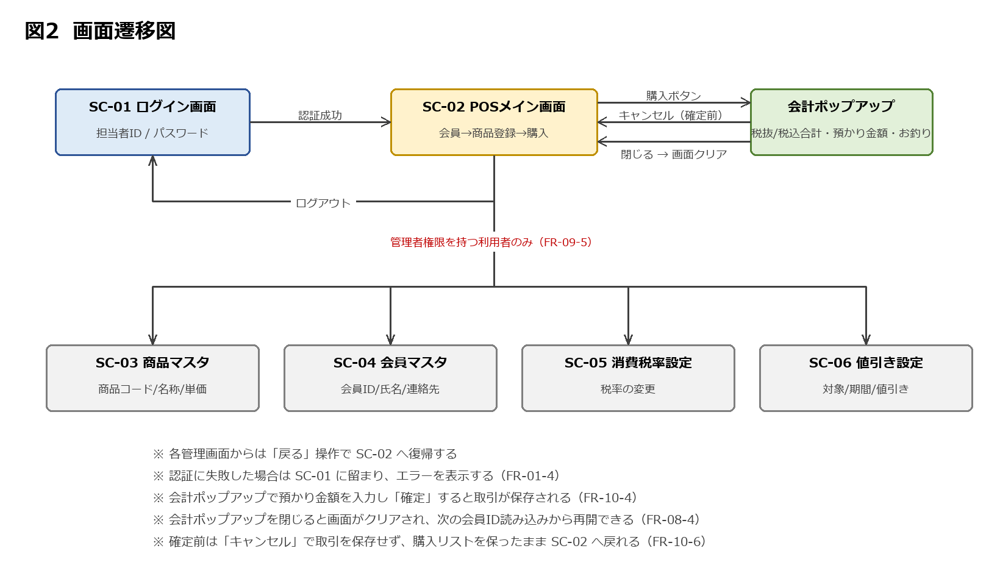
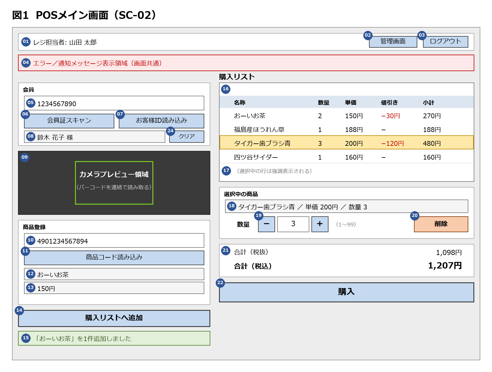

# 要件定義書: 簡易POSアプリ（Lv1 + Lv2）

> 本書は Lv1「簡易POSアプリ 要求一覧」および Lv2「簡易POSアプリ改 要求一覧」を入力とし、
> 実装可能な要件へ落とし込んだものである。

---

## 1. 背景と目的

### 1.1 背景

本システムは、食品・日用品を扱う中規模スーパーマーケット 1 店舗のレジ業務を支える
簡易 POS アプリである。店舗規模などの想定は 2.2（A-1, A-6）に示す。

Lv1 では、商品コードの手入力による商品登録、購入リストの表示、購入確定とデータベースへの
記録、レジ担当者のログイン、会員IDの入力、消費税の表示という**レジの基本機能**を定めた。
Lv2 では、これを土台に、カメラによるバーコードスキャン、購入リストの編集（選択・削除・
数量変更）、会員限定の値引き、単価変更に耐える取引記録という**実運用に必要な機能**を追加した。

### 1.2 目的

本システムにより、次の 3 つの状態を実現する。

1. レジ担当者が、バーコードスキャンと手入力の両方で商品を素早く正確に登録し、
   購入確定前に購入リストを修正し、現金での会計を完了できる
2. 会員特典の値引きと消費税率の変更に、プログラムを改修せず設定変更のみで追従できる
3. すべての取引が「いつ・何を・いくつ・いくらで・誰が買い・誰が処理したか」として残り、
   後日のマスタ変更に影響されない

### 1.3 期待する効果

- **KGI**: レジ処理時間の短縮、会計ミスの削減
- **KPI**: 1 取引あたりの商品登録時間、スキャンによる登録の割合（手入力の削減）、取引記録の欠落件数（目標 0 件）
- **MVP 判定**: 1 台のレジで試験運用し、上記 KPI が計測できる状態になっていること

### 1.4 本書の位置づけ

| 項目 | 内容 |
|---|---|
| 入力 | Lv1「簡易POSアプリ 要求一覧」、Lv2「簡易POSアプリ改 要求一覧」 |
| 出力 | 本書（要件定義書） |
| 読者 | 課題の評価者、および本システムの実装者 |
| 方針 | Lv1 の要求をすべて引き継ぎ、Lv2 の要求を統合する。本書のみで実装に着手できる状態を目標とし、要求一覧を参照しなくても内容が完結するよう記述する。要求一覧の原文と Lv1 の画面イメージは付録 A・B に転載する |

要求一覧は「何を作るべきか」のみを記述し、「どう作るか」を意図的に含めていなかった。
本書は要求を実装可能な要件へ落とし込む段階であるため、画面構成・保持する情報・
実行環境の選定まで踏み込んで定める。ただしテーブル構造や API 仕様といった設計は
実装工程に委ねる。

---

## 2. 対象範囲と前提条件

### 2.1 前提条件（変更不可）

要求一覧が「変更不可」と定めた条件であり、本書でもそのまま前提とする。

| # | 前提 | 出所 |
|---|---|---|
| P-1 | Web アプリとして動作し、ブラウザからアクセスする | Lv1 1, Lv2 1 |
| P-2 | フロントエンドは Next.js | Lv1 1, Lv2 1 |
| P-3 | バックエンドは FastAPI | Lv1 1, Lv2 1 |
| P-4 | Microsoft Azure 上に構築する。データベースは Azure Database for MySQL Flexible Server を利用する。バックエンドの実行サービスは非機能要件から判断する（第7章） | Lv1 1, Lv2 1 |
| P-5 | カメラ付きデバイス（ノートPC・スマートフォン・タブレット）での利用を前提とし、カメラでバーコードを読み取る | Lv2 1 |

### 2.2 運用上の前提

要求一覧に明示はないが、本書が設計判断の基礎として置く前提を示す。

| # | 前提 | 関連 |
|---|---|---|
| A-1 | 1 店舗に有人レジが複数台あり、同時に稼働する | N-06 |
| A-2 | 各レジ端末はブラウザで本システムにアクセスし、HTTPS で通信する | N-07, N-10 |
| A-3 | 利用者は「レジ担当者」と「管理者」の 2 種類である | FR-09-5, D-01-4 |
| A-4 | 商品にはバーコード（JAN コード）が付いている。会員証にもバーコードが印字されている | FR-03-1, FR-02-1 |
| A-5 | 営業時間中は継続して利用され、深夜帯は利用がない | N-03 |
| A-6 | 食品・日用品を扱う中規模スーパーマーケット 1 店舗。商品マスタは数千点規模、会員制度を持つ（本書の想定であり、要求一覧に記載はない） | 1.1, N-03 |

### 2.3 対象範囲

第3章の FR-01〜FR-10、第4章の SC-01〜SC-06、第5章の D-01〜D-09 を対象とする。
FR-10（現金決済）は要求一覧にない機能であるが、本書で対象に加えた（3.11 参照）。

### 2.4 対象外

要求一覧に記載がなく、実際の店舗運営では必要となり得るものを検討した上で、
本書では対象外とした。

| 項目 | 対象外とした理由 | 現時点の代替 |
|---|---|---|
| 返品・取消 | 要求になし。購入確定前であれば削除（FR-05-4）で対応できる | 確定後の訂正は業務手順で扱う |
| レシート・領収書の印刷 | 要求になし。プリンタというハードウェアへの依存が生じる。Lv1 は合計金額のポップアップ表示を明示的に求めている | ポップアップ表示（FR-08-3） |
| 購入履歴の照会画面 | 要求になし。Lv1 の「後から分かる状態で残す」はデータの保持（DR-3）で満たせる | データベースを直接参照する |
| レジ間の連携 | 複数レジの同時稼働は前提とする（A-1）が、作りかけの取引を別のレジへ引き継ぐ等の連携は要求になし | 各レジで取引を完結させる |
| カード・QRコード決済 | 要求になし。決済事業者との加盟店契約と、対面決済用の専用端末（PCI DSS 準拠）が必要で、本課題の範囲を超える。**現金決済は本書で対象に加えた（FR-10）** | 現金以外の支払いは POS 外で行う |

> 上記はいずれも将来の拡張候補である。第5章のデータ要件は、これらを追加しても
> 確定済み取引の記録を変更せずに済むよう定めている（DR-1）。

### 2.5 用語

| 用語 | 本書での意味 |
|---|---|
| 商品 | 商品マスタ（D-02）に登録された販売対象。商品コードで識別する |
| 購入リスト | 購入確定前に画面上で編集中の商品の一覧。確定すると取引になる |
| 取引 | 購入確定 1 回分の記録（D-04, D-05）。確定後は変更しない |
| 会員 | 会員マスタ（D-03）に登録された顧客。会員IDで識別する |
| 値引き | 会員限定・期間限定で特定商品の価格を下げる販促企画（D-07） |
| レジ担当者 | ログインしてレジ操作を行う利用者 |
| 管理者 | レジ操作に加え、マスタ・設定の管理画面を操作できる利用者 |
| スキャン | デバイスのカメラでバーコードを読み取る操作 |
| 読み込み | 会員IDまたは商品コードをシステムに取り込む操作の総称。スキャンと手入力の両方を含む |
| お客様ID | 会員IDの画面上の呼称（Lv1 の画面イメージの表記を踏襲）。データ上は会員ID（D-03-1）と同一 |
| 登録 | 文脈により 2 つを指す。「商品登録」は購入リストへの追加（FR-03, FR-04）、「マスタ登録」はマスタへの新規追加（FR-09）。Lv1 原文の「会員ID登録」は本書の「会員IDの読み込み」を指す |

---

## 3. 機能要件（FR）

本章は Lv1・Lv2 の要求をすべて要件へ落とし込んだものである。各要件には出所を付し、
第8章の対応表から逆引きできるようにしている。

**凡例**

- 出所欄の `Lv1 2.5` などは、各要求一覧の項番を指す
- ★ … 要求一覧に明文がなく、本書が決定した要件、または要求から導出した要件（出所欄に根拠を示す）
- ⚑ … Lv1 の要求を Lv2 が上書きした箇所

### 3.1 Lv1 要求からの変更点

Lv2 の要求には、Lv1 の要求を**打ち消すもの**が含まれる。実装時の判断を誤らないよう、
先に一覧化する。以降の要件は、すべて上書き後の内容で記述している。

| 論点 | Lv1 の要求 | Lv2 の要求（採用） | 該当要件 |
|---|---|---|---|
| 同一商品の再登録 | 1商品1行とし、x2個としない（Lv1 2.3） | 行を増やさず数量を加算する（Lv2 2.1） | FR-04-4 |
| 会員IDの入力時期 | 買い物を始める前に入力する（Lv1 2.6） | 購入確定までいつでも読み込める（Lv2 2.8） | FR-02-3 |
| 商品コードの入力方法（上書きではなく拡張） | 手入力のみ（Lv1 2.2） | バーコードスキャンを追加。手入力も継続（Lv2 2.1） | FR-03-1, FR-03-3 |

上 2 行は Lv1 の要求を打ち消す上書き（⚑）、3 行目は Lv1 を残したまま手段を足す拡張である。
Lv2 前提条件の「Lv3」記載との矛盾は I-1（第9章）で扱い、本書ではカメラスキャンを Lv2 の
実装範囲とする。

### 3.2 FR-01 レジ担当者のログイン

| # | 要件 | 出所 |
|---|---|---|
| FR-01-1 | 担当者は「担当者ID」と「パスワード」を入力してログインする | Lv1 2.5 |
| FR-01-2 | ログイン専用の画面を設け、認証に成功した場合のみPOS画面へ遷移する | Lv1 2.5 |
| FR-01-3 | 社外のID基盤（SSO等）は利用せず、本システム単独でID・パスワードを管理する | Lv1 2.5 |
| FR-01-4 | 担当者IDまたはパスワードが誤っている場合、ログインさせずエラーである旨を伝える | Lv1 2.5 |
| FR-01-5 | ログイン中の担当者を、その後に確定する取引記録へ紐づける | Lv1 2.5 |
| FR-01-6 ★ | ログアウトできる。ログアウト後はログイン画面へ戻る | 本書で決定 |

> FR-01-6 の根拠: シフト交代で担当者を切り替える手段がないと、FR-01-5 の
> 「担当者を取引記録へ紐づける」が実質的に成立しないため。

### 3.3 FR-02 会員IDの読み込み

| # | 要件 | 出所 |
|---|---|---|
| FR-02-1 | 会員証のバーコードをカメラで読み取り、会員IDとして認識する。読み取りは会員証スキャン操作で開始し（会員証モード）、1 件読み取ると商品スキャンへ戻る。読み取った会員IDが存在しない場合も商品モードへ戻り、FR-02-6 の表示を行う。会員証スキャンボタンの再押下で手動でも商品モードへ戻せる。商品モード中に会員証のバーコードを読んだ場合は商品コードとして扱い、FR-03-5 の未登録扱いとする（カメラは 1 台を共用。SC-02-06, SC-02-09） | Lv2 2.8 |
| FR-02-2 | 会員IDの手入力にも対応する | Lv1 2.6 |
| FR-02-3 ⚑ | 会員IDは購入ボタン押下までの任意のタイミングで読み込める。会計ポップアップ表示中は読み込めないが、キャンセル（FR-10-6）で SC-02 へ戻れば再び読み込める | Lv2 2.8 |
| FR-02-4 | 読み込んだ会員IDに対応する会員の氏名を画面に表示する | Lv1 2.1 |
| FR-02-5 | 会員IDが未入力のまま購入した場合、エラーとせず会員なしの取引として確定する | Lv2 2.8 |
| FR-02-6 | 入力された会員IDに該当する会員が存在しない場合、その旨を表示し、会員IDは未設定のまま維持する。担当者は再読み込みか、会員なしでの続行を選べる | Lv1 2.6 / Lv2 2.8 |
| FR-02-7 | 会員証を持たない客の場合、会員IDを入力せずに商品登録へ進める | Lv1 2.6 |
| FR-02-8 ★ | 会員IDが既に読み込まれている状態で再度読み込んだ場合、2件目は登録せず、読み込み済みである旨を表示する。1取引に紐づく会員は1名のみとする | 本書で決定 |
| FR-02-9 ★ | 購入ボタン押下前であれば、読み込んだ会員IDをクリアして会員なしの状態に戻せる（会計ポップアップ表示中は不可）。クリア時は適用済みの値引きを解除する（誤読み込みからの復帰手段） | 本書で決定 |

### 3.4 FR-03 商品の検索

| # | 要件 | 出所 |
|---|---|---|
| FR-03-1 | カメラでバーコードを読み取り、商品コードとして認識する。読み取りに成功した商品は、追加操作を要さず購入リストへ自動的に追加する（新規行か数量加算かは FR-04-4, FR-04-5 に従う） | Lv2 2.1 |
| FR-03-2 | スキャンは連続して行える。1回読み取るごとにスキャンを終了させない | Lv2 2.1 |
| FR-03-3 | 商品コードの手入力にも対応する。手入力の場合は読み込み操作で名称・単価を表示し（FR-03-4）、追加操作（FR-04-1）で購入リストへ追加する（Lv1 の 2 段階の流れを維持） | Lv1 2.2 / Lv2 2.1 |
| FR-03-4 | 商品コードに一致する商品が商品マスタに存在する場合、名称と単価を画面に表示する | Lv1 2.2 |
| FR-03-5 | 一致する商品が存在しない場合、「商品がマスタ未登録です」旨をユーザーに伝える | Lv1 2.2 |
| FR-03-6 | 読み取りに成功し購入リストへ追加された際、1件追加されたことがわかるフィードバックを表示する（FR-05-9 により追加されなかった場合は表示しない） | Lv2 2.1 |

### 3.5 FR-04 購入リストへの追加

| # | 要件 | 出所 |
|---|---|---|
| FR-04-1 | 検索した商品を購入リストへ追加する | Lv1 2.1 |
| FR-04-2 | 追加後、コード入力欄・名称表示・単価表示の内容をクリアし、次の商品を登録できる状態に戻す | Lv1 2.3 |
| FR-04-3 | 商品登録は回数の制限なく繰り返せる | Lv1 2.3 |
| FR-04-4 ⚑ | 既に購入リストにある商品を再度登録した場合、新しい行を追加せず、その行の数量を加算する | Lv2 2.1 |
| FR-04-5 | 購入リストにない商品を登録した場合、新しい行として追加する | Lv2 2.1 |
| FR-04-6 | 手入力からの追加もスキャンからの追加も、新規行か数量加算かの判定（FR-04-4, FR-04-5）は同一とする。追加に至る操作の段数は異なる（FR-03-1, FR-03-3） | Lv2 2.1 |
| FR-04-7 ★ | 購入リストは、商品ごとに名称・数量・単価・値引き額・小計を表示する。小計は値引き後の金額（単価 × 数量 − 値引き額。D-05-7）とする。「値引き後」は要求に明文がなく本書で決定 | Lv1 2.1, Lv2 2.5 / 本書で決定 |

### 3.6 FR-05 購入リストの操作

| # | 要件 | 出所 |
|---|---|---|
| FR-05-1 | 購入リストの中から特定の1商品を選択できる | Lv2 2.2 |
| FR-05-2 | 選択中の商品は、他の行と見分けがつくよう強調表示する | Lv2 2.2 |
| FR-05-3 | 選択中の商品の名称・単価・数量を画面上に表示する | Lv2 2.2 |
| FR-05-4 | 選択中の商品を購入リストから削除できる | Lv2 2.3 |
| FR-05-5 | 選択中の商品の数量を後から変更できる | Lv2 2.4 |
| FR-05-6 | 数量は1以上99以下とする | Lv2 2.4 |
| FR-05-7 | 数量を0にすることはできない。0にする操作は削除で行う | Lv2 2.4 |
| FR-05-8 | 数量を変更した場合、当該商品の小計および購入リスト全体の合計金額へ即時反映する | Lv2 2.4 |
| FR-05-9 ★ | 数量変更の指定、またはスキャン・追加による加算（FR-04-4）で 99 を超える場合、その操作を受け付けず、上限が 99 である旨を共通メッセージ領域（SC-02-04）に表示して直前の数量を維持する。スキャンで拒否された場合、追加フィードバック（FR-03-6, SC-02-15）は表示しない | 本書で決定 |

### 3.7 FR-06 会員特典の値引き

| # | 要件 | 出所 |
|---|---|---|
| FR-06-1 | 会員IDが読み込まれている取引に限り、対象商品へ値引きを適用する | Lv2 2.5 |
| FR-06-2 | 割合で引く値引き（例: 20%引き）に対応する | Lv2 2.5 |
| FR-06-3 | 金額で引く値引き（例: 20円引き）に対応する | Lv2 2.5 |
| FR-06-4 | 値引きには適用期間を設定でき、期間内の取引にのみ適用する | Lv2 2.5 |
| FR-06-5 | 値引きが適用された商品は、値引き額がわかるよう購入リスト上に表示する | Lv2 2.5 |
| FR-06-6 | 値引きの対象商品・適用期間・値引き内容は、プログラムコードを書き換えずに変更・追加できる | Lv2 2.5 |
| FR-06-7 ★ | 商品を購入リストへ追加した後に会員IDを読み込んだ場合、既に登録済みの商品にも遡って値引きを適用する | Lv2 2.8 から導出 |

> FR-06-7 の根拠: Lv2 2.8 が「値引きは購入までに会員IDを入力すれば適用できる」と定めており、
> 商品登録の後に会員IDを読み込む順序を許容しているため。

### 3.8 FR-07 消費税の計算・表示

| # | 要件 | 出所 |
|---|---|---|
| FR-07-1 | 購入ボタン押下後の会計ポップアップ（SC-02-23-1）に、税込みと税抜きの両方の合計金額を表示する（Lv1 の「購入確定時の提示」に相当） | Lv1 2.7 / Lv2 2.9 |
| FR-07-2 | 消費税率は、プログラムコードを書き換えずに変更できる形で保持する。取引に適用する税率は、適用開始日が取引日時以前である設定のうち最新の 1 件とする（D-06） | Lv1 2.8 / Lv2 2.9 |
| FR-07-3 ★ | 税抜き・税込みの合計金額を POS 画面に常時表示し、購入リストの変更を即時反映する（SC-02-21）。常時表示は要求に明文がなく、FR-05-8「合計金額へ反映」の反映先として本書で追加 | FR-05-8 から導出 |

### 3.9 FR-08 購入の確定

| # | 要件 | 出所 |
|---|---|---|
| FR-08-1 | 購入リストの内容を確定し、購入結果をデータベースへ保存する | Lv1 2.4 |
| FR-08-2 | 保存内容から「いつ・何を・いくつ・いくらで・誰が買い・誰がレジ処理したか」を後から確認できる | Lv1 2.4 |
| FR-08-3 | 購入ボタン押下後、会計ポップアップに税込みの合計金額を表示する。Lv1 の「購入確定後にポップアップで表示」は本ポップアップが担い、保存を伴う確定操作は FR-10-4 で定める | Lv1 2.4 |
| FR-08-4 | ポップアップを閉じる操作により、会員ID・お客様名表示・コード入力欄・名称表示・単価表示・購入リスト・選択状態・合計表示をすべてクリアし、次の会員ID読み込みから再開できる状態へ戻す | Lv1 2.4 |
| FR-08-5 | 購入時点の単価および値引き内容を取引記録として保持する。以降に商品マスタの単価を変更しても、確定済みの取引の金額は変化しない | Lv2 2.6 |
| FR-08-6 ★ | 購入リストが空の状態で購入操作を行った場合、購入処理を実行せず、商品が登録されていない旨を表示する | 本書で決定 |

### 3.10 FR-09 マスタ・設定の管理

Lv1・Lv2 の要求一覧に管理機能の記載はない。しかし FR-06-6・FR-07-2 が
「プログラムコードを書き換えずに変更できること」を求めているため、変更手段が必要となる。
本書では管理画面を設ける方針とする。

| # | 要件 | 出所 |
|---|---|---|
| FR-09-1 ★ | 商品マスタ（商品コード・名称・単価）を登録・変更・削除できる | 本書で決定 |
| FR-09-2 ★ | 会員マスタ（会員ID・氏名・電話番号・住所・性別・生年月日）を登録・変更・削除できる。要求の「年齢」は生年月日で保持する（D-03-6） | 本書で決定 |
| FR-09-3 ★ | 消費税率を画面から変更できる | FR-07-2 から導出 |
| FR-09-4 ★ | 値引き設定（対象商品・適用期間・値引き方式・値引き値）を登録・変更・削除できる | FR-06-6 から導出 |
| FR-09-5 ★ | 管理機能は、レジ担当者とは区別された管理者権限を持つ利用者のみが操作できる | 本書で決定 |

> FR-09-5 の根拠: 税率や単価をレジ担当者が変更できる状態は、売上金額の恣意的な操作を
> 許すため。要求一覧に権限の記載はないが、本書で必要と判断した。

### 3.11 FR-10 現金決済

Lv1・Lv2 の要求一覧は、購入確定を「記録して合計を表示する」までと定めており、支払いの
授受を扱っていない。本書では現金決済を対象に加える（カード・QRコード決済は対象外。2.4 参照）。

購入ボタン押下後の流れは次のとおりとする。

1. 会計ポップアップを表示し、税抜合計と税込合計を示す（FR-07-1・FR-08-3 の表示はこれが兼ねる）
2. 預かり金額を入力する
3. 「確定」操作で取引をデータベースへ保存し、お釣りを表示する
4. 「閉じる」操作で画面をクリアし、次の会員ID読み込みから再開する（FR-08-4）

確定前であれば「キャンセル」操作でポップアップを閉じ、購入リストを保ったまま SC-02 へ戻れる（FR-10-6）。

| # | 要件 | 出所 |
|---|---|---|
| FR-10-1 ★ | 購入ボタン押下後、会計ポップアップに税抜合計と税込合計を表示し、預かり金額を入力できる | 本書で決定 |
| FR-10-2 ★ | お釣り（預かり金額 − 税込合計）を計算して表示する | 本書で決定 |
| FR-10-3 ★ | 預かり金額が税込合計に満たない場合、確定できず、不足額を表示する | 本書で決定 |
| FR-10-4 ★ | 会計ポップアップの「確定」操作で取引をデータベースへ保存する。FR-08-1 の「確定」はこの操作を指す。預かり金額とお釣りも取引記録に保持する（D-04-9, D-04-10） | 本書で決定 |
| FR-10-5 ★ | 預かり金額の入力欄には税込合計と同額を初期値として提示し、ちょうどの支払いを 1 操作で確定できるようにする | 本書で決定 |
| FR-10-6 ★ | 会計の確定前であれば、会計ポップアップをキャンセルし、取引を保存せず購入リストを保ったまま SC-02 へ戻れる（誤操作・購入取りやめからの復帰手段） | 本書で決定 |

> FR-08-1 との関係: Lv1 は「購入リストの内容を確定すると DB に保存する」と定めている。
> 本書ではこの「確定」を会計ポップアップの確定操作と解釈し、預かり金額の入力を挟む。
> 購入ボタン押下の時点では保存しない（第9章に記録）。

---

## 4. 画面要件

画面要素には `SC-<画面番号>-<要素番号>` の識別子を与え、対応する機能要件を併記する。
図中の番号は要素番号に対応する（23 の会計ポップアップは重ねて表示されるため図外）。

### 4.1 画面一覧

| 画面番号 | 画面名 | 主な役割 | 対応要件 |
|---|---|---|---|
| SC-01 | ログイン画面 | 担当者の認証 | FR-01 |
| SC-02 | POSメイン画面 | 会員読み込み・商品登録・購入確定・現金決済 | FR-01-5, FR-01-6, FR-02〜FR-08, FR-09-5（管理画面への遷移）, FR-10 |
| SC-03 | 商品マスタ管理画面 | 商品の登録・変更・削除 | FR-09-1 |
| SC-04 | 会員マスタ管理画面 | 会員の登録・変更・削除 | FR-09-2 |
| SC-05 | 消費税率設定画面 | 消費税率の変更 | FR-09-3, FR-07-2 |
| SC-06 | 値引き設定画面 | 値引き企画の登録・変更・削除 | FR-09-4, FR-06-6 |

SC-03〜SC-06 は管理者権限を持つ利用者のみが開ける（FR-09-5）。

### 4.2 画面遷移

| 遷移元 | 契機 | 遷移先 | 対応要件 |
|---|---|---|---|
| SC-01 | 認証成功 | SC-02 | FR-01-2 |
| SC-01 | 認証失敗 | SC-01（留まりエラー表示） | FR-01-4 |
| SC-02 | 購入ボタン押下 | 会計ポップアップ（税抜・税込合計を表示、預かり金額を入力） | FR-07-1, FR-08-3, FR-10-1 |
| 会計ポップアップ | 確定 | 取引を保存し、同ポップアップにお釣りを表示 | FR-10-4, FR-10-2 |
| 会計ポップアップ | キャンセル（確定前のみ） | SC-02（購入リストは保持） | FR-10-6 |
| 会計ポップアップ | 閉じる（確定後） | SC-02（会員・商品入力・購入リストをすべてクリア） | FR-08-4 |
| SC-02 | ログアウト | SC-01 | FR-01-6 |
| SC-02 | 管理画面（管理者のみ） | SC-03〜SC-06 | FR-09-5 |
| SC-03〜SC-06 | 戻る | SC-02 | — |

### 4.3 SC-01 ログイン画面

| # | 要素 | 内容 | 対応要件 |
|---|---|---|---|
| SC-01-01 | 担当者ID入力欄 | 担当者IDを入力する | FR-01-1 |
| SC-01-02 | パスワード入力欄 | 入力値は伏せ字で表示する | FR-01-1 |
| SC-01-03 | ログインボタン | 認証を実行する | FR-01-1 |
| SC-01-04 | エラーメッセージ表示領域 | ID・パスワードが誤っている旨を表示する | FR-01-4 |

### 4.4 SC-02 POSメイン画面

Lv1 の画面イメージ（付録 A）を土台とし、Lv2 で追加された要素（バーコードスキャン、行の選択・
強調、削除、数量変更、値引き額の表示）と、本書で追加した要素（合計金額の常時表示、会員IDの
クリア、ログアウト、管理画面への遷移、共通メッセージ領域）を加えた構成とする。

| # | 図 | 要素 | 内容 | 対応要件 | Lv1図 |
|---|---|---|---|---|---|
| SC-02-01 | 01 | レジ担当者名表示エリア | ログイン中の担当者名を表示する | FR-01-5 | ※ |
| SC-02-02 ★ | 02 | 管理画面遷移ボタン | 管理者権限を持つ場合のみ表示する | FR-09-5 | — |
| SC-02-03 ★ | 03 | ログアウトボタン | SC-01 へ戻る | FR-01-6 | — |
| SC-02-04 ★ | 04 | エラー／通知メッセージ表示領域 | 画面共通の1箇所にまとめて表示する | FR-02-6, FR-02-8, FR-03-5, FR-05-9, FR-08-6 | — |
| SC-02-05 | 05 | お客様ID入力エリア | 会員IDを手入力する | FR-02-2 | ⑧ |
| SC-02-06 | 06 | 会員証スキャンボタン | 押下するとカメラプレビュー（SC-02-09）が会員証モードに切り替わり、1 件読み取ると商品モードへ自動復帰する。会員証モード中に再押下すると手動で商品モードへ戻る | FR-02-1 | — |
| SC-02-07 | 07 | お客様ID読み込みボタン | 入力値を読み込む。未入力のまま押下した場合は会員なしで進む | FR-02-2, FR-02-7 | ⑨ |
| SC-02-08 | 08 | お客様名表示エリア | 該当会員の氏名を表示する | FR-02-4 | ⑩ |
| SC-02-09 | 09 | カメラプレビュー領域 | 常時表示とし、連続スキャンを可能にする。通常は商品モードで、読み取った商品を自動的に購入リストへ追加する。会員証スキャンボタンで一時的に会員証モードになる（カメラは 1 台を共用） | FR-03-1, FR-03-2, FR-02-1 | — |
| SC-02-10 | 10 | 商品コード入力エリア | 商品コードを手入力する | FR-03-3 | ② |
| SC-02-11 | 11 | 商品コード読み込みボタン | 入力されたコードで商品を検索する | FR-03-3 | ① |
| SC-02-12 | 12 | 商品名称表示エリア | 検索した商品の名称を表示する | FR-03-4 | ③ |
| SC-02-13 | 13 | 単価表示エリア | 検索した商品の単価を表示する | FR-03-4 | ④ |
| SC-02-14 | 14 | 購入リストへ追加ボタン | 検索結果を購入リストへ追加する | FR-04-1 | ⑤ |
| SC-02-15 | 15 | 商品追加フィードバック表示 | 1件追加されたことを利用者に伝える | FR-03-6 | — |
| SC-02-16 | 16 | 購入品目リスト | 名称・数量・単価・値引き・小計を行ごとに表示する | FR-04-7, FR-06-5 | ⑥ |
| SC-02-17 | 17 | 選択行の強調表示 | 選択中の1行を他と区別できる表示にする | FR-05-1, FR-05-2 | — |
| SC-02-18 | 18 | 選択中の商品情報表示エリア | 選択行の名称・単価・数量を表示する | FR-05-3 | — |
| SC-02-19 | 19 | 数量変更UI | 「−」「＋」ボタンと数値入力欄を併設する。範囲は1〜99 | FR-05-5〜FR-05-9 | — |
| SC-02-20 | 20 | 削除ボタン | 選択中の商品を購入リストから削除する | FR-05-4 | — |
| SC-02-21 ★ | 21 | 合計金額表示エリア | 税抜・税込の合計を常時表示し、数量変更を即時反映する（FR-07-3） | FR-05-8, FR-07-3 | — |
| SC-02-22 | 22 | 購入ボタン | 会計ポップアップを開き、会計を開始する（データベースへの保存は FR-10-4 の確定操作で行う） | FR-08-1, FR-08-3 | ⑦ |
| SC-02-23 | — | 会計ポップアップ | 購入ボタン押下後に重ねて表示する。税抜・税込合計の表示、預かり金額の入力、お釣りの表示、確定・キャンセル・閉じる操作を持つ（構成は下表）。Lv1 由来のポップアップを現金決済用に拡張したもの | FR-07-1, FR-08-3, FR-08-4, FR-10 | — |
| SC-02-24 ★ | 24 | 会員IDクリアボタン | 読み込んだ会員IDを取り消し、会員なしの状態に戻す。購入ボタン押下前のみ有効 | FR-02-9 | — |

> 「Lv1図」欄は、Lv1 要求一覧の画面イメージ（付録 A）における注釈番号を示す。
> 「※」は Lv1 の画面イメージに注釈番号なしで描かれていた要素、
> 「—」は Lv1 の画面イメージに存在しない要素（Lv2 または本書で追加）である。
> 要素番号の ★ は、対応する機能要件が要求一覧になく本書で追加した要素を示す。

**会計ポップアップ（SC-02-23）の構成**

| # | 要素 | 内容 | 対応要件 |
|---|---|---|---|
| SC-02-23-1 | 合計表示 | 購入リストの税抜合計と税込合計を表示する | FR-08-3, FR-07-1 |
| SC-02-23-2 | 預かり金額入力欄 | 初期値は税込合計と同額 | FR-10-1, FR-10-5 |
| SC-02-23-3 | お釣り表示 | 預かり金額の入力に応じて「預かり金額 − 税込合計」を表示する。不足している間は不足額を表示する | FR-10-2, FR-10-3 |
| SC-02-23-4 | 確定ボタン | 取引を保存する。預かり金額が不足している間は押下できない | FR-10-4, FR-10-3 |
| SC-02-23-5 | 閉じるボタン | 確定後のみ押下できる。画面をクリアして SC-02 へ戻る | FR-08-4 |
| SC-02-23-6 | キャンセルボタン | 確定前のみ押下できる。取引を保存せず、購入リストを保ったまま SC-02 へ戻る | FR-10-6 |

**数量変更UIの方式（SC-02-19）**

要求は方式を指定していない。本書では「−」「＋」ボタンと数値入力欄を併設する。
1個単位の増減はボタン、まとまった数量の指定は直接入力で行えるようにするためである。

**カメラプレビューの配置（SC-02-09）**

FR-03-2 が「1回読み取るごとにスキャンを終了させない」ことを求めているため、
プレビューはモーダルではなく画面内に常時表示する領域として配置する。

### 4.5 SC-03〜SC-06 管理画面

管理画面はいずれも「一覧表示」「新規登録／編集フォーム」「削除」の共通構成とし、
扱う項目のみが画面ごとに異なる。

| # | 要素 | 内容 |
|---|---|---|
| SC-0n-01 | 一覧表示エリア | 登録済みデータを一覧表示する |
| SC-0n-02 | 新規登録ボタン | 入力フォームを開く |
| SC-0n-03 | 入力フォーム | 項目を入力し保存する |
| SC-0n-04 | 編集操作 | 一覧から対象を選び、入力フォームを開く |
| SC-0n-05 | 削除操作 | 一覧から対象を削除する |
| SC-0n-06 | 戻るボタン | SC-02 へ復帰する |

画面ごとの項目は次のとおり。

| 画面 | 入力フォームの項目 | 対応要件 |
|---|---|---|
| SC-03 商品マスタ | 商品コード、商品名称、単価 | FR-09-1 |
| SC-04 会員マスタ | 会員ID、氏名、電話番号、住所、性別、生年月日 | FR-09-2 |
| SC-05 消費税率設定 | 消費税率、適用開始日 | FR-09-3 |
| SC-06 値引き設定 | 対象商品、適用開始日、適用終了日、値引き方式（割合／金額）、値引き値 | FR-09-4 |

---

## 5. データ要件

本章は、システムが**保持すべき情報とその制約**を定める。テーブル構造・型・索引などの
物理設計は実装時に決定するものとし、本章では扱わない。凡例（★）は第3章と同じ。

### 5.1 データ全体に対する制約

| # | 制約 | 根拠 |
|---|---|---|
| DR-1 | 確定済みの取引記録は、その後のマスタ変更（単価・名称・税率・値引き設定）の影響を受けない。取引明細には購入時点の値を写し取って保持する | FR-08-5 |
| DR-2 | 取引は会員に紐づかない状態（会員なし）を許容する | FR-02-5 |
| DR-3 | すべての取引について「いつ・何を・いくつ・いくらで・誰が買い・誰が処理したか」を後から復元できる | FR-08-2 |
| DR-4 | 消費税率および値引き条件はプログラムコードではなくデータとして保持し、画面から変更できる | FR-07-2, FR-06-6 |
| DR-5 ★ | 商品または会員をマスタから削除しても、当該商品・会員を含む過去の取引記録は失われない | DR-1 の帰結。FR-09-1, FR-09-2 の削除操作を許容するため |

### 5.2 D-01 担当者

| # | 項目 | 内容・制約 | 出所 |
|---|---|---|---|
| D-01-1 | 担当者ID | 一意。ログイン時の識別子 | Lv1 2.5 |
| D-01-2 ★ | パスワード | ハッシュ化した値のみを保持し、平文は保持しない | Lv1 2.5 / 本書で決定 |
| D-01-3 | 氏名 | POS画面の担当者名表示（SC-02-01）に用いる | Lv1 2.1 |
| D-01-4 ★ | 権限区分 | 「レジ担当者」または「管理者」。管理画面の表示可否を決める | FR-09-5 |

### 5.3 D-02 商品マスタ

| # | 項目 | 内容・制約 | 出所 |
|---|---|---|---|
| D-02-1 | 商品コード | 一意。商品バーコードの値と一致する | Lv1 2.2, Lv2 2.1 |
| D-02-2 | 商品名称 | | Lv1 2.2 |
| D-02-3 ★ | 単価 | 税抜金額として保持する（理由は下記） | Lv1 2.2, Lv2 2.6 / 本書で決定 |

> 単価を税抜とする理由: FR-07-1 が税抜・税込の両方の合計表示を求めており、FR-07-2 が
> 税率の変更を想定している。税抜を基準に持てば、税率変更後も税込金額を再計算できる。
> 税込を基準にすると税率変更のたびに単価の見直しが必要になる。

### 5.4 D-03 会員マスタ

| # | 項目 | 内容・制約 | 出所 |
|---|---|---|---|
| D-03-1 | 会員ID | 一意。会員証バーコードの値と一致する | Lv1 2.6, Lv2 2.8 |
| D-03-2 | 氏名 | POS画面のお客様名表示（SC-02-08）に用いる | Lv1 2.6 |
| D-03-3 | 電話番号 | | Lv1 2.6 |
| D-03-4 | 住所 | | Lv1 2.6 |
| D-03-5 | 性別 | | Lv1 2.6 |
| D-03-6 ★ | 生年月日 | 要求の「年齢」に代えて保持する。年齢は表示時に算出する | Lv1 2.6 / 本書で決定 |

> 生年月日とする理由: 年齢をそのまま保持すると翌年には誤った値になる。要求が求める
> 「年齢が登録済みである」状態は、生年月日から算出することで満たせる（第9章に記録）。

### 5.5 D-04 取引

購入確定 1 回につき 1 件を保持する。

| # | 項目 | 内容・制約 | 出所 |
|---|---|---|---|
| D-04-1 | 取引ID | 一意 | 本書 |
| D-04-2 | 購入日時 | 「いつ」 | Lv1 2.4 |
| D-04-3 | 担当者ID | 「誰がレジ処理したか」。ログイン中の担当者を記録する | Lv1 2.4, 2.5 |
| D-04-4 | 会員ID | 「誰が買ったか」。会員なしの場合は未設定 | Lv1 2.4, Lv2 2.8 |
| D-04-5 | 税抜合計 | | Lv1 2.7 |
| D-04-6 | 消費税額 | | Lv1 2.7 |
| D-04-7 | 税込合計 | | Lv1 2.7 |
| D-04-8 ★ | 適用税率 | 取引時点で有効だった消費税率。税率変更後も税額を再現するため | 本書で決定（DR-1 と同じ考え方） |
| D-04-9 ★ | 預かり金額 | 現金決済で受け取った金額。税込合計以上 | FR-10-4 |
| D-04-10 ★ | お釣り | 預かり金額 − 税込合計 | FR-10-4 |

### 5.6 D-05 取引明細

取引に含まれる商品 1 行につき 1 件を保持する。

| # | 項目 | 内容・制約 | 出所 |
|---|---|---|---|
| D-05-1 | 取引ID | 親となる取引への紐づけ | 本書 |
| D-05-2 | 商品コード | 「何を」 | Lv1 2.4 |
| D-05-3 ★ | 商品名称（購入時点） | マスタから写し取る。以後の改称の影響を受けない | 本書で決定（FR-08-2 の「何を」を守るため） |
| D-05-4 | 単価（購入時点） | マスタから写し取る。以後の単価変更の影響を受けない | Lv2 2.6 |
| D-05-5 | 数量 | 「いくつ」。1〜99 | Lv1 2.4, Lv2 2.4 |
| D-05-6 | 値引き額 | 適用された値引きの金額。値引きなしは 0 | Lv2 2.5 |
| D-05-7 | 小計 | 単価 × 数量 − 値引き額 | Lv1 2.1 |

### 5.7 D-06 消費税率設定

| # | 項目 | 内容・制約 | 出所 |
|---|---|---|---|
| D-06-1 | 税率 | 百分率 | Lv1 2.8 |
| D-06-2 ★ | 適用開始日 | 将来の改定を事前登録できるようにする。取引に適用する税率は、適用開始日が取引日時以前のもののうち最新の 1 件（FR-07-2） | Lv1 2.8 から導出 |

### 5.8 D-07 値引き設定

| # | 項目 | 内容・制約 | 出所 |
|---|---|---|---|
| D-07-1 | 値引きID | 一意 | 本書 |
| D-07-2 | 対象商品コード | | Lv2 2.5 |
| D-07-3 | 適用開始日 | | Lv2 2.5 |
| D-07-4 | 適用終了日 | | Lv2 2.5 |
| D-07-5 | 値引き方式 | 「割合」または「金額」 | Lv2 2.5 |
| D-07-6 | 値引き値 | 方式が割合なら百分率、金額なら円 | Lv2 2.5 |

### 5.9 D-08 値引き適用記録

取引明細に値引きが適用された場合、どの値引き設定によるものかを保持する。

| # | 項目 | 内容・制約 | 出所 |
|---|---|---|---|
| D-08-1 | 取引明細への紐づけ | | Lv2 3章（非機能） |
| D-08-2 | 適用した値引きID | 値引き設定が後に変更・削除されても記録は残る | Lv2 3章（非機能） |
| D-08-3 | 値引き額（適用時点） | | Lv2 2.5 |

> Lv2 の非機能要求「値引き適用や単価変更の履歴を含む」に対応する。単価の履歴は
> D-05-4、値引きの履歴は本記録で満たす。

### 5.10 D-09 操作ログ

N-09 が求める操作ログを保持する。取引記録（D-04, D-05）とは別に持ち、障害調査と不正操作の
追跡に用いる。

| # | 項目 | 内容・制約 | 出所 |
|---|---|---|---|
| D-09-1 ★ | 日時 | 操作が行われた日時 | N-09 |
| D-09-2 ★ | 操作種別 | ログイン、ログアウト、購入確定、会計キャンセル、マスタ登録・変更・削除、税率変更、値引き設定変更 など | N-09 |
| D-09-3 ★ | 担当者ID | 操作を行った利用者。ログイン失敗時は入力された担当者ID | N-09 |
| D-09-4 ★ | 対象 | 操作対象の識別子（取引ID、商品コード、会員ID など）。該当がない操作は未設定 | N-09 |
| D-09-5 ★ | 結果 | 成功／失敗。失敗時は理由 | N-09 |

> 保持期間は N-09 のとおり 90 日以上とする。

---

## 6. 非機能要件（NFR）

凡例（★）は第3章と同じ。N-03・N-04 は第7章のインフラ選定の根拠となる。

| # | 分類 | 要件 | 出所 |
|---|---|---|---|
| N-01 | 構成 | 検索・スキャン・購入などの処理は、フロントエンド（Next.js）とバックエンド（FastAPI）で役割を分担し、API連携で実現する。業務ロジックとデータアクセスはバックエンドが担う | Lv1 3, Lv2 3 |
| N-02 | データ保全 | 購入データは失われてはならない。購入確定時にデータベースへ永続化し、成功を確認してから完了を利用者に伝える。値引き適用・単価変更の履歴（D-05, D-08）を含む | Lv1 3, Lv2 3 |
| N-03 | 応答速度 | 営業時間内は常に同じような応答速度で動作する。久しぶりにアクセスした瞬間だけ極端に遅くなる挙動（コールドスタート）を避ける。目標値は 6.1 に示す | Lv1 3, Lv2 3 |
| N-04 | 接続維持 | バックエンドはデータベースとの接続をリクエストごとに確立し直さず、接続プール等により維持した状態で運用する。処理のたびに実行環境がゼロから立ち上がる構成を採らない | Lv1 3, Lv2 3 |
| N-05 | 対応デバイス | カメラ付きのノートPC・スマートフォン・タブレットのブラウザから利用できる。対応ブラウザは N-10 に示す | Lv2 前提条件 |
| N-06 ★ | 同時利用 | 複数のレジ端末から同時に利用されても、取引が混在せず、取引ID（D-04-1）が重複しない。ある端末の操作が他端末の取引に影響しない | A-1「有人レジが複数台あり、同時に稼働する」から導出 |
| N-07 ★ | セキュリティ | (1) パスワードはハッシュ化して保持する（D-01-2）。(2) 管理機能は管理者権限を持つ利用者のみ操作できる（FR-09-5）。(3) 通信は HTTPS で暗号化する。(4) 会員の個人情報（D-03）は権限のない者が閲覧できないようにする | 本書で決定 |
| N-08 ★ | バックアップ | データベースは日次で自動バックアップを取得し、少なくとも 7 日分を保持する。障害時にバックアップから復元できる | 本書で決定 |
| N-09 ★ | ログ | バックエンドは操作ログ（D-09: 日時・操作種別・担当者ID・対象・結果）を記録し、少なくとも 90 日間保持する。障害調査および不正操作の追跡に用いる。取引記録（D-04）とは別に保持する | 本書で決定 |
| N-10 ★ | 対応ブラウザ | Chrome、Edge、Safari の各最新版で動作する。カメラによるバーコード読み取りはブラウザのカメラAPIを用いるため、HTTPS 環境が必須となる（N-07 (3) と整合） | 本書で決定 |

> N-07 (3) の HTTPS は、セキュリティ上の要請であると同時に、N-10 の技術的前提でもある。
> 主要ブラウザは HTTPS でない接続からのカメラアクセスを許可しない。
> ただし `localhost`（および `127.0.0.1`）は例外として扱われるため、ローカル開発環境では
> HTTP のまま動作確認できる。HTTPS が必須になるのはデプロイ先（App Service）である。

### 6.1 応答速度の目標値（仮置き）

要求一覧は応答速度を「同じような」と定性的に表現している。実装時に検証できるよう、
本書では次の目標値を**仮置き**する（要求にない数値であるため第9章に記録）。

| 操作 | 目標 | 備考 |
|---|---|---|
| ログイン（FR-01） | 2 秒以内 | 認証とPOS画面の表示まで |
| 商品コードの検索（FR-03-4） | 1 秒以内 | コード入力から名称・単価の表示まで |
| バーコード読み取りから購入リスト追加（FR-03-1, FR-04） | 1 秒以内 | 連続スキャンの妨げにならないこと |
| 会員IDの読み込み（FR-02） | 1 秒以内 | |
| 購入ボタン押下から会計ポップアップ表示（FR-10-1） | 1 秒以内 | 税抜・税込合計の表示まで |
| 会計の確定（FR-10-4） | 2 秒以内 | 「確定」操作からデータベース保存の完了とお釣り表示まで |

いずれも「営業時間内のどの時点でも」満たすこと。初回アクセス時のみ数十秒待たされる
挙動は、N-03 に照らして不可とする。

---

## 7. 要素技術の選定

前提条件（第2章）で固定されている技術はそのまま採用する。要求一覧が「自分たちで判断すること」
と委ねているのはバックエンドの実行環境であり、第6章の N-03（コールドスタート回避）と
N-04（DB接続の維持）を判断基準とする。

### 7.1 選定一覧

| レイヤー | 選定 | 選定理由 | 却下した代替と理由 |
|---|---|---|---|
| フロントエンド | Next.js | 前提条件で指定 | — |
| フロントエンド実行環境 | Azure App Service（Node） | Next.js のサーバ側機能を制約なく動かせる。バックエンドと同じサービスに揃え、運用手順を一本化する | Azure Static Web Apps: 静的サイト向けで、Next.js のサーバ側機能に制約がある |
| バックエンド | FastAPI | 前提条件で指定 | — |
| バックエンド実行環境 | **Azure App Service（Linux / Python）** | 「Always On」を有効にすると常駐プロセスとして稼働し、N-03・N-04 を満たす（7.2 参照） | Azure Functions（従量課金）: 未使用時に停止し、次のアクセスで起動し直す。要求が「避けたい」と明記した構成そのもの。Azure Container Apps: 要件は満たせるが Docker イメージの準備が必要で、初期構築の手数が多い。Azure Kubernetes Service: 1店舗の POS に対して過大 |
| データベース | Azure Database for MySQL Flexible Server | 前提条件で指定 | — |
| DB接続 | SQLAlchemy の接続プール | 接続を維持して再利用し、N-04 を満たす | リクエストごとの接続確立: N-04 に反する |
| バーコード読み取り | ZXing（zxing-js） | ブラウザ上で動作し、日本の小売で用いられる JAN コード（EAN-13）に対応。Chrome・Edge・Safari で動作し N-10 を満たす | ブラウザ標準の BarcodeDetector API: Safari が非対応で N-10 を満たさない |
| 認証 | 自前実装（ID・パスワード） | 要求が社外ID基盤の利用を禁じている（FR-01-3） | SSO / 外部IDプロバイダ: 要求により不可 |
| パスワード保護 | bcrypt 系のハッシュ関数 | N-07 (1)・D-01-2 を満たす | 平文保持: N-07 に反する |
| 通信 | HTTPS（App Service の標準証明書） | N-07 (3)。カメラAPIの動作条件でもある（N-10） | HTTP: ブラウザがカメラアクセスを拒否する |

### 7.2 バックエンド実行環境の選定根拠

要求一覧の非機能要求を、候補ごとに照合した結果を示す。

| 判断基準 | App Service（Always On） | Container Apps（最小1レプリカ） | Functions（従量課金） |
|---|---|---|---|
| N-03 久しぶりのアクセスで遅くならない | ○ 常駐する | ○ ゼロスケールを止めれば常駐 | × 停止後の初回アクセスで起動待ちが発生 |
| N-04 DB接続を維持できる | ○ プロセスが生きているので接続プールが有効 | ○ 同左 | × 起動ごとに接続を作り直す |
| 構築の手数 | 少ない（コードをそのまま配置） | 中（Docker イメージが必要） | 少ない |
| 判定 | **採用** | 代替候補 | **不採用** |

**Always On の注意**: Always On は Basic 以上の料金プランで利用できる。Free / Shared プランでは
有効化できず、一定時間アクセスがないとプロセスが停止するため、N-03 を満たせない。
実装時はプランの選択を誤らないこと。

### 7.3 概算コスト（目安）

実装時の判断材料として記す。価格は地域・時期により変動するため、着手時に確認すること。

| 項目 | 構成 | 月額の目安 |
|---|---|---|
| App Service Plan | Basic B1（1インスタンス）。フロントエンドとバックエンドの 2 アプリを同一プランに載せる | 約 2,000 円 |
| Azure Database for MySQL Flexible Server | Burstable B1ms。自動バックアップ 7 日分を含む（N-08 を満たす） | 約 2,500 円 |
| 合計 | | 約 4,500 円 |

> App Service Plan は 1 つのプランに複数のアプリを配置できる。フロントエンドとバックエンドで
> プランを分ける必要はなく、上記は 1 プランで見積もっている。

---

## 8. 要求と要件の対応表

Lv1・Lv2 の要求一覧の全項目を左に並べ、本書のどの要件・画面要素・データ項目が対応するかを
右に示す。第3章以降の各表にある「出所」欄の逆引きに当たる。
要求一覧の項番は原文のものを用い、1 項番に複数の文がある場合は文ごとに行を分けた。

⚑ は Lv2 が Lv1 を上書きした要求（3.1 参照）。

### 8.1 Lv1 要求一覧との対応

| 項番 | 要求（要約） | 対応する要件 |
|---|---|---|
| 1 | Web アプリとして動作 | P-1 |
| 1 | フロントエンド Next.js | P-2 |
| 1 | バックエンド FastAPI | P-3 |
| 1 | Azure 上に構築。DB は MySQL Flexible Server。バックエンドのサービスは自分たちで判断 | P-4, 7.1, 7.2 |
| 2.1 | 商品コードを入力する場所 | SC-02-10 |
| 2.1 | 入力したコードで商品を検索する操作 | SC-02-11, FR-03-3 |
| 2.1 | 商品の名称を表示する場所 | SC-02-12, FR-03-4 |
| 2.1 | 商品の単価を表示する場所 | SC-02-13, FR-03-4 |
| 2.1 | 検索結果を購入リストに追加する操作 | SC-02-14, FR-04-1 |
| 2.1 | 購入リスト（名称・数量・単価・小計） | SC-02-16, FR-04-7 |
| 2.1 | 購入を確定する操作 | SC-02-22, FR-08-1, FR-10-4 |
| 2.1 | ログインしているレジ担当者の情報 | SC-02-01, FR-01-5, D-01-3 |
| 2.1 | お客様の会員IDの表示 | SC-02-05, SC-02-08, FR-02-4 |
| 2.2 | 一致する商品があれば名称・単価を表示 | FR-03-4 |
| 2.2 | 一致する商品がなければ「マスタ未登録」を伝える | FR-03-5, SC-02-04 |
| 2.3 | 追加後にコード入力・名称・単価をクリア | FR-04-2 |
| 2.3 | 商品登録は何度でも繰り返せる | FR-04-3 |
| 2.3 ⚑ | x2個とせず 1 商品 1 行 | Lv2 2.1 により上書き → FR-04-4（3.1, I-2） |
| 2.4 | 確定すると DB に保存 | FR-08-1, FR-10-4, N-02（保存タイミングは I-6） |
| 2.4 | いつ・何を・いくつ・いくらで・誰が買い・誰が処理したかが残る | FR-08-2, DR-3, D-04-2〜4, D-05-2〜5 |
| 2.4 | 確定後に税込合計をポップアップで表示 | FR-08-3, SC-02-23-1 |
| 2.4 | ポップアップを閉じると画面をクリアし、次の会員ID登録から再開 | FR-08-4, SC-02-23-5 |
| 2.5 | 担当者ID・パスワードでログイン | FR-01-1, SC-01-01〜03 |
| 2.5 | ログイン専用画面。成功で POS 画面へ | FR-01-2, SC-01 |
| 2.5 | 社外 ID 基盤を使わず単独で管理 | FR-01-3, 7.1（認証） |
| 2.5 | 誤った ID・パスワードはエラー | FR-01-4, SC-01-04 |
| 2.5 | 担当者情報を取引記録に紐づける | FR-01-5, D-04-3 |
| 2.6 ⚑ | 買い物を始める前に会員IDを入力する | Lv2 2.8 により上書き → FR-02-3（3.1, I-3） |
| 2.6 | 会員ID・氏名・電話番号・住所・性別・年齢が登録済み | D-03-1〜6（年齢は生年月日で保持。I-4） |
| 2.6 | 存在しない会員IDの扱いを考慮 | FR-02-6 |
| 2.6 ⚑ | 会員IDを手入力してから商品登録・購入へ進む順序 | 手入力は FR-02-2、順序は Lv2 2.8 により上書き（I-3） |
| 2.6 | 会員IDを持たない客はボタンを押して進む | FR-02-7, SC-02-07（I-8） |
| 2.7 | 税込・税抜の両方の合計を表示 | FR-07-1, SC-02-23-1（常時表示は本書の追加: FR-07-3, SC-02-21） |
| 2.8 | 税率をデータとして持ち、コード改修なしで変更可能 | FR-07-2, D-06, FR-09-3, SC-05 |
| 3 | フロントとバックで役割分担（API 連携） | N-01 |
| 3 | 購入データは失われない。確定時に DB へ永続化 | N-02 |
| 3 | 営業時間内は同じ応答速度。久しぶりのアクセスで遅くならない | N-03, 6.1, 7.2 |
| 3 | DB 接続を維持。処理ごとにゼロから立ち上がる構成を避ける | N-04, 7.1（DB接続）, 7.2 |
| 画面イメージ | 注釈 ①〜⑩ | 4.4 の「Lv1図」列 |

### 8.2 Lv2 要求一覧との対応

| 項番 | 要求（要約） | 対応する要件 |
|---|---|---|
| 1 | Web / Next.js / FastAPI / Azure（Lv1 と同じ） | P-1〜P-4 |
| 1 | カメラ付きデバイスでの利用。カメラでバーコードを読み取る（「Lv3」の記載あり） | P-5, N-05（解釈は I-1） |
| 2.1 | カメラでバーコードを読み取り商品コードとして認識 | FR-03-1, SC-02-09 |
| 2.1 | 認識成功時に「1件追加された」フィードバック | FR-03-6, SC-02-15 |
| 2.1 | スキャンは連続して行える | FR-03-2, SC-02-09 |
| 2.1 | 既にある商品は数量を増やす | FR-04-4 |
| 2.1 | ない商品は新しい行で追加 | FR-04-5 |
| 2.1 | 手入力にも対応し、挙動をスキャンと揃える | FR-03-3, FR-04-6 |
| 2.2 | 特定の 1 商品を選択できる | FR-05-1 |
| 2.2 | 選択した商品を強調表示 | FR-05-2, SC-02-17 |
| 2.2 | 選択した商品の情報を表示 | FR-05-3, SC-02-18 |
| 2.3 | 選択状態の商品を削除 | FR-05-4, SC-02-20 |
| 2.4 | 選択状態の商品の数量を後から変更 | FR-05-5, SC-02-19 |
| 2.4 | 数量は 1 以上。0 にはできない（削除で行う） | FR-05-6, FR-05-7 |
| 2.4 | 数量は最大 99 | FR-05-6, FR-05-9 |
| 2.4 | 変更を小計・合計に反映 | FR-05-8, SC-02-21 |
| 2.5 | 会員に限り、特定商品に期間を定めた値引き | FR-06-1, FR-06-4, D-07 |
| 2.5 | 割合形式と金額形式の両方 | FR-06-2, FR-06-3, D-07-5〜6 |
| 2.5 | 値引き額がわかるように表示 | FR-06-5, SC-02-16 |
| 2.5 | 対象・期間・内容をコード改修なしで変更・追加 | FR-06-6, D-07, FR-09-4, SC-06 |
| 2.6 | 単価は将来変更される | D-02-3, FR-09-1 |
| 2.6 | 確定済み取引は当時の単価のまま。過去の売上金額が変わらない | FR-08-5, D-05-4, DR-1 |
| 2.7 | レジ担当者のログイン（Lv1 継続） | FR-01 |
| 2.8 | 会員IDをバーコードスキャンで購入までにいつでも読み込める | FR-02-1, FR-02-3, SC-02-06 |
| 2.8 | 購入までに会員IDを入力すれば値引きを適用 | FR-06-7 |
| 2.8 | 氏名・電話番号・住所・性別・年齢が登録済み | D-03 |
| 2.8 | 会員ID未入力のまま購入は会員なしの正常取引 | FR-02-5, DR-2, D-04-4 |
| 2.8 | 存在しない会員IDの扱いを考慮 | FR-02-6 |
| 2.9 | 消費税の表示・変更対応（Lv1 継続） | FR-07 |
| 3 | フロントとバックで役割分担 | N-01 |
| 3 | データは失われない。値引き適用・単価変更の履歴を含む | N-02, D-05-4, D-08 |
| 3 | 営業時間内は同じ応答速度 | N-03 |
| 3 | DB 接続を維持した運用 | N-04 |
| 4 | 同じ商品を連続スキャンしたとき、どう見つけるか | FR-04-4（実現方法は設計工程） |
| 4 | 選択中の商品をどこで管理するか | FR-05-1（実現方法は設計工程） |
| 4 | 会員ID入力前にスキャンした商品への値引き適用 | FR-06-7 |

### 8.3 対応の確認

- Lv1 の要求項目 39 件、Lv2 の要求項目 36 件は、すべて本書の要件・画面要素・データ項目に対応している。
- Lv1 の 3 行（⚑。論点としては I-2・I-3 の 2 件）は Lv2 により上書きされ、上書き後の内容で要件化した（3.1）。
- 要求一覧に明文のない要件（★。本書の決定または要求からの導出）は 9.2 に一覧化した。

---

## 9. 未確定事項・確認事項

本章は 3 節から成る。9.1 は要求一覧の中で矛盾または曖昧だった箇所と、本書がどう解釈したか。
9.2 は要求一覧に記載がなく本書が決定した事項の一覧（★の総覧）。9.3 は実装を進めるうえで
決めざるを得ないが要求一覧に手がかりがない事項で、本書では仮定を置いて進める。

### 9.1 要求一覧の矛盾・曖昧さと本書の解釈

| # | 事項 | 要求一覧の記述 | 本書の解釈 | 該当 |
|---|---|---|---|---|
| I-1 | カメラスキャンの実装レベル | Lv2 前提条件は「Lv3ではカメラでの読み取りに対応する」と記す一方、Lv2 機能要求 2.1 はカメラ読み取りの振る舞いを具体的に定めている | 機能要求 2.1 が振る舞いまで定義していることを重視し、**Lv2 で実装する**。前提条件の「Lv3」は記載誤りと判断 | 3.1, FR-03-1 |
| I-2 | 同一商品の再登録 | Lv1 2.3「1商品1行、x2個としない」と Lv2 2.1「数量を増やす」が正反対 | Lv2 が Lv1 を上書きしたものとして **数量加算** を採用 | 3.1, FR-04-4 |
| I-3 | 会員IDの入力時期 | Lv1 2.6「買い物を始める前に入力」と Lv2 2.8「購入までにいつでも」 | Lv2 を採用し、**いつでも読み込める**。商品登録後に読み込んだ場合の値引きは遡って適用（FR-06-7） | 3.1, FR-02-3 |
| I-4 | 会員の「年齢」 | Lv1 2.6 は登録済み情報に「年齢」を挙げる | 年齢は経年で変わるため **生年月日を保持**し、年齢は表示時に算出する | D-03-6 |
| I-5 | 単価の税抜・税込 | Lv1・Lv2 とも指定なし | 税率変更（FR-07-2）に耐えるため **税抜で保持** | D-02-3 |
| I-6 | 購入確定の保存タイミング | Lv1 2.4「購入リストの内容を確定すると DB に保存」 | 現金決済（FR-10）を挟むため、**会計ポップアップの「確定」操作**を保存タイミングとする。購入ボタン押下では保存しない | FR-08-1, FR-10-4 |
| I-7 | 「レジ担当者の情報」の表示内容 | Lv1 2.1 は表示項目を特定していない | **担当者の氏名**を表示する | D-01-3, SC-02-01 |
| I-8 | 「お客様ID読み込みボタン」の役割 | Lv1 2.6 は「会員IDを持たない客は入力不要でボタンを押して進む」とし、入力確定と会員なし進行の両方を 1 つのボタンに担わせている | 入力があれば会員IDを確定し、未入力なら会員なしで進む **二役のボタン**とする | FR-02-7, SC-02-07 |

### 9.2 要求一覧に記載がなく本書で決定した事項（★総覧）

第3章以降で ★ を付した事項を集約する。いずれも要求を実装可能にするために必要と判断したもので、
発注者の意図と異なる場合は差し替える。

| 区分 | 事項 | 該当 | 確認の優先度 |
|---|---|---|---|
| 機能追加 | 現金決済（預かり金額・お釣り） | FR-10, D-04-9〜10 | **高**（要求外の機能追加） |
| 機能追加 | マスタ・設定の管理画面 | FR-09-1〜4, SC-03〜06 | **高**（要求外の機能追加。ただし FR-06-6・FR-07-2 を満たす手段として必須） |
| 機能追加 | 管理者権限による管理機能の制限 | FR-09-5, D-01-4 | 中 |
| 機能追加 | ログアウト | FR-01-6 | 低（FR-01-5 の整合上必須） |
| 機能追加 | 会員IDのクリア、会計のキャンセル | FR-02-9, FR-10-6, SC-02-24, SC-02-23-6 | 低（誤操作からの復帰手段） |
| 機能追加 | 会員ID読み込み後の値引きの遡り適用 | FR-06-7 | 中（Lv2「考えてみてほしいこと」の論点） |
| 異常系 | 会員IDの二重読み込み、数量 99 超、空リストでの購入 | FR-02-8, FR-05-9, FR-08-6 | 低 |
| データ | 生年月日での保持、商品名称の写し取り、適用税率の記録、税率の適用開始日、パスワードのハッシュ化 | D-03-6, D-05-3, D-04-8, D-06-2, D-01-2 | 低（いずれも要求の意図を守るための措置） |
| データ | マスタ削除後も取引記録を保持 | DR-5 | 低 |
| データ | 単価を税抜で保持 | D-02-3 | 低（I-5） |
| データ | 操作ログ | D-09 | 低（N-09 の帰結） |
| 機能追加 | 合計金額の常時表示、小計は値引き後の金額、共通メッセージ領域 | FR-07-3, SC-02-21, FR-04-7, SC-02-04 | 低（FR-05-8 の反映先／D-05-7 との整合／通知の一元化） |
| 非機能 | 同時利用、セキュリティ、バックアップ、ログ、対応ブラウザ | N-06〜N-10 | 中 |
| 非機能 | 応答速度の目標値 | 6.1 | 中（数値は仮置き） |
| 技術 | バーコード読み取りライブラリ（ZXing）、パスワードハッシュ（bcrypt 系） | 7.1 | 低 |

### 9.3 実装前に確認したい事項（本書の仮定つき）

要求一覧に手がかりがなく、かつ実装結果（特に金額）に直接影響する事項を挙げる。
確認が取れるまでは「本書の仮定」で実装を進め、回答後に設定値の変更で対応できるようにする。

| # | 確認事項 | 影響 | 本書の仮定 |
|---|---|---|---|
| Q-1 | 消費税の端数処理（切り捨て・四捨五入・切り上げ）と計算単位（明細ごとか取引合計か） | 税込合計が 1 円単位で変わる。FR-07-1 の表示金額と D-04-6 の記録値に直結 | **取引合計に対して税率を掛け、1 円未満を切り捨て** |
| Q-2 | 割合値引きの端数処理 | 値引き額が 1 円単位で変わる。D-05-6 に直結 | **1 円未満を切り捨て**（顧客有利） |
| Q-3 | 値引きと消費税の適用順序 | 値引き後に課税するか、課税後に値引くかで税額が変わる | **値引き後の金額に課税する** |
| Q-4 | 同一商品に複数の値引き設定が期間重複した場合の扱い | 二重値引きの可否 | **値引き額が大きい 1 件のみ適用** |
| Q-5 | 商品コードと会員IDのバーコード規格・桁数 | ZXing の読み取り設定、入力欄の桁数制限、D-02-1・D-03-1 の形式 | **商品は JAN コード（EAN-13、13 桁）**。Lv1 の画面イメージは 11 桁の例を示しているが、日本の小売で標準の JAN を仮定する。会員証は **CODE128** |
| Q-6 | パスワードの複雑さ要件、連続失敗時のロック | FR-01-4 の挙動、N-07 | **8 文字以上、ロックなし**（MVP） |
| Q-7 | 応答速度の目標値の妥当性 | 6.1 の数値 | 6.1 のとおり |
| Q-8 | 購入確定の保存タイミング（I-6）が Lv1 の意図と合っているか | FR-08-1, FR-10-4 の設計 | 会計ポップアップの確定時 |

> Q-1〜Q-4 は金額の計算規則であり、確認が取れないまま実装すると後から取引記録の
> 金額を訂正できない（DR-1）。優先して確認する。

---

## 10. 変更履歴

| 版 | 日付 | 内容 |
|---|---|---|
| v1.0 | 2026-09-04 | 初版。Lv1「簡易POSアプリ 要求一覧」および Lv2「簡易POSアプリ改 要求一覧」を入力とし、機能要件（FR-01〜FR-10）、画面要件（SC-01〜SC-06）、データ要件（D-01〜D-08）、非機能要件（N-01〜N-10）、要素技術の選定、要求との対応表、未確定事項を定めた。現金決済（FR-10）は要求一覧にない機能として本書で追加 |
| v1.1 | 2026-09-04 | 文脈を持たない第三者（採点者・実装者・DB担当・レビュアー・整合性検査の 5 視点）による読者テストの指摘を反映。会計のキャンセル（FR-10-6）と会員IDのクリア（FR-02-9）を追加。スキャン＝自動追加／手入力＝追加ボタンの経路、スキャン加算の上限、カメラ 1 台の共用方法、小計＝値引き後、有効税率の決定規則を明文化。操作ログのデータ要件（D-09）を追加。「確定」の多義性を解消し、FR-08-3・FR-07-1・SC-02-22 の文言を現金決済の流れに合わせた。★の定義を「決定または導出」に修正。用語表に「読み込み」「お客様ID」「登録」を追加。付録 A（Lv1 画面イメージ）・付録 B（要求一覧の原文）を追加 |
| v1.2 | 2026-09-04 | 再検証の残指摘を反映。合計の常時表示を要求由来（FR-07-1）と本書の導出（FR-07-3 ★）に分離。会員IDの読み込み・クリアの期限を「購入ボタン押下前」に明確化。会員証モードの復帰規則（不存在時・手動解除・商品モード中の会員証読み取り）を追加。FR-05-9 拒否時のフィードバック抑止、FR-04-7 の ★、⚑ の件数表記、「読み取り」→「読み込み」の統一、付録 A の注釈転記、図1 の商品コード例を 13 桁へ修正、図2 にキャンセル遷移を追加。最終検査により、会計ポップアップの合計表示を「税抜・税込の両方」に統一、D-06-2 と SC-02-02/03/04 に ★ を付与、2.4 の不要な ★ を削除、SC-02-04 に FR-02-8 を追加 |

---

## 付録 A. Lv1 要求一覧の画面イメージ（転載）

Lv1 要求一覧に含まれていた画面イメージを転載する。第4章 4.4 の「Lv1図」欄の注釈番号
（①〜⑩）はこの図を指す。

図中に描かれた注釈は ①〜⑦ である。原文の画像には、これに加えて次の注釈がテキストボックスとして
重ねて配置されていた（画像には含まれないため、ここに転記する）。

- ⑧ お客様ID入力エリア
- ⑨ お客様ID読み込みボタン
- ⑩ お客様名表示エリア
- レジ担当者名表示エリア（番号なし）

4.4 の「Lv1図」欄の ⑧⑨⑩ と ※ は、この転記を指す。

---

## 付録 B. 要求一覧の原文（転記）

本書の入力である 2 つの要求一覧を、対応表（第8章）との突き合わせのために転記する。
項番は原文のまま。

### B.1 Lv1 要求一覧（簡易POSアプリ）

このドキュメントには「何を作るべきか（要求）」だけを記載しています。API仕様やDBテーブル設計などの「どう作るか（実装設計）」はあえて含めていません。画面イメージや処理の流れから、必要なAPI・データ構造は自分で考えて設計してください。

**1. 前提条件（変更不可）**
- Webアプリとして動作すること（ブラウザからアクセス）
- フロントエンド：Next.js
- バックエンド：FastAPI
- インフラ：Microsoft Azure上で構築する（データベースはAzure Database for MySQL Flexible Serverを利用する。バックエンドをAzure上のどのサービスで動かすかは、後述の要求から自分たちで判断すること）

**2. 機能要求**

2.1 画面に必要な要素
- 商品コードを入力する場所
- 入力したコードで商品を検索する操作（読み込み）
- 検索した商品の「名称」を表示する場所
- 検索した商品の「単価」を表示する場所
- 検索結果を購入リストに追加する操作
- 追加された商品を一覧表示する購入リスト（名称・数量・単価・小計がわかること）
- 購入を確定する操作
- POSシステムにログインしているレジ担当者の情報
- お客様の会員IDの表示

2.2 商品検索の振る舞い
- 入力された商品コードに一致する商品が商品マスタに存在する場合、名称・単価を画面に表示する。
- 一致する商品が存在しない場合、「商品がマスタ未登録です」といった旨をユーザーに伝える。

2.3 購入リストへの追加の振る舞い
- 商品を購入リストに追加すると、コード入力・名称表示・単価表示の内容はクリアされる（次の商品を続けて登録できる状態に戻る）。
- 商品登録は何度でも繰り返せるが、x2個とせず、1商品1行の表示とする。

2.4 購入確定の振る舞い
- 購入リストの内容を確定すると、購入結果はデータベースに保存されなければならない。
- 保存する際、少なくとも「いつ・何を・いくつ・いくらで誰が買って誰がレジの処理をしたか」が後から分かる状態で残す必要がある。
- 購入確定後、税込みの合計金額をポップアップ等でユーザーに表示する。
- ユーザーがそのポップアップを閉じる操作をすると、画面上のコード入力・名称表示・単価表示・購入リストの内容がクリアされ、次の会員ID登録から再開できる状態に戻る。

2.5 レジ担当者のログイン
- レジ業務を開始する前に、担当者は「担当者ID」と「パスワード」を入力してログインする。
- ログイン専用の画面を用意し、正常にログインするとPOSアプリ画面に遷移する。
- 社外のID基盤（会社の統一ログインの仕組みなど）は利用せず、このシステム単独でID・パスワードを管理する。
- 誤った担当者IDまたはパスワードが入力された場合、ログインさせずエラーであることを伝える。
- ログインした担当者の情報は、その後の取引記録に紐づく想定である。

2.6 会員情報の取り扱い
- 買い物を始める前に、会員カードの番号（会員ID）をシステムに入力するステップがある。
- 会員には、会員ID・氏名・電話番号・住所・性別・年齢といった情報が登録済みの前提である。
- 入力された会員IDに対応する会員が存在しない場合の扱いも考慮する必要がある。
- 会員IDを手入力してから商品登録・購入へ進む、という順序がある。
- 会員IDを持っていないお客様は、入力不要で「お客様ID読み込みボタン」を押して商品登録・購入へ進む。

2.7 消費税の表示
- 購入確定時、税込み・税抜きの両方の合計金額をユーザーに提示すること。

2.8 消費税率の変更への備え
- 消費税率は将来変わる可能性がある。税率が変わった際、アプリのプログラムコードそのものを書き換えなくても対応できる状態にしておくこと（＝税率はどこかに"データとして"持たせ、変更可能にする）。

**3. 非機能・その他の要求**
- 検索や購入などの処理は、フロントエンド（Next.js）とバックエンド（FastAPI）で役割分担して実現すること（API連携が必要）。
- 購入データは失われてはならない（購入確定時にDBへの永続化が必須）。
- レジとしての利用中、営業時間内は常に同じような応答速度で動作すること。アクセスが久しぶりにあった瞬間だけ極端に遅くなる、といった挙動は避けたい。
- バックエンドは、DBとの接続を1リクエストごとに一から確立し直すのではなく、ある程度接続を維持した状態で運用することが望ましい（＝処理のたびに実行環境がゼロから立ち上がるような構成は避けたい）。

### B.2 Lv2 要求一覧（簡易POSアプリ改）

このドキュメントには「何を作るべきか（要求）」だけを記載しています。API仕様やDBテーブル設計などの「どう作るか（実装設計）」はあえて含めていません。Lv1の要求はすべて引き継いだ上で、Lv2として追加・変更される要求のみをまとめています。Lv1一覧とあわせて読んでください。

**1. 前提条件（変更不可）**
- Webアプリとして動作すること（ブラウザからアクセス）
- フロントエンド：Next.js
- バックエンド：FastAPI
- インフラ：Microsoft Azure上で構築する（データベースはAzure Database for MySQL Flexible Serverを利用する。バックエンドをAzure上のどのサービスで動かすかは、非機能要求から自分たちで判断すること）
- カメラ付きデバイス（ノートPC・スマホ・タブレット）での利用を前提とする。カメラでバーコードを読み取れること（Lv1ではコード手入力のみだったが、Lv3ではカメラでの読み取りに対応する）

**2. 機能要求（Lv1からの変更点・追加点）**

2.1 バーコードスキャンによる商品登録
- カメラでバーコードを読み取り、商品コードとして認識できること。
- 認識に成功したら、ユーザーに「1件追加された」ことがわかるフィードバックを示すこと。
- スキャンは連続して行えること（1回ごとにスキャンを終了させず、続けて次の商品を読み取れる）。
- すでに購入リストにある商品を続けてスキャンした場合は、新しい行を増やすのではなく、その商品の数量を増やすこと。
- 購入リストにない商品をスキャンした場合は、新しい行として購入リストに追加すること。
- 商品コードの手入力にも対応すること。手入力で確定した場合の挙動（新規追加か数量加算か）は、スキャンの場合と同じ考え方に揃えること。

2.2 購入リストの商品を選択する
- 購入リストの中から、特定の1商品を選択できること。
- 選択した商品は、他の行と見分けがつくように表示されること（強調表示など）。
- 選択した商品の情報（名称・単価・数量など）を、選択操作に応じて画面上に表示すること。

2.3 購入リストの商品を削除する
- 選択状態の商品を、購入リストから削除できること。

2.4 購入リストの商品の数量を変更する
- 選択状態の商品の数量を、後から変更できること。
- 数量は最低1個以上とし、0個にはできないこと（0にする操作は「削除」で行う）。
- 数量は最大99個までとすること。
- 数量を変更したら、その商品の小計・購入リスト全体の合計金額に反映されること。

2.5 会員特典の割引・値引きの適用
- 会員に限り、特定の商品に対して、期間を定めた値引き（販促企画）が適用される。
- 値引きには、割合で引く形式（例：20%引き）と、金額で引く形式（例：20円引き）の両方があり得ること。
- 値引きが適用された商品は、購入リスト上でどのくらい値引きされたかがわかるように表示すること。
- 値引きの対象商品・適用期間・値引き内容は、消費税率と同様に、プログラムコードを書き換えなくても変更・追加できる状態にしておくこと。

2.6 商品単価が変わった場合の取り扱い
- 商品の単価は将来変更されることがある。
- すでに購入が確定した過去の取引については、その後に商品マスタの単価が変更されても、購入した当時の単価のまま記録が変わらないこと（後から単価を見直しても、過去の売上金額が変わってしまってはならない）。

2.7 レジ担当者のログイン（Lv1を継続）
- レジ業務を開始する前に、担当者は「担当者ID」と「パスワード」を入力してログインする。ログイン専用の画面を用意し、正常にログインするとPOSアプリ画面に遷移する。
- 社外のID基盤（SSOなど）は利用しない。誤ったID・パスワードの場合はログインさせずエラーを伝える。

2.8 会員情報の取り扱い
- 会員IDをバーコードスキャンで購入までにいつでも読み込むことができる。
- 会員特典の値引きは購入までに会員IDを入力すれば適用できる。
- 会員には氏名・電話番号・住所・性別・年齢などの情報が登録済みの前提である。
- 会員IDが未入力のまま購入した場合は、エラーではなく会員なしの正常な取引として扱う。
- 入力された会員IDに対応する会員が存在しない場合の扱いも考慮すること。

2.9 消費税の表示・変更対応（Lv1を継続）
- 購入確定時、税込み・税抜きの両方の合計金額を表示する。
- 消費税率は、プログラムコードを書き換えなくても変更できる状態にしておく。

**3. 非機能・その他の要求**
- 検索・スキャン・購入などの処理は、フロントエンド（Next.js）とバックエンド（FastAPI）で役割分担して実現すること。
- データは失われてはならない（購入確定時のDB永続化、値引き適用や単価変更の履歴を含む）。
- レジとしての利用中、営業時間内は常に同じような応答速度で動作すること。
- バックエンドは、DBとの接続をある程度維持した状態で運用することが望ましい（処理のたびに実行環境がゼロから立ち上がる構成は避けたい）。

**4. 考えてみてほしいこと**
- 同じ商品を連続でスキャンしたとき、「新しい行を増やす」のではなく「数量を増やす」ためには、フロントエンドはどうやって購入リストの中から同じ商品を見つければよいか？
- 購入リストの中で「今どの商品が選択されているか」は、どこで・どうやって管理するのが良いか？
- 会員IDを入力する前にスキャンした商品が割引対象であった場合に、どう値引きを適用するのか？
