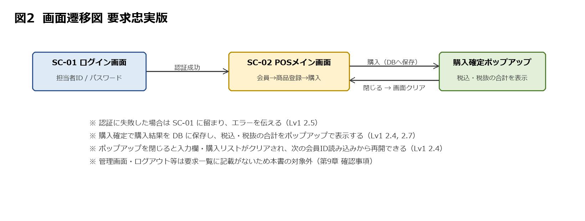
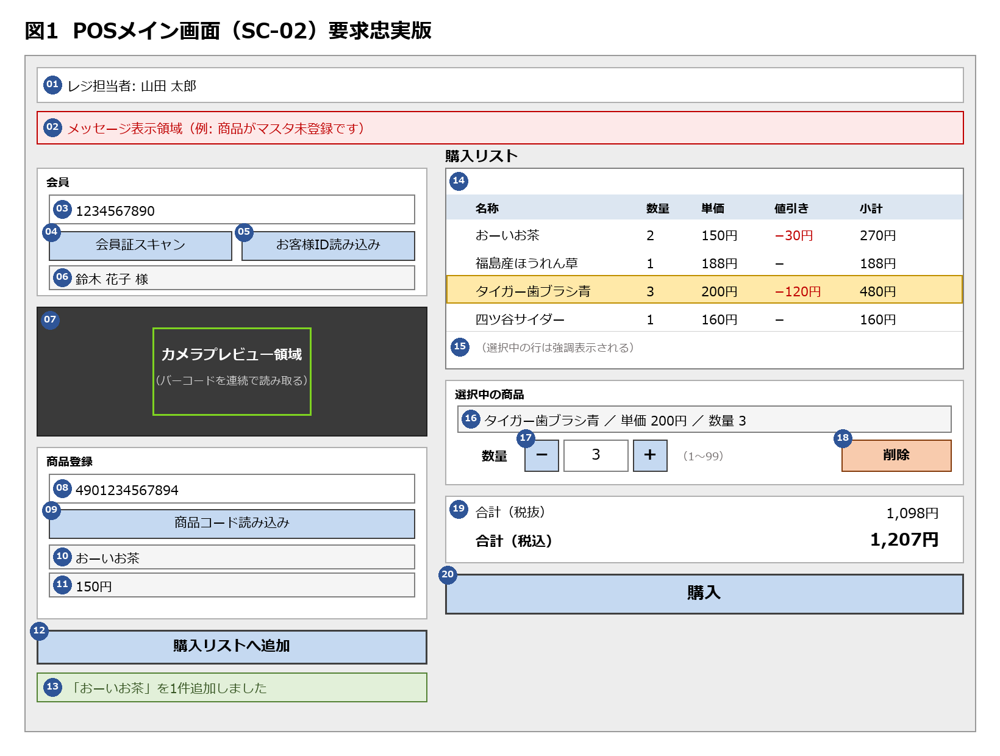

# 要件定義書（要求忠実版）: 簡易POSアプリ（Lv1 + Lv2）

> 本書は Lv1「簡易POSアプリ 要求一覧」および Lv2「簡易POSアプリ改 要求一覧」を入力とし、
> **要求一覧に明文がある事項だけ**を要件として定めたものである。
> 要求一覧に明文がなく実装上決めざるを得ない事項は、本書では決めず、第9章「確認事項」として
> 出題者へ問う形で残す。前版（`Lv2_簡易POSアプリ_要件定義書.md`）で本書が独自に追加していた
> 機能（ログアウト、管理画面、権限、現金決済、監査ログ等）は、すべて本書から除いた。

---

## 1. 背景と目的

### 1.1 背景

本システムは、小売店のレジで用いる簡易 POS アプリである。Lv1 の要求一覧は、商品コードの
手入力による商品登録、購入リストの表示、購入確定とデータベースへの記録、レジ担当者のログイン、
会員IDの入力、消費税の表示を定めた。Lv2 の要求一覧は、これに加えて、カメラによるバーコード
スキャン、購入リストの編集（選択・削除・数量変更）、会員限定の値引き、単価変更に耐える取引記録を
求めている。

店舗の規模・レジの台数・商品点数は要求一覧に記載がないため、本書では想定を置かない。

### 1.2 目的

要求一覧が求めている状態をそのまま目的とする。

1. レジ担当者が、バーコードスキャンまたは手入力で商品を購入リストに登録し、確定前に修正できる
2. 会員特典の値引きと消費税率を、プログラムコードを書き換えずに変更できる
3. 確定した取引が「いつ・何を・いくつ・いくらで・誰が買い・誰が処理したか」として残り、後日の単価変更に影響されない

### 1.3 本書の位置づけ

| 項目 | 内容 |
|---|---|
| 入力 | Lv1「簡易POSアプリ 要求一覧」、Lv2「簡易POSアプリ改 要求一覧」（原文は付録 B） |
| 出力 | 本書（要件定義書 要求忠実版） |
| 読者 | 課題の評価者、および本システムの実装者 |
| 方針 | 要求一覧に明文がある事項のみ要件化する。要求同士の矛盾は解釈を明記する（9.1）。要求に明文がなく決めざるを得ない事項は決めずに確認事項とする（9.3） |
| 前版との関係 | 前版は「実装に着手できる状態」を優先して要求外の機能を追加していた。本書はそれらを除き、要求外の判断を出題者に委ねる |

---

## 2. 対象範囲と前提条件

### 2.1 前提条件（変更不可）

| # | 前提 | 出所 |
|---|---|---|
| P-1 | Web アプリとして動作し、ブラウザからアクセスする | Lv1 1, Lv2 1 |
| P-2 | フロントエンドは Next.js | Lv1 1, Lv2 1 |
| P-3 | バックエンドは FastAPI | Lv1 1, Lv2 1 |
| P-4 | Microsoft Azure 上に構築する。データベースは Azure Database for MySQL Flexible Server を利用する。バックエンドの実行サービスは非機能要求から判断する（第7章） | Lv1 1, Lv2 1 |
| P-5 | カメラ付きデバイス（ノートPC・スマートフォン・タブレット）での利用を前提とし、カメラでバーコードを読み取る | Lv2 1 |

### 2.2 対象範囲

第3章の FR-01〜FR-09、第4章の SC-01〜SC-02、第5章の D-01〜D-08 を対象とする。

### 2.3 対象外

要求一覧に記載がないものは、すべて本書の対象外とする。前版で本書が独自に追加していた次の機能も、
要求一覧に明文がないため対象外に戻す。必要かどうかは出題者に確認する（9.3）。

| 項目 | 要求一覧の記述 |
|---|---|
| ログアウト | なし |
| マスタ・設定の管理画面、管理者権限 | なし（税率・値引きは「コードを書き換えずに変更できる状態」のみ） |
| 現金決済（預かり金額・お釣り）、会計のキャンセル | なし（購入確定は「記録して合計を表示する」まで） |
| 会員IDのクリア | なし |
| 操作ログ・監査ログ、バックアップ、対応ブラウザの指定 | なし |
| 返品・取消、レシート印刷、購入履歴の照会、カード・QR 決済 | なし |

### 2.4 用語

| 用語 | 本書での意味 |
|---|---|
| 商品 | 商品マスタに登録された販売対象。商品コードで識別する |
| 購入リスト | 購入確定前に画面上で編集中の商品の一覧 |
| 取引 | 購入確定 1 回分の記録 |
| 会員 | 会員情報に登録された顧客。会員IDで識別する |
| 値引き | 会員限定・期間限定で特定商品の価格を下げる販促企画 |
| レジ担当者 | ログインしてレジ操作を行う利用者 |
| 読み込み | 会員IDまたは商品コードをシステムに取り込む操作の総称。スキャンと手入力の両方を含む |
| お客様ID | 会員IDの画面上の呼称（Lv1 の画面イメージの表記を踏襲） |

---

## 3. 機能要件（FR）

**凡例**

- 出所欄の `Lv1 2.5` などは、各要求一覧の項番を指す（原文は付録 B）
- ◇ … 要求一覧に明文はないが、要求の文から直接導出した要件。導出の根拠を注記する
- ⚑ … Lv1 の要求を Lv2 が上書きした箇所
- 要求一覧に明文がなく導出もできない事項は要件にせず、第9章 9.3 に置く

### 3.1 Lv1 要求からの変更点

| 論点 | Lv1 の要求 | Lv2 の要求（採用） | 該当要件 |
|---|---|---|---|
| 同一商品の再登録 | 1商品1行とし、x2個としない（Lv1 2.3） | 行を増やさず数量を加算する（Lv2 2.1） | FR-04-4 |
| 会員IDの入力時期 | 買い物を始める前に入力する（Lv1 2.6） | 購入までにいつでも読み込める（Lv2 2.8） | FR-02-3 |
| 商品コードの入力方法（上書きではなく拡張） | 手入力のみ（Lv1 2.2） | バーコードスキャンを追加。手入力も継続（Lv2 2.1） | FR-03-1, FR-03-3 |

Lv2 前提条件の「Lv3ではカメラでの読み取りに対応する」との矛盾は I-1（9.1）で扱う。

### 3.2 FR-01 レジ担当者のログイン

| # | 要件 | 出所 |
|---|---|---|
| FR-01-1 | 担当者は「担当者ID」と「パスワード」を入力してログインする | Lv1 2.5 |
| FR-01-2 | ログイン専用の画面を設け、認証に成功した場合のみ POS 画面へ遷移する | Lv1 2.5 |
| FR-01-3 | 社外の ID 基盤は利用せず、本システム単独で ID・パスワードを管理する | Lv1 2.5 |
| FR-01-4 | 担当者ID またはパスワードが誤っている場合、ログインさせずエラーである旨を伝える | Lv1 2.5 |
| FR-01-5 | ログインした担当者の情報を、その後の取引記録に紐づける | Lv1 2.5 |

### 3.3 FR-02 会員IDの読み込み

| # | 要件 | 出所 |
|---|---|---|
| FR-02-1 | 会員IDをバーコードスキャンで読み込める | Lv2 2.8 |
| FR-02-2 | 会員IDを手入力できる | Lv1 2.6 |
| FR-02-3 ⚑ | 会員IDは購入までの任意のタイミングで読み込める | Lv2 2.8 |
| FR-02-4 | 読み込んだ会員の氏名を画面に表示する | Lv1 画面イメージ ⑩「お客様名表示エリア」 |
| FR-02-5 | 会員IDが未入力のまま購入した場合、エラーとせず会員なしの正常な取引として扱う | Lv2 2.8 |
| FR-02-6 | 入力された会員IDに該当する会員が存在しない場合、その旨を伝える。その後の操作（再入力か、会員なしで続行か）は要求に明文がないため確認事項とする（Q-3） | Lv1 2.6, Lv2 2.8 |
| FR-02-7 | 会員証を持たない客の場合、会員IDを入力せずに「お客様ID読み込みボタン」を押して商品登録・購入へ進める | Lv1 2.6 |

### 3.4 FR-03 商品の検索

| # | 要件 | 出所 |
|---|---|---|
| FR-03-1 | カメラでバーコードを読み取り、商品コードとして認識する | Lv2 2.1 |
| FR-03-2 | スキャンは連続して行える。1 回読み取るごとにスキャンを終了させない | Lv2 2.1 |
| FR-03-3 | 商品コードの手入力にも対応する | Lv1 2.2, Lv2 2.1 |
| FR-03-4 | 商品コードに一致する商品が商品マスタに存在する場合、名称と単価を画面に表示する | Lv1 2.2 |
| FR-03-5 | 一致する商品が存在しない場合、「商品がマスタ未登録です」旨をユーザーに伝える | Lv1 2.2 |
| FR-03-6 | 読み取りに成功した際、1 件追加されたことがわかるフィードバックを示す | Lv2 2.1 |

### 3.5 FR-04 購入リストへの追加

| # | 要件 | 出所 |
|---|---|---|
| FR-04-1 | 検索した商品を購入リストへ追加する | Lv1 2.1 |
| FR-04-2 | 追加後、コード入力・名称表示・単価表示の内容をクリアし、次の商品を登録できる状態に戻す | Lv1 2.3 |
| FR-04-3 | 商品登録は何度でも繰り返せる | Lv1 2.3 |
| FR-04-4 ⚑ | 既に購入リストにある商品を続けて登録した場合、新しい行を増やさず、その商品の数量を増やす | Lv2 2.1 |
| FR-04-5 | 購入リストにない商品を登録した場合、新しい行として追加する | Lv2 2.1 |
| FR-04-6 | 手入力で確定した場合の挙動（新規追加か数量加算か）は、スキャンの場合と同じ考え方に揃える | Lv2 2.1 |
| FR-04-7 | 購入リストは、商品ごとに名称・数量・単価・小計がわかる表示とする | Lv1 2.1 |

### 3.6 FR-05 購入リストの操作

| # | 要件 | 出所 |
|---|---|---|
| FR-05-1 | 購入リストの中から特定の 1 商品を選択できる | Lv2 2.2 |
| FR-05-2 | 選択した商品は、他の行と見分けがつくよう表示する（強調表示など） | Lv2 2.2 |
| FR-05-3 | 選択した商品の情報（名称・単価・数量など）を、選択操作に応じて画面上に表示する | Lv2 2.2 |
| FR-05-4 | 選択状態の商品を購入リストから削除できる | Lv2 2.3 |
| FR-05-5 | 選択状態の商品の数量を後から変更できる | Lv2 2.4 |
| FR-05-6 | 数量は最低 1 個以上とし、0 個にはできない。0 にする操作は削除で行う | Lv2 2.4 |
| FR-05-7 | 数量は最大 99 個までとする | Lv2 2.4 |
| FR-05-8 | 数量を変更したら、その商品の小計・購入リスト全体の合計金額に反映する | Lv2 2.4 |

数量の変更方式（直接入力かボタンか）、99 を超える値が指定された場合の挙動は要求に明文がない（Q-1, Q-2）。

### 3.7 FR-06 会員特典の値引き

| # | 要件 | 出所 |
|---|---|---|
| FR-06-1 | 会員に限り、特定の商品に対して、期間を定めた値引き（販促企画）を適用する | Lv2 2.5 |
| FR-06-2 | 割合で引く形式（例: 20%引き）に対応する | Lv2 2.5 |
| FR-06-3 | 金額で引く形式（例: 20円引き）に対応する | Lv2 2.5 |
| FR-06-4 | 値引きには適用期間があり、期間内にのみ適用する | Lv2 2.5 |
| FR-06-5 | 値引きが適用された商品は、購入リスト上でどのくらい値引きされたかがわかるように表示する | Lv2 2.5 |
| FR-06-6 | 値引きの対象商品・適用期間・値引き内容は、消費税率と同様に、プログラムコードを書き換えなくても変更・追加できる状態にしておく | Lv2 2.5 |
| FR-06-7 ◇ | 商品を購入リストへ追加した後に会員IDを読み込んだ場合も、登録済みの商品に値引きを適用する | Lv2 2.8「値引きは購入までに会員IDを入力すれば適用できる」から導出。Lv2 4 の論点 |

端数処理、値引きと消費税の適用順序、同一商品に複数の値引きが該当する場合の扱いは要求に明文がない（Q-6〜Q-8）。

### 3.8 FR-07 消費税の計算・表示

| # | 要件 | 出所 |
|---|---|---|
| FR-07-1 | 購入確定時、税込みと税抜きの両方の合計金額を提示する | Lv1 2.7, Lv2 2.9 |
| FR-07-2 | 消費税率は、プログラムコードを書き換えなくても変更できる状態にしておく（税率をデータとして持つ） | Lv1 2.8, Lv2 2.9 |

### 3.9 FR-08 購入の確定

| # | 要件 | 出所 |
|---|---|---|
| FR-08-1 | 購入リストの内容を確定すると、購入結果をデータベースに保存する | Lv1 2.4 |
| FR-08-2 | 保存内容から「いつ・何を・いくつ・いくらで・誰が買い・誰がレジ処理したか」を後から確認できる | Lv1 2.4 |
| FR-08-3 | 購入確定後、税込みの合計金額をポップアップ等でユーザーに表示する（FR-07-1 により税抜きも併せて提示する） | Lv1 2.4, 2.7 |
| FR-08-4 | ポップアップを閉じる操作により、コード入力・名称表示・単価表示・購入リストの内容をクリアし、次の会員ID登録から再開できる状態に戻す | Lv1 2.4 |
| FR-08-5 | すでに購入が確定した過去の取引は、その後に商品マスタの単価が変更されても、購入した当時の単価のまま記録が変わらない | Lv2 2.6 |

購入リストが空の状態で確定操作をした場合の挙動は要求に明文がない（Q-4）。

### 3.10 FR-09 設定の変更可能性

| # | 要件 | 出所 |
|---|---|---|
| FR-09-1 | 消費税率は、プログラムコードを書き換えなくても変更できる状態で保持する。変更の手段（設定ファイル、データベースの直接更新、管理画面のいずれか）は要求に明文がないため本書では定めない | Lv1 2.8 |
| FR-09-2 | 値引きの対象商品・適用期間・値引き内容も同様に、プログラムコードを書き換えなくても変更・追加できる状態で保持する。手段は同上 | Lv2 2.5 |

変更の手段と、変更できる利用者の範囲は確認事項とする（Q-9, Q-10）。

---

## 4. 画面要件

画面要素には `SC-<画面番号>-<要素番号>` の識別子を与える。画面要素の多くは Lv1 の画面イメージ
（付録 A）に由来し、Lv2 で追加された操作に対応する要素を加えている。要素の配置・見た目は
要求に明文がないため、図は一例である。

### 4.1 画面一覧

| 画面番号 | 画面名 | 出所 |
|---|---|---|
| SC-01 | ログイン画面 | Lv1 2.5「ログイン専用の画面を用意し」 |
| SC-02 | POS メイン画面 | Lv1 2.1、Lv1 画面イメージ、Lv2 2.1〜2.5 |

### 4.2 画面遷移

| 遷移元 | 契機 | 遷移先 | 出所 |
|---|---|---|---|
| SC-01 | 認証成功 | SC-02 | Lv1 2.5 |
| SC-01 | 認証失敗 | SC-01（留まりエラーを伝える） | Lv1 2.5 |
| SC-02 | 購入確定 | データベースへ保存し、ポップアップで合計を表示 | Lv1 2.4 |
| ポップアップ | 閉じる | SC-02（入力欄・購入リストをクリア） | Lv1 2.4 |

### 4.3 SC-01 ログイン画面

| # | 要素 | 出所 |
|---|---|---|
| SC-01-01 | 担当者ID入力欄 | Lv1 2.5 |
| SC-01-02 | パスワード入力欄 | Lv1 2.5 |
| SC-01-03 | ログイン操作 | Lv1 2.5 |
| SC-01-04 | エラーを伝える表示 | Lv1 2.5 |

### 4.4 SC-02 POS メイン画面

| # | 図 | 要素 | 対応要件 | 出所 | Lv1図 |
|---|---|---|---|---|---|
| SC-02-01 | 01 | レジ担当者の情報の表示 | FR-01-5 | Lv1 2.1 | ※ |
| SC-02-02 | 02 | メッセージ表示（未登録・不存在などを伝える場所） | FR-03-5, FR-02-6 | Lv1 2.2, 2.6（伝えることを要求。場所は一例） | — |
| SC-02-03 | 03 | お客様ID入力エリア | FR-02-2 | Lv1 2.6 | ⑧ |
| SC-02-04 | 04 | 会員証スキャン操作 | FR-02-1 | Lv2 2.8 | — |
| SC-02-05 | 05 | お客様ID読み込みボタン（未入力のまま押すと会員なしで進む） | FR-02-2, FR-02-7 | Lv1 2.6 | ⑨ |
| SC-02-06 | 06 | お客様名表示エリア | FR-02-4 | Lv1 画面イメージ | ⑩ |
| SC-02-07 ◇ | 07 | カメラプレビュー領域（連続スキャンのため常時表示） | FR-03-1, FR-03-2 | Lv2 2.1「連続して行える」から導出 | — |
| SC-02-08 | 08 | 商品コード入力エリア | FR-03-3 | Lv1 2.1 | ② |
| SC-02-09 | 09 | 商品コード読み込みボタン | FR-03-3 | Lv1 2.1 | ① |
| SC-02-10 | 10 | 名称表示エリア | FR-03-4 | Lv1 2.1 | ③ |
| SC-02-11 | 11 | 単価表示エリア | FR-03-4 | Lv1 2.1 | ④ |
| SC-02-12 | 12 | 購入リストへ追加ボタン | FR-04-1 | Lv1 2.1 | ⑤ |
| SC-02-13 | 13 | 追加されたことを示すフィードバック | FR-03-6 | Lv2 2.1 | — |
| SC-02-14 | 14 | 購入品目リスト（名称・数量・単価・値引き・小計） | FR-04-7, FR-06-5 | Lv1 2.1, Lv2 2.5 | ⑥ |
| SC-02-15 | 15 | 選択行の強調表示 | FR-05-1, FR-05-2 | Lv2 2.2 | — |
| SC-02-16 | 16 | 選択中の商品情報の表示 | FR-05-3 | Lv2 2.2 | — |
| SC-02-17 | 17 | 数量変更の操作（方式は Q-1） | FR-05-5〜7 | Lv2 2.4 | — |
| SC-02-18 | 18 | 削除操作 | FR-05-4 | Lv2 2.3 | — |
| SC-02-19 ◇ | 19 | 合計金額の表示 | FR-05-8 | Lv2 2.4「購入リスト全体の合計金額に反映」から導出 | — |
| SC-02-20 | 20 | 購入ボタン | FR-08-1 | Lv1 2.1 | ⑦ |
| SC-02-21 | — | 購入確定ポップアップ（税込・税抜の合計を表示。閉じる操作で画面をクリア） | FR-08-3, FR-08-4, FR-07-1 | Lv1 2.4, 2.7 | — |

> 「Lv1図」欄は Lv1 の画面イメージ（付録 A）の注釈番号。「※」は注釈番号なしで描かれていた要素、
> 「—」は Lv1 の画面イメージに存在しない要素（Lv2 の要求に対応して追加）。

スキャンした商品を追加ボタンなしで自動的にリストへ入れるか、手入力と同じく追加ボタンを要するかは
要求に明文がない（Q-5）。

---

## 5. データ要件

保持すべき情報を定める。テーブル構造は実装設計に委ねる。

### 5.1 データ全体に対する制約

| # | 制約 | 出所 |
|---|---|---|
| DR-1 | 確定済みの取引は、その後の商品マスタの単価変更の影響を受けない | Lv2 2.6 |
| DR-2 | 取引は会員に紐づかない状態（会員なし）を許容する | Lv2 2.8 |
| DR-3 | すべての取引について「いつ・何を・いくつ・いくらで・誰が買い・誰が処理したか」を後から確認できる | Lv1 2.4 |
| DR-4 | 消費税率、値引きの対象商品・適用期間・値引き内容は、プログラムコードではなくデータとして保持する | Lv1 2.8, Lv2 2.5 |

### 5.2 保持する情報

| # | 情報 | 項目 | 出所 |
|---|---|---|---|
| D-01 | 担当者 | 担当者ID、パスワード、表示用の情報（Lv1 画面イメージでは氏名） | Lv1 2.5, 2.1 |
| D-02 | 商品 | 商品コード、名称、単価 | Lv1 2.2 |
| D-03 | 会員 | 会員ID、氏名、電話番号、住所、性別、年齢 | Lv1 2.6, Lv2 2.8 |
| D-04 | 取引 | 購入日時、レジ処理した担当者、購入した会員（会員なしを許容）、税抜合計、消費税額、税込合計 | Lv1 2.4, 2.7 |
| D-05 | 取引の明細 | 商品、購入時点の単価、数量、値引き額、小計 | Lv1 2.4, Lv2 2.5, 2.6 |
| D-06 | 消費税率 | 税率 | Lv1 2.8 |
| D-07 | 値引き | 対象商品、適用期間、値引きの形式（割合／金額）と値 | Lv2 2.5 |
| D-08 | 値引きの適用と単価変更の履歴 | どの取引明細にどの値引きが適用されたか。単価変更の履歴 | Lv2 3「値引き適用や単価変更の履歴を含む」 |

パスワードの保持方法、「年齢」を年齢のまま持つか生年月日で持つか、税率変更の履歴の持ち方、
商品名称が変更された場合の過去記録の扱い、マスタから削除された商品・会員を含む取引の扱いは
要求に明文がない（Q-11〜Q-15）。

---

## 6. 非機能要件（NFR）

| # | 分類 | 要件 | 出所 |
|---|---|---|---|
| N-01 | 構成 | 検索・スキャン・購入などの処理は、フロントエンド（Next.js）とバックエンド（FastAPI）で役割分担して実現する（API 連携） | Lv1 3, Lv2 3 |
| N-02 | データ保全 | 購入データは失われてはならない。購入確定時にデータベースへ永続化する。値引き適用や単価変更の履歴を含む | Lv1 3, Lv2 3 |
| N-03 | 応答速度 | レジとしての利用中、営業時間内は常に同じような応答速度で動作する。アクセスが久しぶりにあった瞬間だけ極端に遅くなる挙動を避ける | Lv1 3, Lv2 3 |
| N-04 | 接続維持 | バックエンドは、データベースとの接続を 1 リクエストごとに一から確立し直すのではなく、ある程度維持した状態で運用する。処理のたびに実行環境がゼロから立ち上がる構成を避ける | Lv1 3, Lv2 3 |
| N-05 | 対応デバイス | カメラ付きのノートPC・スマートフォン・タブレットで利用できる | Lv2 1 |

応答速度の数値目標、複数レジ端末の同時利用、セキュリティ要件（通信の暗号化、パスワードの保護等）、
バックアップ、対応ブラウザは要求に明文がない（Q-16〜Q-19）。

---

## 7. 要素技術の選定

前提条件で指定された技術はそのまま採用する。要求一覧が「自分たちで判断すること」と委ねているのは
バックエンドの実行サービスであり、N-03・N-04 を判断基準とする。

| レイヤー | 選定 | 根拠 |
|---|---|---|
| フロントエンド | Next.js | P-2 |
| バックエンド | FastAPI | P-3 |
| データベース | Azure Database for MySQL Flexible Server | P-4 |
| バックエンド実行環境 | Azure App Service（Always On 有効） | N-03（久しぶりのアクセスで遅くならない）と N-04（接続を維持する）を満たす常駐型。Azure Functions の従量課金は「処理のたびに実行環境がゼロから立ち上がる」構成に当たり、要求が避けたいとするものそのもの |
| バーコード読み取り | ブラウザ上でカメラ映像を読み取る | P-5。ライブラリの選定は実装設計に委ねる |

---

## 8. 要求と要件の対応表

### 8.1 Lv1 要求一覧との対応

| 項番 | 要求（要約） | 対応 |
|---|---|---|
| 1 | Web アプリとして動作 | P-1 |
| 1 | フロントエンド Next.js | P-2 |
| 1 | バックエンド FastAPI | P-3 |
| 1 | Azure 上に構築。DB は MySQL Flexible Server。バックエンドのサービスは自分たちで判断 | P-4, 第7章 |
| 2.1 | 商品コードを入力する場所 | SC-02-08 |
| 2.1 | 入力したコードで商品を検索する操作 | SC-02-09, FR-03-3 |
| 2.1 | 商品の名称を表示する場所 | SC-02-10, FR-03-4 |
| 2.1 | 商品の単価を表示する場所 | SC-02-11, FR-03-4 |
| 2.1 | 検索結果を購入リストに追加する操作 | SC-02-12, FR-04-1 |
| 2.1 | 購入リスト（名称・数量・単価・小計） | SC-02-14, FR-04-7 |
| 2.1 | 購入を確定する操作 | SC-02-20, FR-08-1 |
| 2.1 | ログインしているレジ担当者の情報 | SC-02-01, FR-01-5, D-01 |
| 2.1 | お客様の会員IDの表示 | SC-02-03, SC-02-06, FR-02-4 |
| 2.2 | 一致する商品があれば名称・単価を表示 | FR-03-4 |
| 2.2 | 一致する商品がなければ「マスタ未登録」を伝える | FR-03-5, SC-02-02 |
| 2.3 | 追加後にコード入力・名称・単価をクリア | FR-04-2 |
| 2.3 | 商品登録は何度でも繰り返せる | FR-04-3 |
| 2.3 ⚑ | x2個とせず 1 商品 1 行 | Lv2 2.1 により上書き → FR-04-4（3.1, I-2） |
| 2.4 | 確定すると DB に保存 | FR-08-1, N-02 |
| 2.4 | いつ・何を・いくつ・いくらで・誰が買い・誰が処理したかが残る | FR-08-2, DR-3, D-04, D-05 |
| 2.4 | 確定後に税込合計をポップアップで表示 | FR-08-3, SC-02-21 |
| 2.4 | ポップアップを閉じると画面をクリアし、次の会員ID登録から再開 | FR-08-4, SC-02-21 |
| 2.5 | 担当者ID・パスワードでログイン | FR-01-1, SC-01-01〜03 |
| 2.5 | ログイン専用画面。成功で POS 画面へ | FR-01-2, SC-01 |
| 2.5 | 社外 ID 基盤を使わず単独で管理 | FR-01-3 |
| 2.5 | 誤った ID・パスワードはエラー | FR-01-4, SC-01-04 |
| 2.5 | 担当者情報を取引記録に紐づける | FR-01-5, D-04 |
| 2.6 ⚑ | 買い物を始める前に会員IDを入力する | Lv2 2.8 により上書き → FR-02-3（3.1, I-3） |
| 2.6 | 会員ID・氏名・電話番号・住所・性別・年齢が登録済み | D-03 |
| 2.6 | 存在しない会員IDの扱いを考慮 | FR-02-6, Q-3 |
| 2.6 ⚑ | 会員IDを手入力してから商品登録・購入へ進む順序 | 手入力は FR-02-2、順序は Lv2 2.8 により上書き（I-3） |
| 2.6 | 会員IDを持たない客はボタンを押して進む | FR-02-7, SC-02-05（I-5） |
| 2.7 | 税込・税抜の両方の合計を表示 | FR-07-1, SC-02-21 |
| 2.8 | 税率をデータとして持ち、コード改修なしで変更可能 | FR-07-2, FR-09-1, D-06, DR-4 |
| 3 | フロントとバックで役割分担（API 連携） | N-01 |
| 3 | 購入データは失われない。確定時に DB へ永続化 | N-02 |
| 3 | 営業時間内は同じ応答速度。久しぶりのアクセスで遅くならない | N-03, 第7章 |
| 3 | DB 接続を維持。処理ごとにゼロから立ち上がる構成を避ける | N-04, 第7章 |
| 画面イメージ | 注釈 ①〜⑩ | 4.4 の「Lv1図」列 |

### 8.2 Lv2 要求一覧との対応

| 項番 | 要求（要約） | 対応 |
|---|---|---|
| 1 | Web / Next.js / FastAPI / Azure（Lv1 と同じ） | P-1〜P-4 |
| 1 | カメラ付きデバイスでの利用。カメラでバーコードを読み取る（「Lv3」の記載あり） | P-5, N-05（解釈は I-1） |
| 2.1 | カメラでバーコードを読み取り商品コードとして認識 | FR-03-1, SC-02-07 |
| 2.1 | 認識成功時に「1件追加された」フィードバック | FR-03-6, SC-02-13 |
| 2.1 | スキャンは連続して行える | FR-03-2, SC-02-07 |
| 2.1 | 既にある商品は数量を増やす | FR-04-4 |
| 2.1 | ない商品は新しい行で追加 | FR-04-5 |
| 2.1 | 手入力にも対応し、挙動をスキャンと揃える | FR-03-3, FR-04-6 |
| 2.2 | 特定の 1 商品を選択できる | FR-05-1 |
| 2.2 | 選択した商品を強調表示 | FR-05-2, SC-02-15 |
| 2.2 | 選択した商品の情報を表示 | FR-05-3, SC-02-16 |
| 2.3 | 選択状態の商品を削除 | FR-05-4, SC-02-18 |
| 2.4 | 選択状態の商品の数量を後から変更 | FR-05-5, SC-02-17 |
| 2.4 | 数量は 1 以上。0 にはできない（削除で行う） | FR-05-6 |
| 2.4 | 数量は最大 99 | FR-05-7（超過時の挙動は Q-2） |
| 2.4 | 変更を小計・合計に反映 | FR-05-8, SC-02-19 |
| 2.5 | 会員に限り、特定商品に期間を定めた値引き | FR-06-1, FR-06-4, D-07 |
| 2.5 | 割合形式と金額形式の両方 | FR-06-2, FR-06-3, D-07 |
| 2.5 | 値引き額がわかるように表示 | FR-06-5, SC-02-14 |
| 2.5 | 対象・期間・内容をコード改修なしで変更・追加 | FR-06-6, FR-09-2, D-07, DR-4 |
| 2.6 | 単価は将来変更される | D-02 |
| 2.6 | 確定済み取引は当時の単価のまま。過去の売上金額が変わらない | FR-08-5, D-05, DR-1 |
| 2.7 | レジ担当者のログイン（Lv1 継続） | FR-01 |
| 2.8 | 会員IDをバーコードスキャンで購入までにいつでも読み込める | FR-02-1, FR-02-3, SC-02-04 |
| 2.8 | 購入までに会員IDを入力すれば値引きを適用 | FR-06-7 |
| 2.8 | 氏名・電話番号・住所・性別・年齢が登録済み | D-03 |
| 2.8 | 会員ID未入力のまま購入は会員なしの正常取引 | FR-02-5, DR-2 |
| 2.8 | 存在しない会員IDの扱いを考慮 | FR-02-6, Q-3 |
| 2.9 | 消費税の表示・変更対応（Lv1 継続） | FR-07 |
| 3 | フロントとバックで役割分担 | N-01 |
| 3 | データは失われない。値引き適用・単価変更の履歴を含む | N-02, D-08 |
| 3 | 営業時間内は同じ応答速度 | N-03 |
| 3 | DB 接続を維持した運用 | N-04 |
| 4 | 同じ商品を連続スキャンしたとき、どう見つけるか | FR-04-4（実現方法は設計） |
| 4 | 選択中の商品をどこで管理するか | FR-05-1（実現方法は設計） |
| 4 | 会員ID入力前にスキャンした商品への値引き適用 | FR-06-7 |

### 8.3 対応の確認

- Lv1 の要求項目 39 行、Lv2 の要求項目 36 行は、すべて本書の要件・画面要素・データ項目に対応する
- 要求一覧に明文がない要件は、導出した 3 件（◇: FR-06-7, SC-02-07, SC-02-19）のみ。それ以外の要求外事項は要件にせず 9.3 に置いた

---

## 9. 解釈と確認事項

### 9.1 要求一覧の矛盾・曖昧さと本書の解釈

要求一覧を読むうえで避けられない解釈。いずれも要求一覧の文面を根拠にしている。

| # | 事項 | 要求一覧の記述 | 本書の解釈 | 該当 |
|---|---|---|---|---|
| I-1 | カメラスキャンの実装レベル | Lv2 前提条件は「Lv3ではカメラでの読み取りに対応する」、Lv2 機能要求 2.1 はカメラ読み取りの振る舞いを定義 | 機能要求 2.1 が振る舞いまで定義しているため **Lv2 で実装する**。前提条件の「Lv3」は記載誤りと判断。要確認 | FR-03-1 |
| I-2 | 同一商品の再登録 | Lv1 2.3「1商品1行」と Lv2 2.1「数量を増やす」 | Lv2 が上書き。**数量加算** | FR-04-4 |
| I-3 | 会員IDの入力時期 | Lv1 2.6「買い物を始める前に」と Lv2 2.8「購入までにいつでも」 | Lv2 が上書き。**いつでも** | FR-02-3 |
| I-4 | 「レジ担当者の情報」の表示内容 | Lv1 2.1 は項目を特定していない | Lv1 画面イメージの注釈「レジ担当者名表示エリア」から**氏名** | SC-02-01, D-01 |
| I-5 | 「お客様ID読み込みボタン」の役割 | Lv1 2.6「会員IDを持たない客は入力不要でボタンを押して進む」 | 入力があれば読み込み、未入力なら会員なしで進む**二役** | FR-02-7, SC-02-05 |

### 9.2 要求から導出した要件（◇）

| # | 導出した要件 | 根拠 |
|---|---|---|
| FR-06-7 | 商品登録後に会員IDを読み込んだ場合も値引きを適用 | Lv2 2.8「購入までに会員IDを入力すれば適用できる」が、商品登録後の読み込みを許容している |
| SC-02-07 | カメラプレビューを常時表示 | Lv2 2.1「1回ごとにスキャンを終了させず、続けて次の商品を読み取れる」 |
| SC-02-19 | 合計金額の表示 | Lv2 2.4「購入リスト全体の合計金額に反映されること」は、合計が表示されていることを前提とする |

### 9.3 出題者への確認事項

要求一覧に明文がなく、実装に着手するには決める必要がある事項。本書では決めず、選択肢を添えて問う。
前版で本書が独自に決めていた事項は、ここに戻した。

| # | 確認事項 | 選択肢の例 | 影響 |
|---|---|---|---|
| Q-1 | 数量変更の操作方式 | 直接入力／増減ボタン／両方 | SC-02-17 |
| Q-2 | 数量が 99 を超える操作をした場合の挙動（数量変更・連続スキャンの両方） | 拒否して上限を伝える／99 に丸める | FR-05-7 |
| Q-3 | 存在しない会員IDを読み込んだ後の操作 | 再入力を求める／会員なしで続行できる／両方 | FR-02-6 |
| Q-4 | 購入リストが空のまま購入操作をした場合 | 拒否して伝える／操作を無効化 | FR-08-1 |
| Q-5 | スキャンで読み取った商品を、追加ボタンなしで自動的にリストへ入れるか | 自動追加／手入力と同じく追加ボタン | FR-03-6, FR-04-1 |
| Q-6 | 消費税の端数処理と計算単位 | 切り捨て／四捨五入、明細ごと／合計に対して | FR-07-1, D-04 |
| Q-7 | 割合値引きの端数処理、値引きと課税の順序 | 切り捨て、値引き後に課税 など | FR-06, FR-07 |
| Q-8 | 同一商品に複数の値引きが該当する場合 | 最大額の 1 件／すべて適用／登録時に重複を禁止 | FR-06-1 |
| Q-9 | 税率・値引きを変更する手段 | 設定ファイル／DB を直接更新／管理画面を設ける | FR-09 |
| Q-10 | 変更できる利用者の範囲（レジ担当者にも許すか） | 全員／特定の担当者のみ（権限区分が必要） | FR-09 |
| Q-11 | パスワードの保持方法 | ハッシュ化して保持／指定なし | D-01 |
| Q-12 | 会員の「年齢」の保持方法 | 年齢のまま／生年月日を保持して算出 | D-03 |
| Q-13 | 税率変更の履歴（変更後、過去の取引の税額をどう扱うか） | 取引に適用税率を記録／記録しない | D-04, D-06 |
| Q-14 | 商品名称が変更された場合の過去の取引記録 | 名称も購入時点で写し取る／最新名称を表示 | D-05 |
| Q-15 | マスタから削除した商品・会員を含む過去の取引 | 論理削除で残す／削除を禁止／物理削除を許す | D-02, D-03 |
| Q-16 | 応答速度の数値目標 | 例: 商品検索 1 秒以内 など | N-03 |
| Q-17 | 複数のレジ端末が同時に利用されることを想定するか | 想定する（取引 ID の一意性等が必要）／1 台 | N-01, D-04 |
| Q-18 | セキュリティ要件（通信の暗号化、パスワード保護、権限）をどこまで求めるか | — | 全体 |
| Q-19 | バックアップ、操作ログ、対応ブラウザの指定の要否 | — | 非機能 |
| Q-20 | 前版が追加していた機能（ログアウト、会員IDのクリア、現金決済とお釣り、会計のキャンセル、管理画面）の要否 | 必要／不要 | 2.3 |
| Q-21 | バーコードの規格・桁数（商品・会員証） | JAN 13 桁 など。Lv1 画面イメージは 11 桁の例 | FR-02-1, FR-03-1 |

---

## 10. 変更履歴

| 版 | 日付 | 内容 |
|---|---|---|
| v1.0 | 2026-09-09 | 要求忠実版として作成。前版（v1.2）から、要求一覧に明文のない機能・仕様（ログアウト、管理画面と権限、現金決済、会員IDクリア、監査ログ、バックアップ、応答速度目標値、KGI/KPI、店舗規模の想定、セキュリティ要件等）を除き、実装上決めざるを得ない事項は決定ではなく確認事項（Q-1〜Q-21）に戻した。要求から直接導出した要件は ◇ 3 件のみ。図 2 枚を作り直した |

---

## 付録 A. Lv1 要求一覧の画面イメージ（転載）

Lv1 要求一覧に含まれていた画面イメージを転載する。第4章 4.4 の「Lv1図」欄の注釈番号
（①〜⑩）はこの図を指す。

図中に描かれた注釈は ①〜⑦ である。原文の画像には、これに加えて次の注釈がテキストボックスとして
重ねて配置されていた（画像には含まれないため、ここに転記する）。

- ⑧ お客様ID入力エリア
- ⑨ お客様ID読み込みボタン
- ⑩ お客様名表示エリア
- レジ担当者名表示エリア（番号なし）

4.4 の「Lv1図」欄の ⑧⑨⑩ と ※ は、この転記を指す。

---

## 付録 B. 要求一覧の原文（転記）

本書の入力である 2 つの要求一覧を、対応表（第8章）との突き合わせのために転記する。
項番は原文のまま。

### B.1 Lv1 要求一覧（簡易POSアプリ）

このドキュメントには「何を作るべきか（要求）」だけを記載しています。API仕様やDBテーブル設計などの「どう作るか（実装設計）」はあえて含めていません。画面イメージや処理の流れから、必要なAPI・データ構造は自分で考えて設計してください。

**1. 前提条件（変更不可）**
- Webアプリとして動作すること（ブラウザからアクセス）
- フロントエンド：Next.js
- バックエンド：FastAPI
- インフラ：Microsoft Azure上で構築する（データベースはAzure Database for MySQL Flexible Serverを利用する。バックエンドをAzure上のどのサービスで動かすかは、後述の要求から自分たちで判断すること）

**2. 機能要求**

2.1 画面に必要な要素
- 商品コードを入力する場所
- 入力したコードで商品を検索する操作（読み込み）
- 検索した商品の「名称」を表示する場所
- 検索した商品の「単価」を表示する場所
- 検索結果を購入リストに追加する操作
- 追加された商品を一覧表示する購入リスト（名称・数量・単価・小計がわかること）
- 購入を確定する操作
- POSシステムにログインしているレジ担当者の情報
- お客様の会員IDの表示

2.2 商品検索の振る舞い
- 入力された商品コードに一致する商品が商品マスタに存在する場合、名称・単価を画面に表示する。
- 一致する商品が存在しない場合、「商品がマスタ未登録です」といった旨をユーザーに伝える。

2.3 購入リストへの追加の振る舞い
- 商品を購入リストに追加すると、コード入力・名称表示・単価表示の内容はクリアされる（次の商品を続けて登録できる状態に戻る）。
- 商品登録は何度でも繰り返せるが、x2個とせず、1商品1行の表示とする。

2.4 購入確定の振る舞い
- 購入リストの内容を確定すると、購入結果はデータベースに保存されなければならない。
- 保存する際、少なくとも「いつ・何を・いくつ・いくらで誰が買って誰がレジの処理をしたか」が後から分かる状態で残す必要がある。
- 購入確定後、税込みの合計金額をポップアップ等でユーザーに表示する。
- ユーザーがそのポップアップを閉じる操作をすると、画面上のコード入力・名称表示・単価表示・購入リストの内容がクリアされ、次の会員ID登録から再開できる状態に戻る。

2.5 レジ担当者のログイン
- レジ業務を開始する前に、担当者は「担当者ID」と「パスワード」を入力してログインする。
- ログイン専用の画面を用意し、正常にログインするとPOSアプリ画面に遷移する。
- 社外のID基盤（会社の統一ログインの仕組みなど）は利用せず、このシステム単独でID・パスワードを管理する。
- 誤った担当者IDまたはパスワードが入力された場合、ログインさせずエラーであることを伝える。
- ログインした担当者の情報は、その後の取引記録に紐づく想定である。

2.6 会員情報の取り扱い
- 買い物を始める前に、会員カードの番号（会員ID）をシステムに入力するステップがある。
- 会員には、会員ID・氏名・電話番号・住所・性別・年齢といった情報が登録済みの前提である。
- 入力された会員IDに対応する会員が存在しない場合の扱いも考慮する必要がある。
- 会員IDを手入力してから商品登録・購入へ進む、という順序がある。
- 会員IDを持っていないお客様は、入力不要で「お客様ID読み込みボタン」を押して商品登録・購入へ進む。

2.7 消費税の表示
- 購入確定時、税込み・税抜きの両方の合計金額をユーザーに提示すること。

2.8 消費税率の変更への備え
- 消費税率は将来変わる可能性がある。税率が変わった際、アプリのプログラムコードそのものを書き換えなくても対応できる状態にしておくこと（＝税率はどこかに"データとして"持たせ、変更可能にする）。

**3. 非機能・その他の要求**
- 検索や購入などの処理は、フロントエンド（Next.js）とバックエンド（FastAPI）で役割分担して実現すること（API連携が必要）。
- 購入データは失われてはならない（購入確定時にDBへの永続化が必須）。
- レジとしての利用中、営業時間内は常に同じような応答速度で動作すること。アクセスが久しぶりにあった瞬間だけ極端に遅くなる、といった挙動は避けたい。
- バックエンドは、DBとの接続を1リクエストごとに一から確立し直すのではなく、ある程度接続を維持した状態で運用することが望ましい（＝処理のたびに実行環境がゼロから立ち上がるような構成は避けたい）。

### B.2 Lv2 要求一覧（簡易POSアプリ改）

このドキュメントには「何を作るべきか（要求）」だけを記載しています。API仕様やDBテーブル設計などの「どう作るか（実装設計）」はあえて含めていません。Lv1の要求はすべて引き継いだ上で、Lv2として追加・変更される要求のみをまとめています。Lv1一覧とあわせて読んでください。

**1. 前提条件（変更不可）**
- Webアプリとして動作すること（ブラウザからアクセス）
- フロントエンド：Next.js
- バックエンド：FastAPI
- インフラ：Microsoft Azure上で構築する（データベースはAzure Database for MySQL Flexible Serverを利用する。バックエンドをAzure上のどのサービスで動かすかは、非機能要求から自分たちで判断すること）
- カメラ付きデバイス（ノートPC・スマホ・タブレット）での利用を前提とする。カメラでバーコードを読み取れること（Lv1ではコード手入力のみだったが、Lv3ではカメラでの読み取りに対応する）

**2. 機能要求（Lv1からの変更点・追加点）**

2.1 バーコードスキャンによる商品登録
- カメラでバーコードを読み取り、商品コードとして認識できること。
- 認識に成功したら、ユーザーに「1件追加された」ことがわかるフィードバックを示すこと。
- スキャンは連続して行えること（1回ごとにスキャンを終了させず、続けて次の商品を読み取れる）。
- すでに購入リストにある商品を続けてスキャンした場合は、新しい行を増やすのではなく、その商品の数量を増やすこと。
- 購入リストにない商品をスキャンした場合は、新しい行として購入リストに追加すること。
- 商品コードの手入力にも対応すること。手入力で確定した場合の挙動（新規追加か数量加算か）は、スキャンの場合と同じ考え方に揃えること。

2.2 購入リストの商品を選択する
- 購入リストの中から、特定の1商品を選択できること。
- 選択した商品は、他の行と見分けがつくように表示されること（強調表示など）。
- 選択した商品の情報（名称・単価・数量など）を、選択操作に応じて画面上に表示すること。

2.3 購入リストの商品を削除する
- 選択状態の商品を、購入リストから削除できること。

2.4 購入リストの商品の数量を変更する
- 選択状態の商品の数量を、後から変更できること。
- 数量は最低1個以上とし、0個にはできないこと（0にする操作は「削除」で行う）。
- 数量は最大99個までとすること。
- 数量を変更したら、その商品の小計・購入リスト全体の合計金額に反映されること。

2.5 会員特典の割引・値引きの適用
- 会員に限り、特定の商品に対して、期間を定めた値引き（販促企画）が適用される。
- 値引きには、割合で引く形式（例：20%引き）と、金額で引く形式（例：20円引き）の両方があり得ること。
- 値引きが適用された商品は、購入リスト上でどのくらい値引きされたかがわかるように表示すること。
- 値引きの対象商品・適用期間・値引き内容は、消費税率と同様に、プログラムコードを書き換えなくても変更・追加できる状態にしておくこと。

2.6 商品単価が変わった場合の取り扱い
- 商品の単価は将来変更されることがある。
- すでに購入が確定した過去の取引については、その後に商品マスタの単価が変更されても、購入した当時の単価のまま記録が変わらないこと（後から単価を見直しても、過去の売上金額が変わってしまってはならない）。

2.7 レジ担当者のログイン（Lv1を継続）
- レジ業務を開始する前に、担当者は「担当者ID」と「パスワード」を入力してログインする。ログイン専用の画面を用意し、正常にログインするとPOSアプリ画面に遷移する。
- 社外のID基盤（SSOなど）は利用しない。誤ったID・パスワードの場合はログインさせずエラーを伝える。

2.8 会員情報の取り扱い
- 会員IDをバーコードスキャンで購入までにいつでも読み込むことができる。
- 会員特典の値引きは購入までに会員IDを入力すれば適用できる。
- 会員には氏名・電話番号・住所・性別・年齢などの情報が登録済みの前提である。
- 会員IDが未入力のまま購入した場合は、エラーではなく会員なしの正常な取引として扱う。
- 入力された会員IDに対応する会員が存在しない場合の扱いも考慮すること。

2.9 消費税の表示・変更対応（Lv1を継続）
- 購入確定時、税込み・税抜きの両方の合計金額を表示する。
- 消費税率は、プログラムコードを書き換えなくても変更できる状態にしておく。

**3. 非機能・その他の要求**
- 検索・スキャン・購入などの処理は、フロントエンド（Next.js）とバックエンド（FastAPI）で役割分担して実現すること。
- データは失われてはならない（購入確定時のDB永続化、値引き適用や単価変更の履歴を含む）。
- レジとしての利用中、営業時間内は常に同じような応答速度で動作すること。
- バックエンドは、DBとの接続をある程度維持した状態で運用することが望ましい（処理のたびに実行環境がゼロから立ち上がる構成は避けたい）。

**4. 考えてみてほしいこと**
- 同じ商品を連続でスキャンしたとき、「新しい行を増やす」のではなく「数量を増やす」ためには、フロントエンドはどうやって購入リストの中から同じ商品を見つければよいか？
- 購入リストの中で「今どの商品が選択されているか」は、どこで・どうやって管理するのが良いか？
- 会員IDを入力する前にスキャンした商品が割引対象であった場合に、どう値引きを適用するのか？
