# 設計仕様書（要求忠実版）: 簡易POSアプリ（Lv1 + Lv2）

> 本書は「Lv2_簡易POSアプリ_要件定義書_要求忠実版.md」（以下、要件定義書）を入力とし、
> 課題で指定された設計項目（UML 4 種、ER 図、入力値・商品数の下限上限、エラー処理、API 一覧、
> セキュリティ対策）を、**要求一覧にある機能の範囲で**定めたものである。
> 前版（`Lv2_簡易POSアプリ_設計仕様書.md`）にあった要求外の機能（管理 API、現金決済、会計キャンセル、
> 監査ログ、冪等キー、権限区分、ログアウト等）は除いた。
> 課題の指定を満たすために本書が置いた提案値・提案事項は ★ で示し、要件定義書 9.3 の確認事項（Q-n）に紐づける。

---

## 1. はじめに

| 項目 | 内容 |
|---|---|
| 入力 | 要件定義書（要求忠実版）v1.0。識別子 FR / SC / D / DR / N / P / I / Q はそのまま参照する |
| 出力 | 本書と図 9 枚（PNG。Mermaid ソースは付録 A） |
| 読者 | 課題の評価者、および実装者 |
| 範囲 | システム構成、ユースケース、業務フロー、画面、データ、API、シーケンス、クラス、設定値、エラー処理、セキュリティ。ソースコードは含まない |
| 凡例 | ★ … 要求一覧に明文がなく、課題の指定項目を満たすために本書が置いた提案。対応する確認事項（Q-n）を併記する |
| 識別子 | UC-nn（ユースケース）、DB-n（DB 規約）、API-nn / API-Pn、BFF-n、SEC-nn、ERR-n、定数は大文字スネークケース |

---

## 2. システム構成

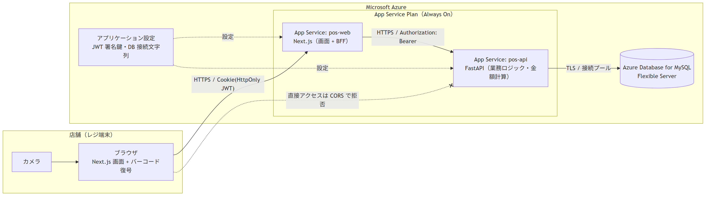

| コンポーネント | 技術 | 役割 | 対応 |
|---|---|---|---|
| ブラウザ（レジ端末） | カメラ付き端末のブラウザ | 画面の表示・操作、バーコードの復号（映像はサーバへ送らない）、購入リストの状態保持 | P-5, N-05 |
| pos-web | Next.js | 画面の配信。Route Handler による BFF（Cookie ⇄ Bearer の変換、入力検証、FastAPI への中継） | P-2, N-01 |
| pos-api | FastAPI、SQLAlchemy | 認証、金額計算の正本、取引の保存 | P-3, N-01 |
| MySQL | Azure Database for MySQL Flexible Server | データの永続化 | P-4, N-02 |
| アプリケーション設定 | App Service の設定 | JWT 署名鍵、DB 接続文字列。リポジトリに置かない | SEC-01 |

Azure 上の配置は要件定義書 7 章のとおり App Service（Always On）とする。N-03・N-04 を満たすため
Basic 以上のプランを用いる（Always On は Free / Shared プランでは使えない）。

ブラウザが直接通信する相手は pos-web のみ。pos-api は BFF からの要求だけを受け（CORS で他オリジンを拒否）、
MySQL は pos-api からのみ接続を受ける（ファイアウォール）。

---

## 3. ユースケース

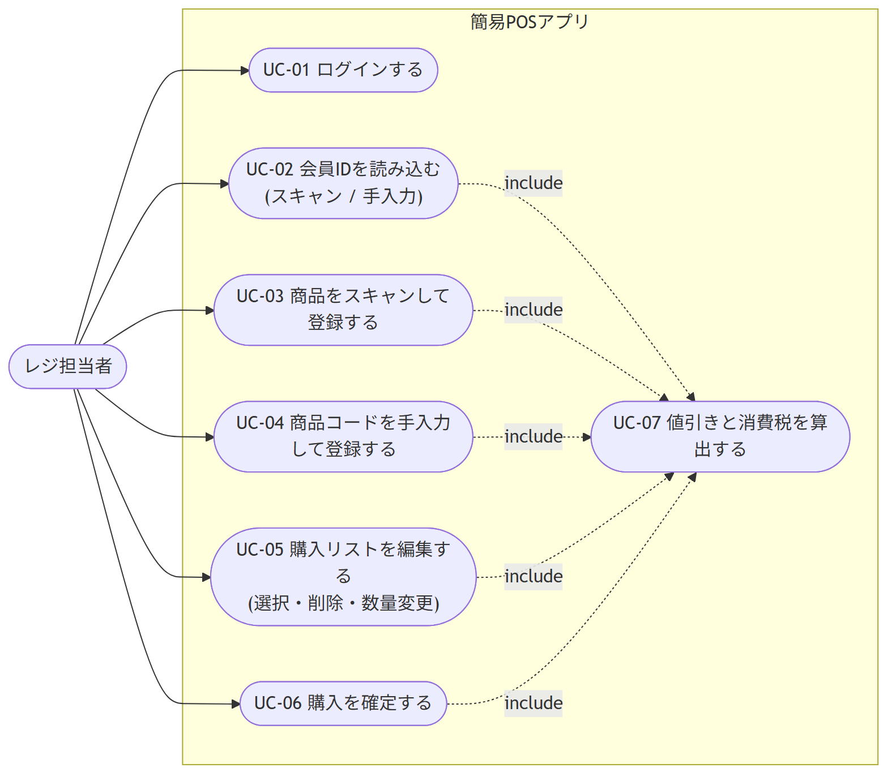

アクターはレジ担当者のみ（要求一覧に登場する利用者はレジ担当者だけ）。

| UC | 名称 | 概要 | 要件 | API | 画面 |
|---|---|---|---|---|---|
| UC-01 | ログインする | 担当者ID・パスワードで認証し POS 画面へ | FR-01 | API-01, 02 | SC-01 |
| UC-02 | 会員IDを読み込む | スキャンまたは手入力。登録済み商品にも値引きを適用 | FR-02, FR-06-7 | API-04, 05 | SC-02-03〜06 |
| UC-03 | 商品をスキャンして登録する | カメラでコードを読み取り購入リストへ | FR-03-1〜2, FR-04 | API-03, 05 | SC-02-07, 13, 14 |
| UC-04 | 商品コードを手入力して登録する | コード入力→読み込み→名称・単価表示→追加 | FR-03-3〜5, FR-04 | API-03, 05 | SC-02-08〜12 |
| UC-05 | 購入リストを編集する | 行を選択し、削除または数量変更 | FR-05 | API-05 | SC-02-15〜18 |
| UC-06 | 購入を確定する | 購入結果を保存し、税込・税抜合計をポップアップで表示。閉じると画面をクリア | FR-07, FR-08 | API-06 | SC-02-20, 21 |
| UC-07 | 値引きと消費税を算出する | （内部）購入リストと会員IDから値引き・税率・合計を算出 | FR-06, FR-07 | API-05 | SC-02-14, 19 |

---

## 4. 業務フロー

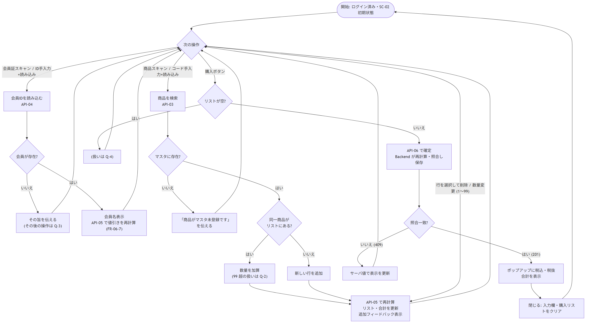

| 分岐 | 条件 | 要件 |
|---|---|---|
| 会員が存在? | API-04 の結果。不存在時はその旨を伝える。その後の操作は Q-3 | FR-02-6 |
| マスタに存在? | API-03 の結果。不存在なら「商品がマスタ未登録です」 | FR-03-4, FR-03-5 |
| 同一商品がリストにある? | あれば数量加算、なければ新規行 | FR-04-4, FR-04-5 |
| 数量 99 超 | 挙動は Q-2 | FR-05-7 |
| リストが空 | 挙動は Q-4 | FR-08-1 |
| 照合一致? | Backend の再計算と Frontend の値が不一致なら保存せず 409（SEC-05） | 課題指定 |

購入リストの状態は「idle（空）→ editing（編集中）→ committed（保存済み・ポップアップ表示中）→ idle」の 3 状態で管理する。

---

## 5. 画面設計

画面・要素の識別子は要件定義書 4 章（SC-01、SC-02-01〜21）をそのまま用いる。図も要件定義書のものを参照する。

| 画面 | ルート | ガード |
|---|---|---|
| SC-01 ログイン | `/login` | ログイン済みなら `/pos` へ |
| SC-02 POS メイン | `/pos` | Cookie がなければ `/login` へ（`middleware.ts`）。強制は API 側の JWT 検証（SEC-02） |

### 5.1 SC-02 のコンポーネント

| コンポーネント | 含む要素 | 操作 | API |
|---|---|---|---|
| `PosHeader` | SC-02-01 | — | — |
| `MessageBar` | SC-02-02 | 伝えるべきメッセージを表示 | — |
| `MemberPanel` | SC-02-03〜06 | 手入力読み込み、会員証スキャン開始 | API-04 → API-05 |
| `CameraPreview` | SC-02-07 | 復号結果を `MemberPanel` または `ProductEntryPanel` へ通知。同一コードの連続検出は SCAN_DEBOUNCE_MS 内で無視（★） | — |
| `ProductEntryPanel` | SC-02-08〜13 | 手入力読み込み、追加 | API-03 → API-05 |
| `CartTable` | SC-02-14, 15 | 行の選択 | — |
| `SelectedItemPanel` | SC-02-16〜18 | 数量変更（方式は Q-1）、削除 | API-05 |
| `TotalsPanel` | SC-02-19 | — | — |
| `PurchaseButton` | SC-02-20 | 購入確定 | API-06 |
| `ResultPopup` | SC-02-21 | 税込・税抜合計の表示、閉じる | — |

### 5.2 状態管理

```ts
type CartStatus = "idle" | "editing" | "committed";
interface CartLine { product_code: string; quantity: number }
interface CartState {
  status: CartStatus;
  staff: StaffInfo;
  member: MemberInfo | null;
  scanMode: "product" | "member";
  pendingProduct: ProductInfo | null;   // 手入力で読み込んだ、追加前の商品
  lines: CartLine[];                    // 入力（金額の正本は Backend）
  quote: QuoteResult | null;            // API-05 の最新結果（表示用）
  selectedLineNo: number | null;
  commitResult: CommitResponse | null;
  message: string | null;
}
```

購入リストが変わるたび（追加・削除・数量変更・会員読み込み）に API-05 を呼び、`quote` を表示に用いる。
値引きの判定と税率の決定は Frontend では行わない（SEC-05）。

---

## 6. データ設計

### 6.1 ER 図

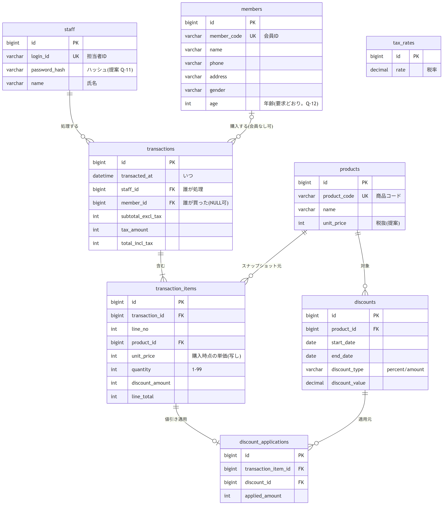

`tax_rates` は取引と外部キーで結ばず、取引には算出済みの税額・合計の値を保存する。
税率変更後の過去取引の扱い（適用税率を記録するか）は Q-13。

### 6.2 共通規約

| # | 規約 | 根拠 |
|---|---|---|
| DB-1 | テーブル・列は英語の snake_case、テーブル名は複数形 | — |
| DB-2 | 全テーブルに代理キー `id BIGINT UNSIGNED AUTO_INCREMENT`。業務キー（商品コード・会員ID・担当者ID）は別列に UNIQUE | 商品コード等はバーコードの値であり主キーに向かない |
| DB-3 | 金額は円の整数 `INT`。率は `DECIMAL(5,2)`、値引き値は `DECIMAL(10,2)` | D-04〜D-07 |
| DB-4 | 日時は `DATETIME(6)` に UTC で保存し、表示時に JST へ変換。業務日付は `DATE` | — |
| DB-5 | 文字コード `utf8mb4`。コード類は `utf8mb4_bin` | — |
| DB-6 | 取引明細に購入時点の単価を写し取り、以後のマスタ変更に影響されない | DR-1, FR-08-5 |
| DB-7 | 外部キーは `ON DELETE RESTRICT`。マスタの削除方法（論理／物理）は Q-15 | — |
| DB-8 | 全テーブルに `created_at`。マスタには `updated_at` | — |

### 6.3 テーブル定義

`created_at` / `updated_at` は表から省く。

#### staff（担当者）— D-01

| 列 | 型 | 制約 | 説明 | 対応 |
|---|---|---|---|---|
| id | BIGINT UNSIGNED | PK | | — |
| login_id | VARCHAR(32) | NN, UNIQUE | 担当者ID | FR-01-1 |
| password_hash | VARCHAR(60) | NN | ★ ハッシュ化して保持（bcrypt）。平文保持は認証設計として採らない。要求に明文はない（Q-11） | FR-01-3 |
| name | VARCHAR(50) | NN | 氏名（担当者名表示） | SC-02-01, I-4 |

#### products（商品）— D-02

| 列 | 型 | 制約 | 説明 | 対応 |
|---|---|---|---|---|
| id | BIGINT UNSIGNED | PK | | — |
| product_code | VARCHAR(13) | NN, UNIQUE | 商品コード。桁数は ★ 提案（Q-21） | FR-03-4 |
| name | VARCHAR(100) | NN | 名称 | |
| unit_price | INT | NN | 単価。★ 税抜で保持（税率変更に耐えるため。要求に明文なし） | FR-07 |

#### members（会員）— D-03

| 列 | 型 | 制約 | 説明 | 対応 |
|---|---|---|---|---|
| id | BIGINT UNSIGNED | PK | | — |
| member_code | VARCHAR(32) | NN, UNIQUE | 会員ID | FR-02 |
| name | VARCHAR(50) | NN | 氏名 | FR-02-4 |
| phone | VARCHAR(20) | NULL | 電話番号 | D-03 |
| address | VARCHAR(200) | NULL | 住所 | D-03 |
| gender | VARCHAR(10) | NULL | 性別 | D-03 |
| age | INT | NULL | 年齢（要求の記載どおり。生年月日での保持は Q-12） | D-03 |

#### transactions（取引）— D-04

| 列 | 型 | 制約 | 説明 | 対応 |
|---|---|---|---|---|
| id | BIGINT UNSIGNED | PK | 取引ID | — |
| transacted_at | DATETIME(6) | NN | いつ | FR-08-2 |
| staff_id | BIGINT UNSIGNED | NN, FK → staff | 誰がレジ処理したか | FR-01-5 |
| member_id | BIGINT UNSIGNED | NULL, FK → members | 誰が買ったか。会員なしは NULL | FR-02-5, DR-2 |
| subtotal_excl_tax | INT | NN | 税抜合計 | FR-07-1 |
| tax_amount | INT | NN | 消費税額 | FR-07-1 |
| total_incl_tax | INT | NN | 税込合計 | FR-07-1 |

#### transaction_items（取引明細）— D-05

| 列 | 型 | 制約 | 説明 | 対応 |
|---|---|---|---|---|
| id | BIGINT UNSIGNED | PK | | — |
| transaction_id | BIGINT UNSIGNED | NN, FK → transactions | | |
| line_no | INT | NN, UNIQUE(transaction_id, line_no) | 表示順。items の配列順に Backend が採番 | — |
| product_id | BIGINT UNSIGNED | NN, FK → products | 何を | FR-08-2 |
| unit_price | INT | NN | 購入時点の単価（写し） | FR-08-5, DR-1 |
| quantity | INT | NN, CHECK 1〜99 | いくつ | FR-05-6, FR-05-7 |
| discount_amount | INT | NN, 既定 0 | 値引き額 | FR-06-5 |
| line_total | INT | NN | 小計 = unit_price × quantity − discount_amount | FR-04-7 |

商品名称の写し取りは Q-14。

#### tax_rates（消費税率）— D-06

| 列 | 型 | 制約 | 説明 | 対応 |
|---|---|---|---|---|
| id | BIGINT UNSIGNED | PK | | — |
| rate | DECIMAL(5,2) | NN | 税率（%）。有効な行は 1 件とする。将来の改定を事前登録する仕組み（適用開始日）は Q-13 | FR-07-2, FR-09-1 |

#### discounts（値引き）— D-07

| 列 | 型 | 制約 | 説明 | 対応 |
|---|---|---|---|---|
| id | BIGINT UNSIGNED | PK | | — |
| product_id | BIGINT UNSIGNED | NN, FK → products | 対象商品 | FR-06-1 |
| start_date | DATE | NN | 適用開始日 | FR-06-4 |
| end_date | DATE | NN, CHECK ≥ start_date | 適用終了日 | FR-06-4 |
| discount_type | VARCHAR(10) | NN | percent / amount | FR-06-2, 3 |
| discount_value | DECIMAL(10,2) | NN | 割合なら %、金額なら円 | FR-06-2, 3 |

#### discount_applications（値引き適用記録）— D-08

| 列 | 型 | 制約 | 説明 | 対応 |
|---|---|---|---|---|
| id | BIGINT UNSIGNED | PK | | — |
| transaction_item_id | BIGINT UNSIGNED | NN, FK → transaction_items | 対象明細 | D-08 |
| discount_id | BIGINT UNSIGNED | NN, FK → discounts | 適用した値引き | D-08 |
| applied_amount | INT | NN | 値引き額 | D-08 |

### 6.4 設定データの変更手段

税率・値引きの変更手段は要求に明文がなく、要件定義書 FR-09 は手段を定めていない（Q-9, Q-10）。
本書では管理画面・管理 API を設けず、**初期データと変更は SQL（マイグレーション／シード）で投入する**ことを
最小の実装とする。管理画面が必要と判断された場合は別途設計する。

---

## 7. API 設計

### 7.1 方針

| # | 方針 |
|---|---|
| API-P1 | ブラウザ → Next.js Route Handler `/api/...`（BFF）→ FastAPI `/api/v1/...`。ブラウザから FastAPI へ直接アクセスさせない |
| API-P2 | REST + JSON。金額は円の整数、率は小数、日時は ISO 8601（UTC） |
| API-P3 | BFF が Cookie の JWT を `Authorization: Bearer` に付け替える。FastAPI は `/auth/login` と `/health` 以外で JWT を検証する |
| API-P4 | 型・形式は Zod（BFF）と Pydantic（FastAPI）で検証し 400。業務上の範囲（数量 1〜99 等）はサービス層で判定し 422 |

### 7.2 API 一覧

| # | メソッド | パス（`/api/v1` 以下） | 概要 | 認証 | 要件 |
|---|---|---|---|---|---|
| API-01 | POST | `/auth/login` | 担当者ID・パスワードで認証し JWT を発行 | なし | FR-01-1〜4 |
| API-02 | GET | `/auth/me` | ログイン中の担当者情報（担当者名表示） | 要 | FR-01-5, SC-02-01 |
| API-03 | GET | `/products/{code}` | 商品コードで商品を検索 | 要 | FR-03-4, FR-03-5 |
| API-04 | GET | `/members/{code}` | 会員IDで会員を検索 | 要 | FR-02-4, FR-02-6 |
| API-05 | POST | `/pricing/quote` | 購入リスト＋会員IDから値引き・税・合計を算出 | 要 | FR-05-8, FR-06, FR-07 |
| API-06 | POST | `/transactions` | 取引を確定・保存（Frontend の計算値と照合） | 要 | FR-08, 課題指定（照合） |
| API-07 ★ | GET | `/health` | 稼働確認（DB 疎通）。App Service のヘルスチェック用 | なし | N-03 |

### 7.3 共通型定義（TypeScript）

```ts
type Money = number;        // 円の整数
type Rate = number;         // 百分率
type DateTimeUTC = string;  // ISO 8601
type DiscountType = "percent" | "amount";

interface ApiError { error: { code: string; message: string; details: Record<string, unknown> } }

interface StaffInfo   { id: number; login_id: string; name: string }
interface ProductInfo { id: number; product_code: string; name: string; unit_price: Money }
interface MemberInfo  { id: number; member_code: string; name: string }   // 氏名のみ（表示に必要な範囲）

interface QuoteItemRequest { product_code: string; quantity: number }
interface AppliedDiscount  { discount_id: number; type: DiscountType; value: number; amount: Money }
interface QuoteLine {
  product_code: string; product_name: string; unit_price: Money; quantity: number;
  discount: AppliedDiscount | null; line_total: Money;
}
interface QuoteResult {
  tax_rate: Rate; lines: QuoteLine[];
  subtotal_excl_tax: Money; tax_amount: Money; total_incl_tax: Money;
}
```

### 7.4 API 詳細

#### API-01 POST /auth/login

| 入力 | 型 | 必須 | 制約 |
|---|---|---|---|
| login_id | string | ○ | 1〜32 文字 ★ |
| password | string | ○ | 1〜64 文字 ★（最小長は Q-11） |

出力 200: `{ access_token, token_type: "Bearer", expires_in, staff: StaffInfo }`。BFF は `access_token` を HttpOnly Cookie に格納し、ブラウザには `{ staff }` のみ返す。
エラー: 401 AUTH_INVALID_CREDENTIALS（ID 不存在とパスワード不一致を区別しない。FR-01-4）。

```ts
interface LoginRequest  { login_id: string; password: string }
interface LoginResponse { access_token: string; token_type: "Bearer"; expires_in: number; staff: StaffInfo }
```

#### API-02 GET /auth/me

出力 200: `StaffInfo`。401 AUTH_REQUIRED。

#### API-03 GET /products/{code}

| 入力（path） | 制約 |
|---|---|
| code | 数字。桁数の上限は PRODUCT_CODE_MAX ★（Q-21） |

出力 200: `ProductInfo`。404 PRODUCT_NOT_FOUND（FR-03-5）。

#### API-04 GET /members/{code}

| 入力（path） | 制約 |
|---|---|
| code | 半角英数字 1〜MEMBER_CODE_MAX 文字 ★ |

出力 200: `MemberInfo`（氏名のみ）。404 MEMBER_NOT_FOUND（FR-02-6）。

#### API-05 POST /pricing/quote

| 入力 | 型 | 必須 | 制約 |
|---|---|---|---|
| member_code | string \| null | — | 会員なしは null |
| items | QuoteItemRequest[] | ○ | 0〜CART_MAX_LINES 行 ★。product_code は重複不可 |
| items[].quantity | integer | ○ | QTY_MIN〜QTY_MAX（1〜99。FR-05-6, 7） |

出力 200: `QuoteResult`。

計算規則（Backend の正本。Frontend は結果を表示するだけで、値引きの判定は行わない）:

1. `line_gross = unit_price × quantity`
2. 会員ありで期間内の値引きがあれば `discount.amount` を算出（percent: `line_gross × value / 100`、amount: `value × quantity`）。端数処理・複数該当時の選択は Q-7, Q-8（★ 実装時は「1 円未満切り捨て」「値引き額が最大の 1 件」を仮置き）
3. `line_total = line_gross − discount.amount`
4. `subtotal_excl_tax = Σ line_total`、`tax_amount = subtotal × rate / 100`（端数処理は Q-6。★ 仮置き: 切り捨て）、`total_incl_tax = subtotal + tax`

エラー: 404 PRODUCT_NOT_FOUND / MEMBER_NOT_FOUND、422 QUANTITY_OUT_OF_RANGE / TAX_RATE_NOT_CONFIGURED。

```ts
interface QuoteRequest { member_code: string | null; items: QuoteItemRequest[] }
```

#### API-06 POST /transactions

購入ボタンで呼ぶ（FR-08-1）。Frontend が表示していた金額を送り、Backend がマスタから再計算して照合する（課題指定「Backend でも計算し Frontend の値と照合」）。

| 入力 | 型 | 必須 | 制約 |
|---|---|---|---|
| member_code | string \| null | — | |
| items[] | CommitItem | ○ | 0〜CART_MAX_LINES 行。0 行の扱いは Q-4（★ 仮置き: 422 CART_EMPTY） |
| items[].quantity / unit_price / discount_amount / line_total | — | ○ | Frontend が表示していた値 |
| tax_rate / subtotal_excl_tax / tax_amount / total_incl_tax | — | ○ | 同上 |

処理順:

1. Pydantic で型・形式を検証（400）。数量などの業務範囲はサービス層で判定（422）
2. API-05 と同じ規則で全額を再計算し、明細ごとの金額と合計を Frontend の値と比較。1 円でも差があれば 409 PRICE_MISMATCH とし、details に Backend の `QuoteResult` を返す
3. 1 トランザクションで transactions → transaction_items → discount_applications を INSERT（写し列は Backend の再計算値。line_no は配列順）
4. 201 を返す。Frontend はポップアップに税込・税抜合計を表示する（FR-08-3, FR-07-1）

```ts
interface CommitItem { product_code: string; quantity: number; unit_price: Money; discount_amount: Money; line_total: Money }
interface CommitRequest {
  member_code: string | null; items: CommitItem[];
  tax_rate: Rate; subtotal_excl_tax: Money; tax_amount: Money; total_incl_tax: Money;
}
interface CommitResponse {
  transaction_id: number; transacted_at: DateTimeUTC;
  subtotal_excl_tax: Money; tax_amount: Money; total_incl_tax: Money;
}
// 409 PRICE_MISMATCH の details: { server: QuoteResult }
```

#### API-07 GET /health ★

出力 200 `{ status: "ok", db: "ok" }`。DB 疎通に失敗すれば 503。

### 7.5 BFF の責務

| # | 責務 |
|---|---|
| BFF-1 | `/api/*` を受け、同じパスで FastAPI `/api/v1/*` へ中継する。ブラウザは FastAPI の URL を知らない |
| BFF-2 | ログイン成功時に `access_token` を `HttpOnly; Secure; SameSite=Strict; Path=/` の Cookie に格納。以降は Cookie → `Authorization: Bearer` に付け替える |
| BFF-3 | Zod で本文の型・形式を検証し、不正なら 400 を返して FastAPI へ送らない |
| BFF-4 | FastAPI の 5xx は本文を `INTERNAL_ERROR` / `SERVICE_UNAVAILABLE` に正規化し、内部情報を隠す |

---

## 8. シーケンス図

| 図 | 内容 | 要件 |
|---|---|---|
| 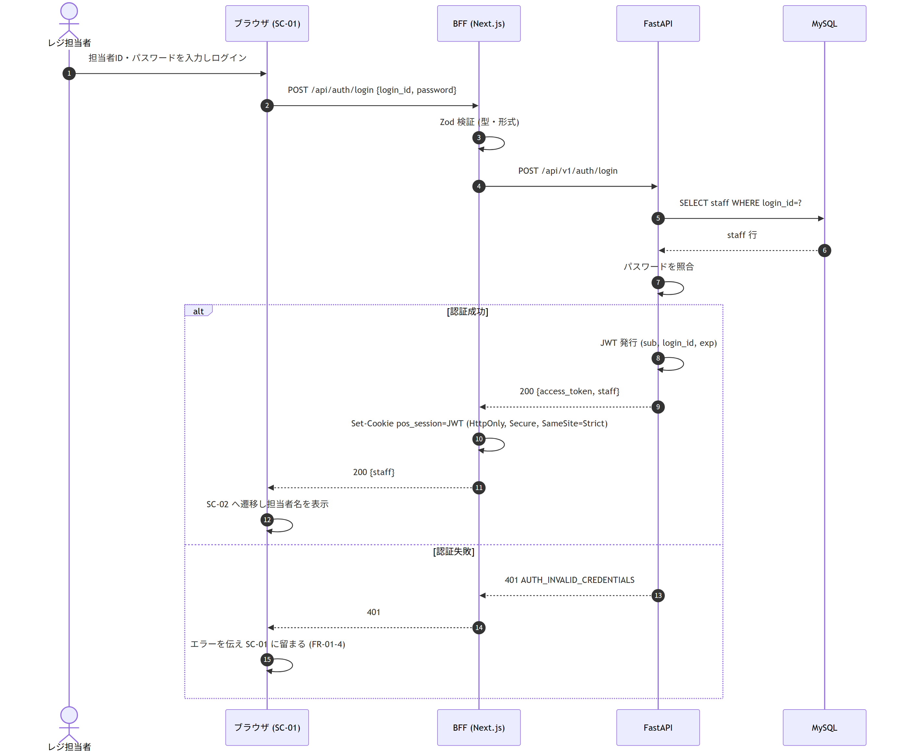 | 8.1 ログイン。JWT を BFF が HttpOnly Cookie に格納。失敗時は同一文言で 401 | FR-01, SEC-01〜03 |
| 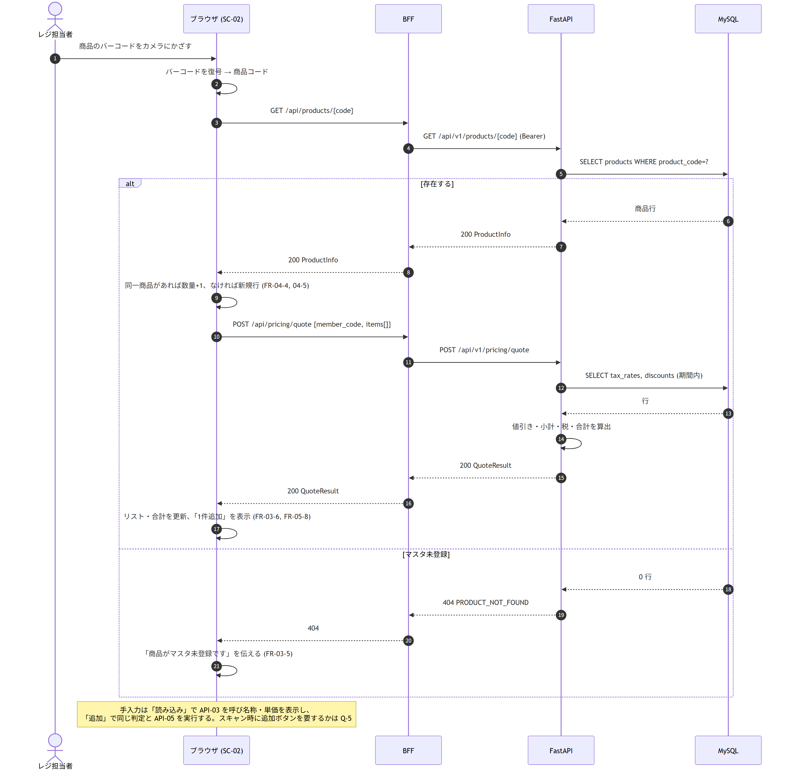 | 8.2 スキャン → API-03 で検索 → 数量加算／新規行 → API-05 で再計算。未登録なら「マスタ未登録」 | FR-03, FR-04 |
| 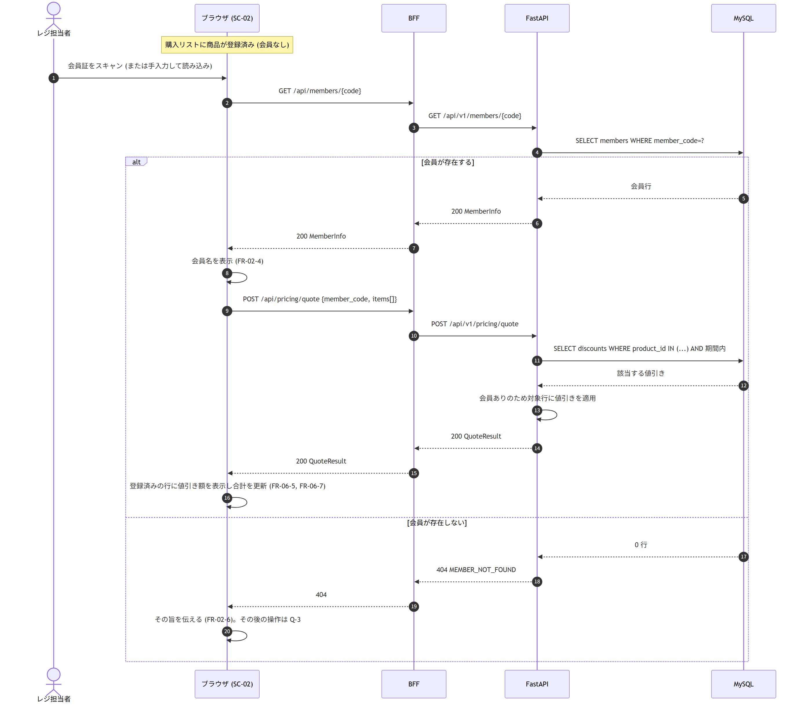 | 8.3 会員読み込み → API-04 → 登録済みの行を含めて API-05 を呼び直し、値引きを適用 | FR-02, FR-06-7 |
| 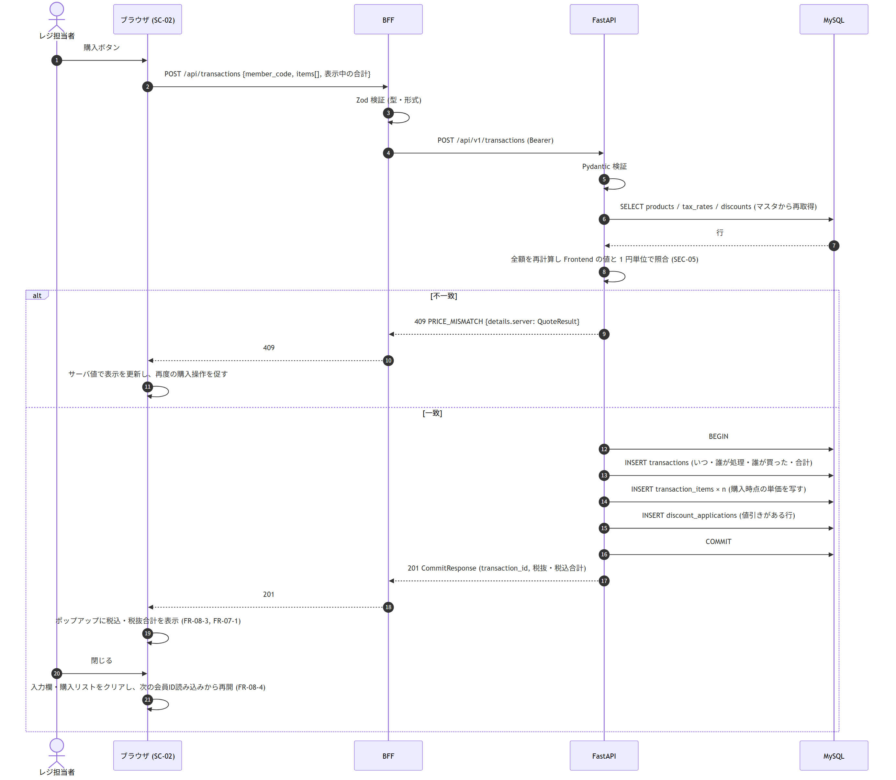 | 8.4 購入ボタン → API-06 が再計算・照合 → 一致なら 1 トランザクションで保存 → ポップアップ → 閉じてクリア | FR-08, SEC-05 |

---

## 9. クラス設計

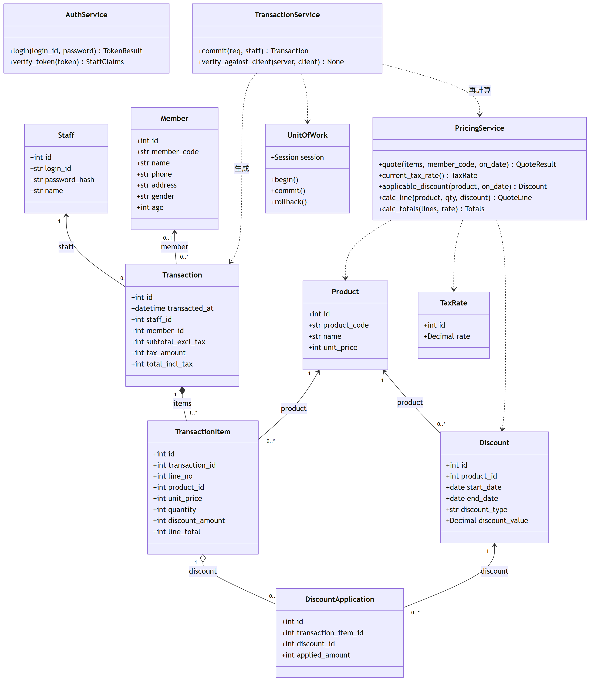

| レイヤ | 要素 | 責務 |
|---|---|---|
| Router（FastAPI） | `routers/auth.py`, `products.py`, `members.py`, `pricing.py`, `transactions.py` | HTTP の受付、Pydantic 検証、JWT 検証の依存関係 |
| Service | `AuthService` | 認証、JWT の発行・検証 |
| Service | `PricingService` | **金額計算の正本。** 有効税率・値引きの決定、明細と合計の算出。API-05 と API-06 の両方が使う |
| Service | `TransactionService` | 再計算との照合、1 トランザクションでの保存 |
| Repository / UnitOfWork | `UnitOfWork` | SQLAlchemy Session とトランザクション境界。接続プール（N-04） |
| Model | `Staff`, `Product`, `Member`, `Transaction`, `TransactionItem`, `TaxRate`, `Discount`, `DiscountApplication` | 6 章のテーブルと 1 対 1 |
| Schema（Pydantic） | `LoginRequest`, `QuoteRequest`, `CommitRequest`, … | 7.3 の TypeScript 型と 1 対 1 |

Frontend は `features/cart/store.ts`（5.2 の状態）、`features/scanner/`（バーコード復号）、`lib/apiClient.ts`、`lib/schemas.ts`（Zod）、`app/api/**/route.ts`（BFF）で構成する。

---

## 10. 設定・制約値

課題の指定「入力値や商品数の下限・上限の定義」に対応する。要求一覧に明文があるのは数量（1〜99）のみで、
それ以外は ★ 本書の提案値であり、要件定義書 9.3 の確認事項に対応する。定数は `shared/limits.json` を
正本とし、Frontend・Backend の双方が読み込む。

| 定数 | 値 | 適用 | 根拠 |
|---|---|---|---|
| QTY_MIN / QTY_MAX | 1 / 99 | 明細の数量 | FR-05-6, FR-05-7（要求） |
| CART_MAX_LINES ★ | 100 | 1 取引の明細行数 | 提案。要求に上限なし |
| PRODUCT_CODE_MAX ★ | 13 桁の数字 | 商品コード | Q-21（JAN を想定） |
| MEMBER_CODE_MAX ★ | 32 文字の英数字 | 会員ID | Q-21 |
| LOGIN_ID_MAX / PASSWORD_MIN / PASSWORD_MAX ★ | 32 / 8 / 64 | 認証 | Q-11 |
| PRICE_MAX ★ | 9,999,999 円 | 単価、値引き額 | INT の範囲内の実用上限 |
| TAX_ROUNDING / DISCOUNT_ROUNDING ★ | floor（1 円未満切り捨て） | 金額計算 | Q-6, Q-7 の仮置き |
| DISCOUNT_SELECTION ★ | max_amount | 複数該当時の値引き | Q-8 の仮置き |
| JWT_TTL_HOURS ★ | 8 | トークン有効期間 | SEC-02 |
| SCAN_DEBOUNCE_MS ★ | 1,500 | 同一バーコードの連続検出を無視 | カメラが同じコードを毎フレーム読むため |
| BODY_MAX_BYTES ★ | 1,048,576 | 要求本文の上限 | SEC-07 |

環境変数: `APP_ENV`、`API_UPSTREAM_URL`（BFF → FastAPI）、`JWT_SECRET`（秘密）、`DATABASE_URL`（秘密）、`CORS_ALLOW_ORIGINS`。秘密はアプリケーション設定に置く。

---

## 11. エラー処理

### 11.1 方針

| # | 方針 |
|---|---|
| ERR-1 | 入力は BFF（Zod）と FastAPI（Pydantic）の 2 段で検証する。FastAPI は BFF を信頼しない |
| ERR-2 | 全エラーは `{ error: { code, message, details } }` で返す |
| ERR-3 | Frontend は `code` で動作を決め、表示文言は下表から引く。要求一覧に文言があるもの（FR-03-5）はそのまま用いる |
| ERR-4 | 5xx はスタックトレース・SQL を返さない |
| ERR-5 | エラー時に購入リストの内容を失わない |

### 11.2 エラーコード

| コード | HTTP | 発生 API | 条件 | 画面の文言 | 動作 | 要件 |
|---|---|---|---|---|---|---|
| AUTH_INVALID_CREDENTIALS | 401 | API-01 | ID 不存在またはパスワード不一致 | 担当者IDまたはパスワードが違います | SC-01 に留まる | FR-01-4 |
| AUTH_REQUIRED | 401 | 全 API | JWT なし・無効・期限切れ | 再度ログインしてください | SC-01 へ | SEC-02 |
| VALIDATION_ERROR | 400 | 全 API | 型・形式の不正 | 入力内容に誤りがあります | 操作を中止 | API-P4 |
| PRODUCT_NOT_FOUND | 404 | API-03, 05, 06 | 商品が未登録 | 商品がマスタ未登録です | リストは変えない | FR-03-5 |
| MEMBER_NOT_FOUND | 404 | API-04, 05, 06 | 会員が未登録 | 該当する会員が見つかりません | 会員IDは未設定のまま。その後は Q-3 | FR-02-6 |
| QUANTITY_OUT_OF_RANGE | 422 | API-05, 06 | 数量が 1〜99 外 | 数量は 1〜99 で指定してください | 直前の数量を維持（99 超の扱いは Q-2） | FR-05-6, 7 |
| CART_EMPTY ★ | 422 | API-06 | 明細 0 行 | 商品が登録されていません | 保存しない（Q-4） | FR-08-1 |
| TAX_RATE_NOT_CONFIGURED ★ | 422 | API-05, 06 | 税率が未設定 | 消費税率が設定されていません | 会計不可 | FR-07-2 |
| PRICE_MISMATCH | 409 | API-06 | Frontend の金額と Backend 再計算が不一致 | 金額が更新されました。内容を確認して再度購入してください | `details.server` で表示を差し替え。保存しない | 課題指定（照合） |
| INTERNAL_ERROR | 500 | 全 API | 想定外の例外 | 処理に失敗しました。もう一度お試しください | 操作を中止 | ERR-4 |
| SERVICE_UNAVAILABLE | 503 | 全 API | DB 接続不可 | サービスに接続できません | 表示を継続 | N-02 |

Frontend のみ: CAMERA_UNAVAILABLE（カメラが使えない。手入力へ誘導。FR-03-3）。

### 11.3 例外の変換（FastAPI）

| 例外 | 変換先 |
|---|---|
| `RequestValidationError`（Pydantic） | 400 VALIDATION_ERROR |
| `AppError`（サービス層の業務範囲違反） | 422 と業務コード |
| `sqlalchemy.exc.OperationalError` | 503 SERVICE_UNAVAILABLE |
| その他 | 500 INTERNAL_ERROR（ログのみ詳細） |

API-06 は `BEGIN` 以降の例外をすべてロールバックし、部分的な取引を残さない（N-02）。

---

## 12. セキュリティ設計

課題で指定された項目に対応する。指定にない対策（ログイン試行制限、共有秘密ヘッダ、監査ログ、権限区分等）は本書に含めない。

| # | 指定項目 | 設計 |
|---|---|---|
| SEC-01 | ログイン — 認証 | 担当者ID・パスワードを FastAPI が照合。パスワードは bcrypt でハッシュ化して保持（★ Q-11）。失敗理由は区別しない（FR-01-4） |
| SEC-02 | ログイン — JWT トークン | FastAPI が HS256 で署名した JWT を発行（`sub`, `login_id`, `exp`＝8 時間 ★）。署名鍵はアプリケーション設定。BFF が `HttpOnly; Secure; SameSite=Strict; Path=/` の Cookie に格納し、ブラウザの JavaScript から読めない。`localStorage` は使わない |
| SEC-03 | ログイン — 認可 | 利用者はレジ担当者のみ（要求一覧に他の利用者はいない）。`/auth/login` と `/health` 以外の全 API で JWT を検証し、無効なら 401。権限区分（管理者等）は要求にないため設けない（Q-10） |
| SEC-04 | POS — BFF（リバースプロキシ） | ブラウザは Next.js Route Handler とのみ通信し、FastAPI の URL は露出しない。BFF が Cookie ⇄ Bearer を変換し、Zod で入力を検証してから中継する（7.5） |
| SEC-04 | POS — CORS | FastAPI の `CORSMiddleware` は `allow_origins` を Next.js のオリジンのみとし `*` を使わない。`allow_methods` は GET / POST、`allow_headers` は `Authorization, Content-Type` に限定。ブラウザが FastAPI を直接呼んでも他オリジンからは拒否される |
| SEC-05 | POS — Backend でも計算し Frontend の値と照合 | 値引きの判定・税率の決定・合計の算出は `PricingService` が行う（API-05）。確定時（API-06）は Frontend の表示値を受け取り、マスタから独立に再計算して 1 円単位で照合。不一致は 409 で保存しない。保存する値は Backend の再計算値 |
| SEC-06 | POS — Swagger Docs 非表示 | 本番は `FastAPI(docs_url=None, redoc_url=None, openapi_url=None)`。`APP_ENV=development` のときのみ有効 |
| SEC-07 | SQL インジェクション — 型定義（Frontend / TypeScript） | 7.3 の型に対応する Zod スキーマで本文を検証（BFF-3）。商品コードは数字のみ、会員IDは英数字のみ、数量は整数、のように型・文字種・長さを制限する。本文サイズは BODY_MAX_BYTES 以下 |
| SEC-07 | SQL インジェクション — ORM | SQLAlchemy 2.x の ORM / Core を用い、値は常にバインド変数で渡す。文字列連結で SQL を組み立てない。Pydantic でも同じ検証を行い、BFF を経由しない要求にも効かせる。DB のエラー文言はクライアントへ返さない |
| SEC-08 | ライブラリ・OSS の脆弱性 — Ver 調査 | 12.1 のとおり |

### 12.1 依存ライブラリのバージョンと既知脆弱性（確認日 2026-09-07）

npm / PyPI レジストリで最新安定版を確認し、採用バージョンについて OSV.dev（公開の脆弱性データベース）に照会した。

| 区分 | ライブラリ | 採用 | 最新安定版 | 既知の脆弱性（OSV） |
|---|---|---|---|---|
| Frontend | Next.js | 16.3.x | 16.3.4 | 0 件 |
| Frontend | React / React DOM | 19.2.x | 19.2.8 | 0 件 |
| Frontend | TypeScript | 5.9.x | 7.0.2 | —（7.0 は新実装のコンパイラ。Next.js との互換確認後に移行） |
| Frontend | Zod | 4.5.x | 4.5.4 | 0 件 |
| Frontend | @zxing/library（バーコード復号） | 0.23.x | 0.23.0 | 0 件 |
| Backend | FastAPI | 0.141.x | 0.141.1 | 0 件 |
| Backend | Uvicorn | 0.52.x | 0.52.4 | 0 件 |
| Backend | SQLAlchemy | 2.0.x | 2.0.52 | 0 件 |
| Backend | Pydantic | 2.13.x | 2.13.5 | 0 件 |
| Backend | PyMySQL | 1.2.x | 1.2.0 | 0 件 |
| Backend | PyJWT | 2.13.x | 2.13.0 | 0 件 |
| Backend | bcrypt | 5.0.x | 5.0.0 | 0 件 |
| Backend | Alembic | 1.19.x | 1.19.2 | 0 件 |

運用: `package-lock.json` と `requirements.txt`（`==` 固定）で再現性を確保し、CI で `npm audit` / `pip-audit` を実行する。

---

## 13. 要件・指定項目との対応表

### 13.1 要件定義書 → 本書

| 要件 | 設計 |
|---|---|
| FR-01 | UC-01、API-01/02、SC-01、AuthService、SEC-01〜03、8.1 |
| FR-02 | UC-02、API-04/05、`MemberPanel`、8.3 |
| FR-03 | UC-03/04、API-03、`ProductEntryPanel`、`CameraPreview`、8.2 |
| FR-04 | 5.2 状態管理、API-05 |
| FR-05 | UC-05、`CartTable`、`SelectedItemPanel`、QTY_MIN/MAX |
| FR-06 | UC-07、API-05 計算規則、PricingService、discounts / discount_applications |
| FR-07 | API-05、tax_rates、`ResultPopup` |
| FR-08 | UC-06、API-06、transactions / transaction_items、8.4 |
| FR-09 | 6.4（変更手段は SQL。管理画面は設けない） |
| SC-01, SC-02 | 5 章 |
| D-01〜D-08, DR-1〜4 | 6 章 |
| N-01〜N-05 | 2 章、API-P1、UnitOfWork、`CameraPreview` |
| P-1〜P-5 | 2 章 |
| I-1〜I-5 | そのまま継承 |
| Q-1〜Q-21 | 本書で仮置きしたもの（★）と、実装時に決めるもの（Q-1, Q-3, Q-4 は挙動を確定していない） |

### 13.2 課題の指定項目 → 本書

| 指定項目 | 章 |
|---|---|
| ユースケース図 | 3 |
| アクティビティ図 | 4 |
| シーケンス図 | 8（4 枚） |
| クラス図 | 9 |
| ER 図 | 6.1 |
| 入力値や商品数の下限・上限 | 10 |
| エラー処理 | 11 |
| API 一覧表（入力項目の型定義、出力項目） | 7.2〜7.4（7 本） |
| JWT トークン／認証認可 | SEC-01〜03 |
| BFF（リバースプロキシ）／CORS | SEC-04 |
| Backend でも計算し Frontend の値と照合 | SEC-05、API-05/06 |
| Swagger Docs 非表示 | SEC-06 |
| SQL インジェクション対策（TypeScript の型定義／ORM） | SEC-07 |
| フレームワーク・ライブラリ・OSS の脆弱性の Ver 調査 | SEC-08、12.1 |

---

## 14. 提案事項と変更履歴

### 14.1 本書の提案（★）の一覧

要求一覧に明文がなく、課題の指定項目を満たすために本書が置いたもの。出題者の回答で差し替える。

| 事項 | 該当 | 確認事項 |
|---|---|---|
| パスワードのハッシュ化、パスワード長 | staff.password_hash、PASSWORD_MIN/MAX | Q-11 |
| 単価を税抜で保持 | products.unit_price | Q-6 |
| 商品コード・会員IDの桁数・文字種 | PRODUCT_CODE_MAX、MEMBER_CODE_MAX | Q-21 |
| 1 取引の明細行数上限、価格上限 | CART_MAX_LINES、PRICE_MAX | — |
| 端数処理・値引きの選択 | TAX_ROUNDING、DISCOUNT_ROUNDING、DISCOUNT_SELECTION | Q-6〜Q-8 |
| 空リストでの確定を 422 とする | CART_EMPTY | Q-4 |
| JWT 有効期間 8 時間 | JWT_TTL_HOURS | — |
| 設定の変更手段を SQL とする | 6.4 | Q-9, Q-10 |
| 稼働確認 API | API-07 | — |
| 同一バーコードの連続検出の抑止 | SCAN_DEBOUNCE_MS | — |

### 14.2 変更履歴

| 版 | 日付 | 内容 |
|---|---|---|
| v1.0 | 2026-09-09 | 要求忠実版として作成。前版（v1.1）から管理 API・現金決済・会計キャンセル・監査ログ・冪等キー・権限区分・ログアウト・ログイン試行制限・共有秘密ヘッダ・バックアップ等を除き、API を 27 本から 7 本に、テーブルを 10 から 8 に、図を 12 枚から 9 枚に整理。要求外の提案は ★ と 14.1 に集約 |

---

## 付録 A. 図の Mermaid ソース

再生成: `npx mmdc -p puppeteer.json -i <name>.mmd -o <name>.png -b white -s 2 -w 1600`（ローカル Chrome を使用）。
メッセージ内の `;` は文の区切りと解釈されるため使わない。

### A.1 システム構成図（sdr_fig02）

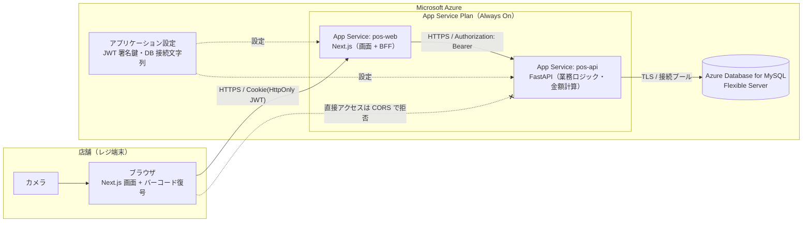
```mermaid
flowchart LR
  subgraph STORE["店舗（レジ端末）"]
    BR["ブラウザ<br/>Next.js 画面 + バーコード復号"]
    CAM["カメラ"] --> BR
  end
  subgraph AZ["Microsoft Azure"]
    subgraph PLAN["App Service Plan（Always On）"]
      WEB["App Service: pos-web<br/>Next.js（画面 + BFF）"]
      API["App Service: pos-api<br/>FastAPI（業務ロジック・金額計算）"]
    end
    DB[("Azure Database for MySQL<br/>Flexible Server")]
    CFG["アプリケーション設定<br/>JWT 署名鍵・DB 接続文字列"]
  end
  BR -- "HTTPS / Cookie(HttpOnly JWT)" --> WEB
  WEB -- "HTTPS / Authorization: Bearer" --> API
  API -- "TLS / 接続プール" --> DB
  CFG -. 設定 .-> WEB
  CFG -. 設定 .-> API
  BR -. "直接アクセスは CORS で拒否" .-x API
```

### A.2 ユースケース図（sdr_fig03）

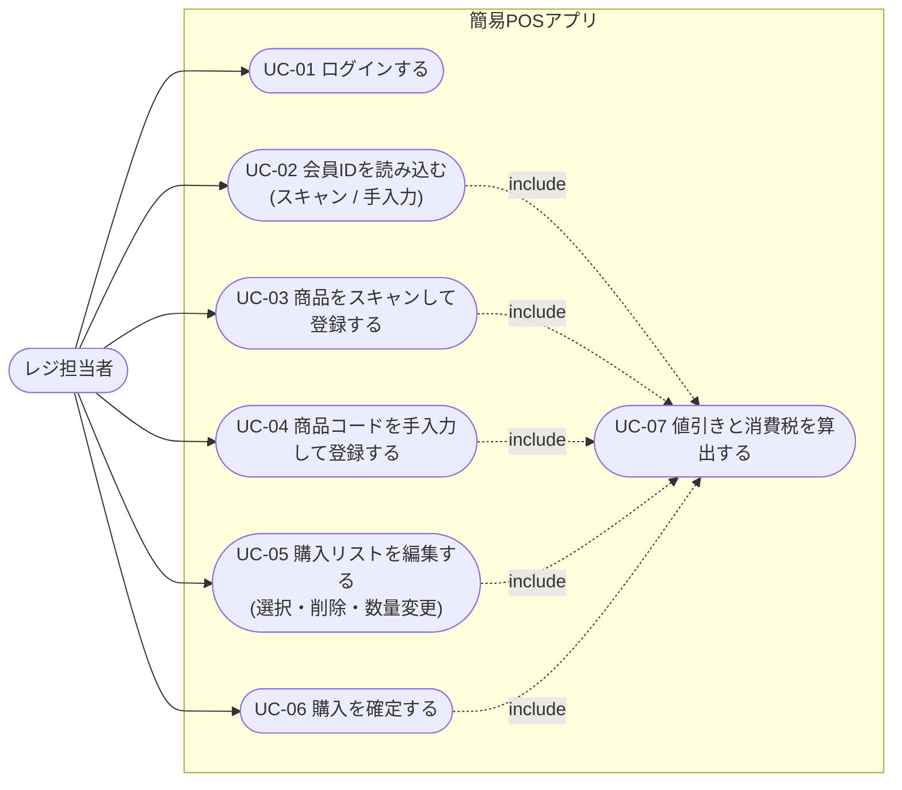
```mermaid
flowchart LR
  cashier(["レジ担当者"])
  subgraph POS["簡易POSアプリ"]
    direction TB
    UC01(["UC-01 ログインする"])
    UC02(["UC-02 会員IDを読み込む<br/>(スキャン / 手入力)"])
    UC03(["UC-03 商品をスキャンして登録する"])
    UC04(["UC-04 商品コードを手入力して登録する"])
    UC05(["UC-05 購入リストを編集する<br/>(選択・削除・数量変更)"])
    UC06(["UC-06 購入を確定する"])
    UC07(["UC-07 値引きと消費税を算出する"])
  end
  cashier --> UC01
  cashier --> UC02
  cashier --> UC03
  cashier --> UC04
  cashier --> UC05
  cashier --> UC06
  UC02 -. "include" .-> UC07
  UC03 -. "include" .-> UC07
  UC04 -. "include" .-> UC07
  UC05 -. "include" .-> UC07
  UC06 -. "include" .-> UC07
```

### A.3 アクティビティ図（sdr_fig04）

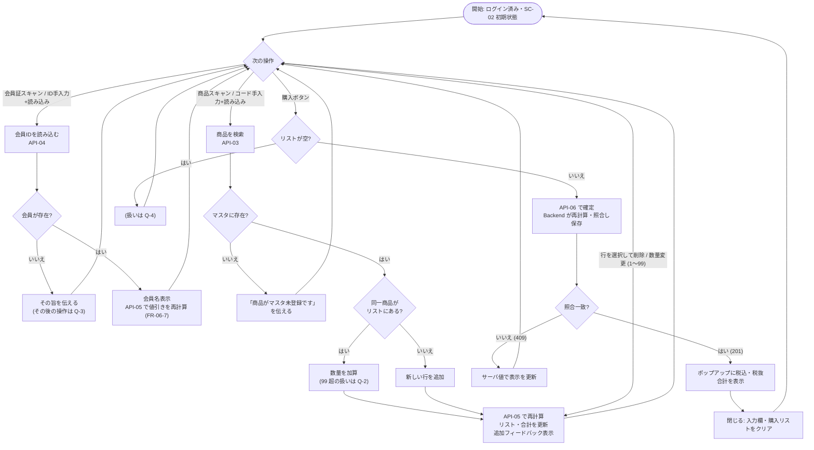
```mermaid
flowchart TD
  S(["開始: ログイン済み・SC-02 初期状態"]) --> P{"次の操作"}
  P -->|"会員証スキャン / ID手入力+読み込み"| C["会員IDを読み込む<br/>API-04"]
  C --> D{"会員が存在?"}
  D -->|"いいえ"| E["その旨を伝える<br/>(その後の操作は Q-3)"] --> P
  D -->|"はい"| F["会員名表示<br/>API-05 で値引きを再計算 (FR-06-7)"] --> P
  P -->|"商品スキャン / コード手入力+読み込み"| G["商品を検索<br/>API-03"]
  G --> H{"マスタに存在?"}
  H -->|"いいえ"| I["「商品がマスタ未登録です」を伝える"] --> P
  H -->|"はい"| J{"同一商品が<br/>リストにある?"}
  J -->|"はい"| K["数量を加算<br/>(99 超の扱いは Q-2)"]
  J -->|"いいえ"| N["新しい行を追加"]
  K --> O["API-05 で再計算<br/>リスト・合計を更新<br/>追加フィードバック表示"]
  N --> O
  O --> P
  P -->|"行を選択して削除 / 数量変更 (1〜99)"| O
  P -->|"購入ボタン"| R{"リストが空?"}
  R -->|"はい"| T["(扱いは Q-4)"] --> P
  R -->|"いいえ"| Y["API-06 で確定<br/>Backend が再計算・照合し保存"]
  Y --> Z{"照合一致?"}
  Z -->|"いいえ (409)"| Z2["サーバ値で表示を更新"] --> P
  Z -->|"はい (201)"| AA["ポップアップに税込・税抜合計を表示"]
  AA --> AB["閉じる: 入力欄・購入リストをクリア"]
  AB --> S
```

### A.4 ER 図（sdr_fig06）

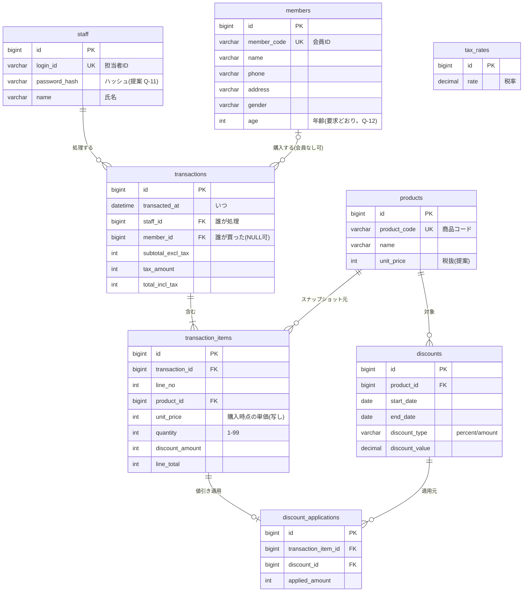
```mermaid
erDiagram
  staff ||--o{ transactions : "処理する"
  members |o--o{ transactions : "購入する(会員なし可)"
  transactions ||--|{ transaction_items : "含む"
  products ||--o{ transaction_items : "スナップショット元"
  products ||--o{ discounts : "対象"
  transaction_items ||--o| discount_applications : "値引き適用"
  discounts ||--o{ discount_applications : "適用元"

  staff {
    bigint id PK
    varchar login_id UK "担当者ID"
    varchar password_hash "ハッシュ(提案 Q-11)"
    varchar name "氏名"
  }
  products {
    bigint id PK
    varchar product_code UK "商品コード"
    varchar name
    int unit_price "税抜(提案)"
  }
  members {
    bigint id PK
    varchar member_code UK "会員ID"
    varchar name
    varchar phone
    varchar address
    varchar gender
    int age "年齢(要求どおり。Q-12)"
  }
  transactions {
    bigint id PK
    datetime transacted_at "いつ"
    bigint staff_id FK "誰が処理"
    bigint member_id FK "誰が買った(NULL可)"
    int subtotal_excl_tax
    int tax_amount
    int total_incl_tax
  }
  transaction_items {
    bigint id PK
    bigint transaction_id FK
    int line_no
    bigint product_id FK
    int unit_price "購入時点の単価(写し)"
    int quantity "1-99"
    int discount_amount
    int line_total
  }
  tax_rates {
    bigint id PK
    decimal rate "税率"
  }
  discounts {
    bigint id PK
    bigint product_id FK
    date start_date
    date end_date
    varchar discount_type "percent/amount"
    decimal discount_value
  }
  discount_applications {
    bigint id PK
    bigint transaction_item_id FK
    bigint discount_id FK
    int applied_amount
  }
```

### A.5 シーケンス図: ログイン（sdr_fig08_1）

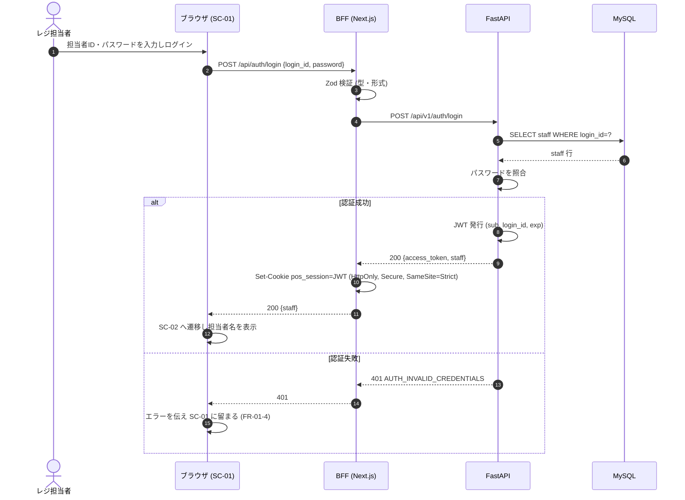
```mermaid
sequenceDiagram
  autonumber
  actor U as レジ担当者
  participant B as ブラウザ (SC-01)
  participant F as BFF (Next.js)
  participant A as FastAPI
  participant DB as MySQL
  U->>B: 担当者ID・パスワードを入力しログイン
  B->>F: POST /api/auth/login {login_id, password}
  F->>F: Zod 検証 (型・形式)
  F->>A: POST /api/v1/auth/login
  A->>DB: SELECT staff WHERE login_id=?
  DB-->>A: staff 行
  A->>A: パスワードを照合
  alt 認証成功
    A->>A: JWT 発行 (sub, login_id, exp)
    A-->>F: 200 {access_token, staff}
    F->>F: Set-Cookie pos_session=JWT (HttpOnly, Secure, SameSite=Strict)
    F-->>B: 200 {staff}
    B->>B: SC-02 へ遷移し担当者名を表示
  else 認証失敗
    A-->>F: 401 AUTH_INVALID_CREDENTIALS
    F-->>B: 401
    B->>B: エラーを伝え SC-01 に留まる (FR-01-4)
  end
```

### A.6 シーケンス図: スキャン追加（sdr_fig08_2）

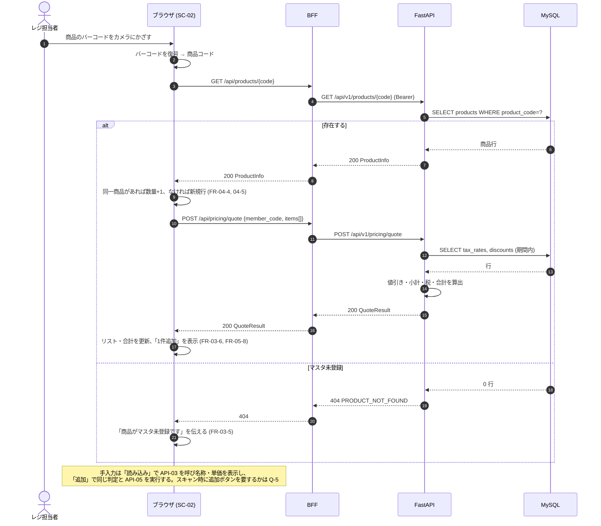
```mermaid
sequenceDiagram
  autonumber
  actor U as レジ担当者
  participant B as ブラウザ (SC-02)
  participant F as BFF
  participant A as FastAPI
  participant DB as MySQL
  U->>B: 商品のバーコードをカメラにかざす
  B->>B: バーコードを復号 → 商品コード
  B->>F: GET /api/products/{code}
  F->>A: GET /api/v1/products/{code} (Bearer)
  A->>DB: SELECT products WHERE product_code=?
  alt 存在する
    DB-->>A: 商品行
    A-->>F: 200 ProductInfo
    F-->>B: 200 ProductInfo
    B->>B: 同一商品があれば数量+1、なければ新規行 (FR-04-4, 04-5)
    B->>F: POST /api/pricing/quote {member_code, items[]}
    F->>A: POST /api/v1/pricing/quote
    A->>DB: SELECT tax_rates, discounts (期間内)
    DB-->>A: 行
    A->>A: 値引き・小計・税・合計を算出
    A-->>F: 200 QuoteResult
    F-->>B: 200 QuoteResult
    B->>B: リスト・合計を更新、「1件追加」を表示 (FR-03-6, FR-05-8)
  else マスタ未登録
    DB-->>A: 0 行
    A-->>F: 404 PRODUCT_NOT_FOUND
    F-->>B: 404
    B->>B: 「商品がマスタ未登録です」を伝える (FR-03-5)
  end
  Note over B: 手入力は「読み込み」で API-03 を呼び名称・単価を表示し、<br/>「追加」で同じ判定と API-05 を実行する。スキャン時に追加ボタンを要するかは Q-5
```

### A.7 シーケンス図: 会員値引き（sdr_fig08_3）

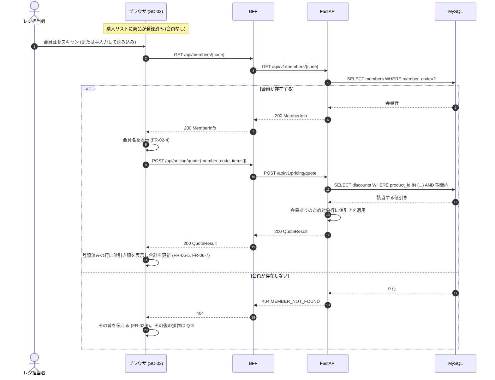
```mermaid
sequenceDiagram
  autonumber
  actor U as レジ担当者
  participant B as ブラウザ (SC-02)
  participant F as BFF
  participant A as FastAPI
  participant DB as MySQL
  Note over B: 購入リストに商品が登録済み (会員なし)
  U->>B: 会員証をスキャン (または手入力して読み込み)
  B->>F: GET /api/members/{code}
  F->>A: GET /api/v1/members/{code}
  A->>DB: SELECT members WHERE member_code=?
  alt 会員が存在する
    DB-->>A: 会員行
    A-->>F: 200 MemberInfo
    F-->>B: 200 MemberInfo
    B->>B: 会員名を表示 (FR-02-4)
    B->>F: POST /api/pricing/quote {member_code, items[]}
    F->>A: POST /api/v1/pricing/quote
    A->>DB: SELECT discounts WHERE product_id IN (...) AND 期間内
    DB-->>A: 該当する値引き
    A->>A: 会員ありのため対象行に値引きを適用
    A-->>F: 200 QuoteResult
    F-->>B: 200 QuoteResult
    B->>B: 登録済みの行に値引き額を表示し合計を更新 (FR-06-5, FR-06-7)
  else 会員が存在しない
    DB-->>A: 0 行
    A-->>F: 404 MEMBER_NOT_FOUND
    F-->>B: 404
    B->>B: その旨を伝える (FR-02-6)。その後の操作は Q-3
  end
```

### A.8 シーケンス図: 購入確定（sdr_fig08_4）

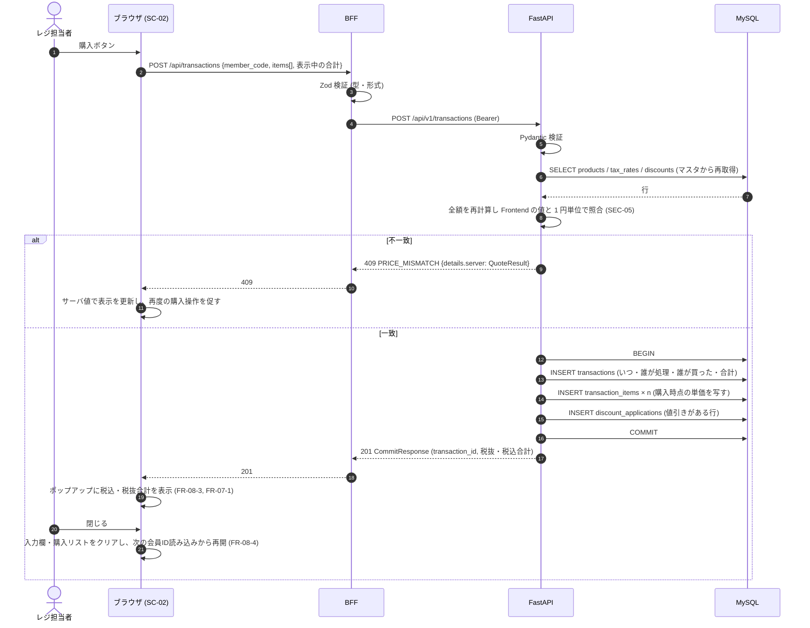
```mermaid
sequenceDiagram
  autonumber
  actor U as レジ担当者
  participant B as ブラウザ (SC-02)
  participant F as BFF
  participant A as FastAPI
  participant DB as MySQL
  U->>B: 購入ボタン
  B->>F: POST /api/transactions {member_code, items[], 表示中の合計}
  F->>F: Zod 検証 (型・形式)
  F->>A: POST /api/v1/transactions (Bearer)
  A->>A: Pydantic 検証
  A->>DB: SELECT products / tax_rates / discounts (マスタから再取得)
  DB-->>A: 行
  A->>A: 全額を再計算し Frontend の値と 1 円単位で照合 (SEC-05)
  alt 不一致
    A-->>F: 409 PRICE_MISMATCH {details.server: QuoteResult}
    F-->>B: 409
    B->>B: サーバ値で表示を更新し、再度の購入操作を促す
  else 一致
    A->>DB: BEGIN
    A->>DB: INSERT transactions (いつ・誰が処理・誰が買った・合計)
    A->>DB: INSERT transaction_items × n (購入時点の単価を写す)
    A->>DB: INSERT discount_applications (値引きがある行)
    A->>DB: COMMIT
    A-->>F: 201 CommitResponse (transaction_id, 税抜・税込合計)
    F-->>B: 201
    B->>B: ポップアップに税込・税抜合計を表示 (FR-08-3, FR-07-1)
    U->>B: 閉じる
    B->>B: 入力欄・購入リストをクリアし、次の会員ID読み込みから再開 (FR-08-4)
  end
```

### A.9 クラス図（sdr_fig09）

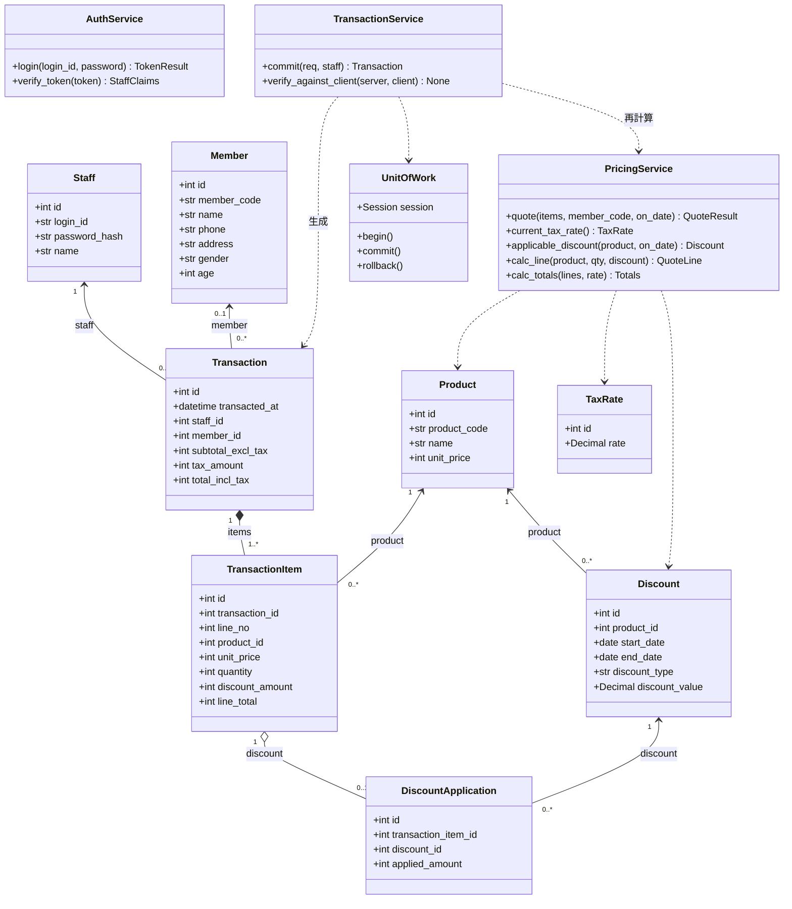
```mermaid
classDiagram
  direction TB
  class Staff {
    +int id
    +str login_id
    +str password_hash
    +str name
  }
  class Product {
    +int id
    +str product_code
    +str name
    +int unit_price
  }
  class Member {
    +int id
    +str member_code
    +str name
    +str phone
    +str address
    +str gender
    +int age
  }
  class Transaction {
    +int id
    +datetime transacted_at
    +int staff_id
    +int member_id
    +int subtotal_excl_tax
    +int tax_amount
    +int total_incl_tax
  }
  class TransactionItem {
    +int id
    +int transaction_id
    +int line_no
    +int product_id
    +int unit_price
    +int quantity
    +int discount_amount
    +int line_total
  }
  class TaxRate {
    +int id
    +Decimal rate
  }
  class Discount {
    +int id
    +int product_id
    +date start_date
    +date end_date
    +str discount_type
    +Decimal discount_value
  }
  class DiscountApplication {
    +int id
    +int transaction_item_id
    +int discount_id
    +int applied_amount
  }
  Transaction "1" *-- "1..*" TransactionItem : items
  TransactionItem "1" o-- "0..1" DiscountApplication : discount
  Staff "1" <-- "0..*" Transaction : staff
  Member "0..1" <-- "0..*" Transaction : member
  Product "1" <-- "0..*" TransactionItem : product
  Product "1" <-- "0..*" Discount : product
  Discount "1" <-- "0..*" DiscountApplication : discount

  class AuthService {
    +login(login_id, password) TokenResult
    +verify_token(token) StaffClaims
  }
  class PricingService {
    +quote(items, member_code, on_date) QuoteResult
    +current_tax_rate() TaxRate
    +applicable_discount(product, on_date) Discount
    +calc_line(product, qty, discount) QuoteLine
    +calc_totals(lines, rate) Totals
  }
  class TransactionService {
    +commit(req, staff) Transaction
    +verify_against_client(server, client) None
  }
  class UnitOfWork {
    +Session session
    +begin()
    +commit()
    +rollback()
  }
  TransactionService ..> PricingService : 再計算
  TransactionService ..> UnitOfWork
  PricingService ..> Product
  PricingService ..> TaxRate
  PricingService ..> Discount
  TransactionService ..> Transaction : 生成
```
