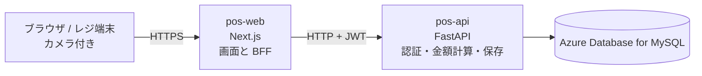
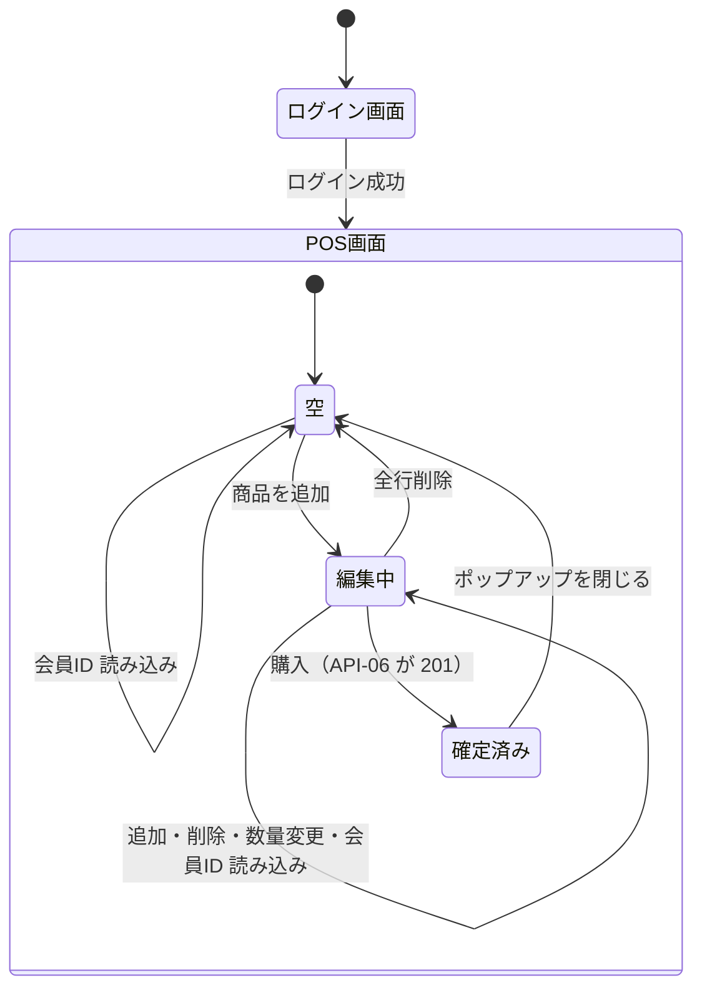
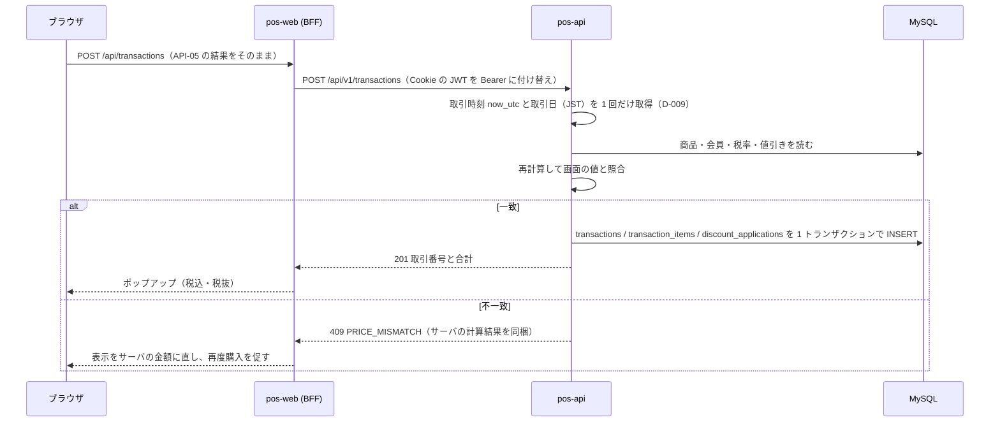
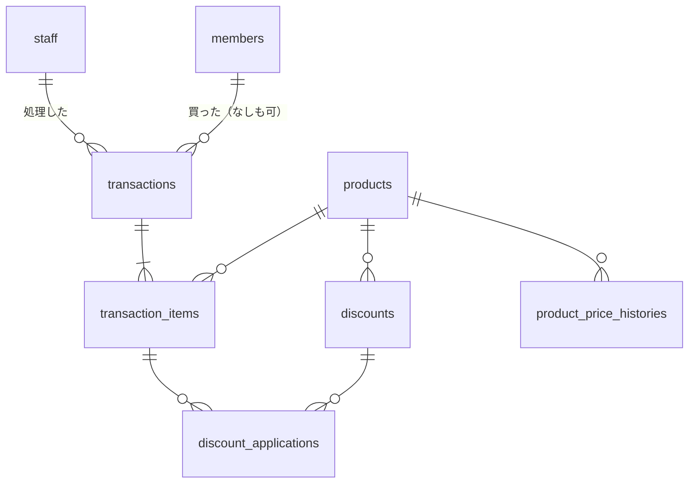

# 設計仕様書 v2: 簡易POSアプリ（Lv1 + Lv2）

ステップ 2 のやり直し版。`要件定義書_v2.md`（要件 70 件）と決定ログ（D-000〜D-010）をもとに作成。

## 読み方

- **根拠**: 設計の各項目に付ける。次の 3 種類だけを使う
  - 要件番号（FR-xx、N-xx、DT-x、P-x）
  - 決定ログ（D-xxx）
  - **課題**: 設計仕様書に入れるよう課題で指定された項目（UML、ER 図、入力の上下限、エラー処理、API 一覧、セキュリティ 8 項目）。要求一覧とは別の出所で、根拠として扱うことを D-010 で決めた
- **★**: 要求にも決定ログにもないが、作るために仮に置いた値や動き。必ず確認事項の番号（K-n）と結びつける（D-000）。設計で新たに見つかった論点は K-30 以降として要件定義書 v2 の 6.2 に追加した
- 図は Mermaid で本文に埋め込む（GitHub でそのまま表示される）

---

## 1. 全体の構成

| 部品 | 役割 | 根拠 |
|---|---|---|
| ブラウザ | 画面を表示し、カメラでバーコードを読む。購入リストの入力（商品コードと数量）を持つ。金額は計算しない | P-1, P-6, D-008 |
| pos-web（Next.js） | 画面を配る。ブラウザとサーバの間に立つ中継役（BFF）。ログイン情報を Cookie で預かり、サーバへ渡すときにヘッダに付け替える。ブラウザは pos-web とだけ通信し、pos-api の場所を知らない | P-2, N-01, 課題（BFF） |
| pos-api（FastAPI） | 認証、商品・会員の検索、金額計算（値引き・税・合計）、取引の保存。**金額の正解はここだけが持つ** | P-3, N-01, D-008 |
| データベース | 商品・会員・担当者・税率・値引き・取引を保存 | P-5, DT-1〜DT-7 |
| 実行環境 | pos-web、pos-api とも Azure App Service（Basic 以上、Always On）。常に起動しているので、久しぶりのアクセスでも遅くならない。pos-api は DB の接続プール（起動時に接続を作り、要求ごとに使い回す）を持ち、接続を維持する。Functions の従量課金は「処理のたびに環境が立ち上がる」ので採らない | P-4, P-7, N-04〜N-07 |

---

## 2. 画面

画面は 2 つ。要件に「ログイン専用の画面」と「POS アプリ画面」とあるため（FR-01-2）。配置は決めない（D-007）。

### SC-01 ログイン画面

| 要素 | 動き | 根拠 |
|---|---|---|
| 担当者ID 入力欄 | | FR-01-1 |
| パスワード入力欄 | | FR-01-1 |
| ログインボタン | API-01 を呼ぶ。成功したら SC-02 へ | FR-01-2 |
| エラー表示 | 失敗したら「担当者IDまたはパスワードが違います」を出し、画面に留まる | FR-01-4 |

### SC-02 POS 画面

| 要素 | 動き | 根拠 |
|---|---|---|
| レジ担当者の情報 | ログイン中の担当者を表示。★ 表示する内容は担当者ID（要求にある情報だけで表示できるため） | FR-01-6（K-4） |
| メッセージ欄 ★ | 「商品がマスタ未登録です」「会員が見つかりません」「1 件追加しました」などを出す場所 | FR-03-5, FR-03-6, FR-02-6（K-27） |
| お客様ID 入力欄 | 会員ID を手入力 | FR-02-2 |
| お客様ID 読み込みボタン | 入力があれば API-04 で会員を確認。空のまま押せば会員なしで進む。押すのは任意 | FR-02-7, D-005 |
| 会員ID の表示 | 読み込んだ会員ID を表示。氏名は表示しない（要求にないため） | FR-02-4（K-5） |
| カメラ映像 | バーコードを連続して読み取る。読み取り先は「商品」か「会員証」 | FR-03-1, FR-03-2, FR-02-1 |
| 読み取り先の切り替え ★ | 「商品」「会員証」のボタンで、カメラが読んだ値をどちらとして扱うかを切り替える。読み取り後は「商品」に戻る | FR-02-1, FR-03-1（K-24） |
| 商品コード入力欄 | 商品コードを手入力 | FR-03-3 |
| 読み込みボタン | API-03 で商品を検索し、名称・単価を表示 | FR-03-7, FR-03-4 |
| 名称表示・単価表示 | 読み込んだ商品の名称と単価 | FR-03-4 |
| 追加ボタン | 読み込んだ商品を購入リストへ追加し、コード入力・名称・単価をクリア | FR-04-1, FR-04-2, D-006 |
| 「1 件追加」の表示 ★ | スキャンで追加されたら、メッセージ欄に「1 件追加しました」 | FR-03-6（K-27, K-36） |
| 購入リスト | 名称・数量・単価・値引き額・小計を行ごとに表示。行をタップで選択。選択行は背景色で強調（FR-05-2 の実現方法） | FR-04-7, FR-06-5, FR-05-1, FR-05-2 |
| 選択中の商品 | 名称・単価・数量を表示。数量の変更（★ 直接入力と ＋／− ボタンの両方）と削除 | FR-05-3, FR-05-4, FR-05-5（K-7） |
| 合計 ★ | 税抜合計と税込合計を表示。値は API-05 の結果をそのまま出す | FR-05-8, FR-07-1（K-25） |
| 購入ボタン | API-06 を呼ぶ。★ 購入リストが空のときは押せない | FR-08-1（K-9） |
| 購入完了のポップアップ | 税込合計と税抜合計を表示。「閉じる」で画面を初期状態に戻す。★ 会員ID の表示もクリアする | FR-08-3, FR-07-1, FR-08-4（K-26） |

### 画面の流れ

---

## 3. 操作の流れ

### 商品の登録（スキャン）

1. カメラがバーコードを読む。読み取り先が「商品」なら商品コードとして扱う（FR-03-1）
2. pos-web が API-03 で商品を検索。なければ「商品がマスタ未登録です」を出して終わり（FR-03-5）
3. 同じ商品が購入リストにあれば数量 +1、なければ新しい行（FR-04-4, FR-04-5, D-003）。数量が 99 のときは増やさず「数量は 1〜99 で指定してください」（FR-05-7。★ K-8）
4. 「1 件追加しました」を表示（FR-03-6）
5. 購入リストの内容（商品コードと数量）と会員ID を API-05 に送り、返ってきた金額を表示（D-008）
6. 続けて次のバーコードを読む（FR-03-2）。★ 同じコードを 1.5 秒以内に続けて読んだときは、カメラが毎フレーム同じコードを読むため、ブラウザ側で無視する（K-34）

### 商品の登録（手入力）

1. 商品コードを入力し、読み込みボタンを押す。API-03 で検索し、名称・単価を表示（FR-03-7, FR-03-4）
2. 追加ボタンを押す。購入リストへ入れる考え方はスキャンと同じ（新しい行か数量加算か）（FR-04-1, FR-04-6, D-006）
3. コード入力・名称・単価をクリアし、次の商品を登録できる状態に戻る。何度でも繰り返せる（FR-04-2, FR-04-3）。以降はスキャンの手順 5 と同じ

### 購入リストの操作

1. 行をタップして選択。選択行を強調し、名称・単価・数量を表示（FR-05-1〜FR-05-3）
2. 数量を変える。1〜99 の中なら反映し、API-05 を呼び直して小計と合計を更新（FR-05-5, FR-05-8）
3. 1 のときに − を押す、または 0 を入力しても数量は変えない。0 にしたいときは削除を使う（FR-05-6）。99 のときに + を押す、または 100 以上を入力しても変えない（FR-05-7。★ K-8）
4. 削除を押すと行が消え、選択は解除。API-05 を呼び直す（FR-05-4）。行がなくなれば「空」に戻る

### 会員ID の読み込み

- いつでもできる（FR-02-3, D-001）。スキャン（読み取り先を「会員証」にする）か手入力
- API-04 で会員を確認。いれば会員ID を表示し、購入リストの金額を API-05 で計算し直す。先に登録した商品にも値引きが付く（FR-06-7, D-002）
- いなければ「会員が見つかりません」を出し、会員は未設定のまま（FR-02-6。★ その後は再入力か会員なしで続ける。K-6）
- 入力欄が空のまま読み込みボタンを押せば、会員なしで進む（FR-02-7, D-005）

### 購入の確定

1. 購入ボタンを押す。API-05 の最新の結果（明細ごとの金額と合計、税率）から API-06 の入力を組み立てて送る。値は書き換えない
2. pos-api は取引時刻と取引日を 1 回だけ取得し（D-009）、マスタから金額を計算し直して、画面の値と 1 円単位で照合する（課題: 照合）
3. 一致すれば 1 つのトランザクションで保存し 201（FR-08-1, FR-08-2, N-02）。違えば 409 を返して保存せず、画面はサーバの金額に表示を直す
4. ポップアップに税込合計と税抜合計を表示（FR-08-3, FR-07-1）。閉じると初期状態に戻る（FR-08-4）

---

## 4. データベース

| テーブル | 列 | 根拠 |
|---|---|---|
| staff（担当者） | id、login_id（担当者ID、一意。★ 32 文字以内。K-17）、password_hash（★ bcrypt でハッシュ化。K-17） | FR-01-1, FR-01-3, DT-3 |
| products（商品） | id、product_code（商品コード、一意。★ 13 桁の数字。K-21）、name、unit_price（★ 税抜の円。K-11。★ 0〜9,999,999 円。K-33） | FR-03-4, DT-2 |
| product_price_histories ★（単価の変更履歴） | id、product_id、old_unit_price、new_unit_price、changed_at。単価を変える SQL と同じトランザクションで 1 行足す（DB-5）。changed_at は DB が UTC で記録（DB-2） | N-03, DT-7（K-19） |
| members（会員） | id、member_code（会員ID、一意。★ 32 文字以内の英数字。K-21）、name、phone、address、gender、age（★ 年齢のまま。K-18） | DT-1 |
| tax_rates（消費税率） | id、rate（%）。★ 行は 1 つだけで、変更は UPDATE で上書きする。取引ごとの税率は transactions.tax_rate に写すので履歴は残る | FR-07-2, DT-5（K-16, K-20） |
| discounts（値引き） | id、product_id、start_date、end_date（★ どちらも日本時間の暦日。期間は開始日と終了日を含む。K-35）、discount_type（percent / amount）、discount_value | FR-06-1〜FR-06-4, FR-06-6, DT-6 |
| transactions（取引） | id、transacted_at（いつ。UTC）、staff_id（誰が処理）、member_id（誰が買った。会員なしは NULL）、tax_rate（★ 取引時点の税率の写し。K-20）、subtotal_excl_tax、tax_amount、total_incl_tax | FR-08-2, FR-01-5, FR-02-5, FR-07-1, DT-4 |
| transaction_items（明細） | id、transaction_id、line_no、product_id（何を）、unit_price（購入時点の単価の写し）、quantity（いくつ。1〜99）、discount_amount、line_total | FR-08-2, FR-08-5, FR-05-6, FR-05-7, FR-06-5 |
| discount_applications ★（値引きの適用記録） | id、transaction_item_id、discount_id、applied_amount。どの明細にどの値引きがいくら付いたかを残す | N-03, DT-7（K-19） |

全テーブルに created_at（行を入れた時刻。UTC）を持つ（DB-2）。

**決めごと**

| # | 内容 | 根拠 |
|---|---|---|
| DB-1 | 金額は円の整数。★ 率は小数 2 桁 | FR-07, FR-06-2（K-12, K-13） |
| DB-2 | 日時は UTC で保存する。接続時にセッションの時間帯を `+00:00` に固定する。表示するときに日本時間へ直す。記録用の時刻（created_at、changed_at）は DB の既定値で UTC を入れる | D-009 |
| DB-3 | 明細に購入時点の単価を、取引に取引時点の税率を写す。後で products.unit_price や tax_rates.rate を変えても過去の取引は変わらない。過去の取引はこの写しで見せる | FR-08-5（K-20） |
| DB-4 | 値引きの期間判定は、サーバが作った取引日（日本時間の暦日）をパラメータとして渡して比較する。SQL の `CURDATE()` は使わない | D-009 |
| DB-5 ★ | 税率・値引き・商品単価・担当者の登録と変更は、管理画面を作らず SQL で直接行う（要求に手段の記載がないため最小の形）。パスワードは専用スクリプトでハッシュ化してから入れる | FR-06-6, FR-07-2（K-16, K-17） |
| DB-6 | 商品・会員・担当者を削除する機能は作らない（要求にない。D-000） | D-000 |

---

## 5. API

ブラウザ → pos-web の `/api/...` → pos-api の `/api/v1/...`。ブラウザは pos-api を直接呼ばない。pos-web が Cookie の JWT を `Authorization: Bearer` に付け替える。

入力の検査は 2 段。**型と形**（数字か、桁数か、重複がないか）は pos-web（Zod）と pos-api（Pydantic）で検査して 400。**業務の範囲**（数量 1〜99 など）は pos-api のサービス層で検査して 422。★ 要求本文は 1 MB まで。超えたら 400（K-38）。

| # | メソッドとパス | 入力 | 出力 | エラー | 根拠 |
|---|---|---|---|---|---|
| API-01 | POST /auth/login | login_id（文字列 1〜32 ★）、password（文字列 1〜64 ★。下限 8 文字は登録時の規則で、ログイン要求では検査しない） | access_token、token_type "Bearer"、expires_in、staff { id, login_id }。pos-web はトークンを Cookie に入れ、ブラウザには staff だけ返す | 401 AUTH_INVALID_CREDENTIALS（ID 不存在とパスワード不一致を区別しない） | FR-01-1, FR-01-4（K-17） |
| API-02 | GET /auth/me | （JWT） | staff { id, login_id } | 401 AUTH_REQUIRED | FR-01-6 |
| API-03 | GET /products/{code} | code: 数字 1〜13 桁 ★ | { id, product_code, name, unit_price } | 400、404 PRODUCT_NOT_FOUND | FR-03-4, FR-03-5（K-21） |
| API-04 | GET /members/{code} | code: 英数字 1〜32 文字 ★ | { id, member_code }（氏名は返さない） | 400、404 MEMBER_NOT_FOUND | FR-02-6（K-5, K-21） |
| API-05 | POST /pricing/quote | member_code（英数字 1〜32 か null）、items[ { product_code（数字 1〜13）, quantity（整数） } ]。★ items は 0〜100 行、product_code の重複は 400（K-32） | tax_rate、lines[ { product_code, product_name, unit_price, quantity, discount { discount_id, type, value, amount } か null, line_total } ]、subtotal_excl_tax、tax_amount、total_incl_tax | 400、404 PRODUCT_NOT_FOUND / MEMBER_NOT_FOUND、422 QUANTITY_OUT_OF_RANGE（数量が 1〜99 の外。K-8）、422 TAX_RATE_NOT_CONFIGURED ★（K-16） | FR-05-8, FR-06, FR-07, D-008 |
| API-06 | POST /transactions | API-05 の応答の値を組み替えて送る: member_code（英数字 1〜32 か null）、items[ { product_code（数字 1〜13）, quantity（整数）, unit_price（整数）, discount_amount（整数）, line_total（整数） } ]（★ 1〜100 行、重複なし。K-32）、tax_rate（小数）、subtotal_excl_tax、tax_amount、total_incl_tax（整数） | 201: transaction_id、transacted_at（UTC の ISO 8601）、subtotal_excl_tax、tax_amount、total_incl_tax | 400、404 PRODUCT_NOT_FOUND / MEMBER_NOT_FOUND、409 PRICE_MISMATCH（details にサーバの計算結果）、422 QUANTITY_OUT_OF_RANGE / TAX_RATE_NOT_CONFIGURED、422 CART_EMPTY ★（0 行。K-9） | FR-08-1〜FR-08-3, D-008, 課題（照合） |
| API-07 ★ | GET /health | なし | { status: "ok", db: "ok" } | 503 | App Service が稼働確認に使う運用用の API。要求にはない（K-31） |

### 金額の計算規則（API-05 と API-06 で同じ。サーバだけが行う。D-008）

1. 行の金額 = 単価 × 数量
2. 会員がいて、その商品に取引日が期間内の値引きがあれば、値引き額を出す（★ 期間は開始日と終了日を含む。K-35）。割合なら 行の金額 × 率 ÷ 100、金額なら ★ 値 × 数量（1 個ごとに引く。K-39）。★ 端数は 1 円未満切り捨て（K-13）。★ 複数あれば値引き額が最大の 1 件（K-14）。★ 値引き額は行の金額を上限とする（K-13）
3. 小計 = 行の金額 − 値引き額
4. 税抜合計 = 小計の合計。消費税額 = 税抜合計 × 税率 ÷ 100。★ 端数は 1 円未満切り捨て、合計に対して 1 回計算（K-12）。税込合計 = 税抜合計 + 消費税額。★ 値引き後の金額に課税する（K-13）

### 日付・時刻の作り方（D-009）

| 項目 | どこで | いつ | どうやって |
|---|---|---|---|
| 取引時刻 transacted_at | pos-api | API-06 の処理の先頭で 1 回だけ | `Clock.now_utc()` で UTC の現在時刻を取る。本番はシステム時計、テストでは固定時刻を注入する |
| 取引日（値引きの期間判定） | pos-api | 上と同じ瞬間 | 取引時刻を `Asia/Tokyo` に変換して日付にする。`date.today()` や SQL の `CURDATE()`、ブラウザの時計は使わない |
| API-05 の判定日 | pos-api | API-05 の処理の先頭で 1 回 | 同じ方法。例: UTC 9 月 9 日 14:59:59 → 9 月 9 日、15:00:00 → 9 月 10 日 |
| 値引きの開始日・終了日 | SQL で投入する人 | 値引きを登録するとき | 日本時間の暦日として入れる（DB-5） |
| 記録用の時刻（created_at、changed_at） | データベース | 行を入れたとき | DB の既定値。セッションの時間帯が `+00:00` なので UTC になる（DB-2） |

---

## 6. 仮に置いた値（★）の一覧

要求に書かれているのは数量の 1〜99 だけ。それ以外はすべて仮の値で、K 番号と結びつける。値は `shared/limits.json` に 1 か所で持ち、pos-web と pos-api の両方が読む。

| 値 | 仮の設定 | どこで検査・使用するか | 確認事項 |
|---|---|---|---|
| 数量の下限・上限 | 1 / 99 | FR-05-6, FR-05-7（要求。仮ではない） | — |
| 数量が範囲外になる操作 ★ | 受け付けず、直前の数量のまま。メッセージを出す | 3 章、API-05 / 06 の 422 | K-8 |
| 空の購入リストで購入 ★ | 購入ボタンを無効。API-06 は 422 CART_EMPTY | 2 章、API-06 | K-9 |
| 商品コード ★ | 数字 1〜13 桁 | API-03 / 05 / 06 の入力検査、products | K-21 |
| 会員ID ★ | 英数字 1〜32 文字 | API-04 / 05 / 06 の入力検査、members | K-21 |
| 担当者ID ★ | 32 文字以内 | API-01、staff | K-17 |
| パスワード ★ | bcrypt でハッシュ化。登録時 8〜64 文字（SQL 投入前のスクリプトで検査） | staff、DB-5 | K-17 |
| 単価 ★ | 税抜。0〜9,999,999 円（SQL 投入時に検査。DB の CHECK 制約でも守る）。小計・合計は 整数の範囲に収まる（単価上限 × 99 個 × 100 行） | products、計算規則 | K-11, K-33 |
| 消費税の端数 ★ | 1 円未満切り捨て。合計に対して 1 回 | 計算規則 4 | K-12 |
| 値引きの端数・順番 ★ | 1 円未満切り捨て。値引き後に課税。値引き額は行の金額が上限。金額値引きは 1 個ごと | 計算規則 2, 4 | K-13, K-39 |
| 値引きが重なったとき ★ | 値引き額が最大の 1 件 | 計算規則 2 | K-14 |
| 値引き期間の境界 ★ | 開始日と終了日を含む。日本時間の暦日 | 計算規則 2、discounts | K-35 |
| 購入リストの行数・重複 ★ | 最大 100 行。同じ商品コードが 2 行あれば 400 | API-05 / 06 の入力検査 | K-32 |
| ログイン状態の有効期間 ★ | JWT の有効期限 8 時間。切れたら再ログイン | API-01、pos-web の Cookie | K-30 |
| 同じバーコードの連続読み取り ★ | 1.5 秒以内は無視 | ブラウザ（pos-web の画面側）。3 章 | K-34 |
| 稼働確認 API ★ | GET /health | API-07 | K-31 |
| 業務の時間帯 | Asia/Tokyo | 日付・時刻の作り方 | D-009（決定済み） |
| 要求本文の大きさ ★ | 1 MB まで | pos-web、pos-api の入力検査 | K-38 |

---

## 7. エラーの扱い

エラーはすべて `{ error: { code, message, details } }` の形。画面は code で動きを決め、文言は下表から出す。要求一覧に文言があるのは FR-03-5 だけで、それ以外の文言はすべて ★（K-36）。

| code | HTTP | いつ | 画面の文言 | 根拠 |
|---|---|---|---|---|
| AUTH_INVALID_CREDENTIALS | 401 | ID かパスワードが違う | 担当者IDまたはパスワードが違います ★ | FR-01-4（K-36） |
| AUTH_REQUIRED | 401 | ログインしていない、有効期間が切れた | 再度ログインしてください ★ | FR-01-1（K-30, K-36） |
| VALIDATION_ERROR | 400 | 型・形が不正、重複、本文が大きすぎる | 入力内容に誤りがあります ★ | 課題（エラー処理）、5 章の前文（K-36） |
| PRODUCT_NOT_FOUND | 404 | 商品が未登録 | 商品がマスタ未登録です | FR-03-5 |
| MEMBER_NOT_FOUND | 404 | 会員が未登録 | 会員が見つかりません ★ | FR-02-6（K-6, K-36） |
| QUANTITY_OUT_OF_RANGE | 422 | 数量が 1〜99 の外 | 数量は 1〜99 で指定してください ★ | FR-05-6, FR-05-7（K-8, K-36） |
| CART_EMPTY ★ | 422 | 明細が 0 行 | 商品が登録されていません ★ | FR-08-1（K-9, K-36） |
| TAX_RATE_NOT_CONFIGURED ★ | 422 | 税率の行がない | 消費税率が設定されていません ★ | FR-07-2（K-16, K-36） |
| PRICE_MISMATCH | 409 | 画面の金額とサーバの再計算が違う | 金額が更新されました。内容を確認して再度購入してください ★ | 課題（照合）（K-36） |
| INTERNAL_ERROR / SERVICE_UNAVAILABLE | 500 / 503 | 想定外、DB に接続できない | 処理に失敗しました／サービスに接続できません ★ | N-02（K-36） |

- 保存中にエラーが起きたら、途中まで保存せずすべて取り消す（N-02）
- ★ カメラが使えないときは、手入力に切り替えられるようメッセージ欄に「商品コードを手入力してください」と出す（FR-03-3。K-37, K-36）
- ★ エラーが起きても購入リストの内容は消さない（N-02 の考え方を画面側にも当てはめた。K-37）

---

## 8. セキュリティ（課題の指定項目）

根拠はいずれも「課題」。要件番号は、その対策が守る要件を示す。

| 指定 | 設計 | 守る要件 |
|---|---|---|
| JWT トークン | pos-api が署名付き JWT を発行（★ 有効 8 時間。K-30）。pos-web が HttpOnly / Secure / SameSite=Strict / Path=/ の Cookie に保存。ブラウザの JavaScript から読めない | FR-01 |
| 認証認可 | パスワードは bcrypt でハッシュ化（★ K-17）。失敗理由は区別しない（FR-01-4）。ログイン以外のすべての API で JWT を検証。利用者はレジ担当者だけなので権限の区分は設けない（D-000） | FR-01-3, FR-01-4, FR-01-5 |
| BFF（リバースプロキシ） | ブラウザは pos-web とだけ通信。pos-web が Cookie を Bearer に付け替え、Zod で入力を検査してから pos-api へ中継。pos-api の 5xx は内容を隠して返す | N-01 |
| CORS | pos-api の CORS 設定は pos-web のオリジンだけを許可し、`*` は使わない。メソッドは GET / POST、ヘッダは Authorization と Content-Type だけ。ブラウザが pos-api を直接呼ぼうとしても拒否される（サーバ間の通信を制限するものではない） | N-01 |
| Backend でも計算し Frontend の値と照合 | 計算はサーバだけ（D-008）。確定時に画面の表示値を受け取り、計算し直して 1 円単位で照合。違えば 409 で保存しない。保存する値はサーバの計算結果 | FR-08-1, D-008 |
| Swagger Docs 非表示 | 本番は /docs、/openapi.json を無効にする。開発環境だけ有効 | — |
| SQL インジェクション: 型定義（TypeScript） | Zod で「商品コードは数字だけ」「会員ID は英数字だけ」「数量は整数」を検査。SQL の断片になる文字列を通さない | FR-03-3, FR-02-2 |
| SQL インジェクション: ORM | SQLAlchemy を使い、値は必ずバインド変数で渡す。文字列をつなげて SQL を作らない。Pydantic でも同じ検査をする | — |
| ライブラリの Ver 調査 | 採用する版は実装時に npm / PyPI の最新安定版を確認し、OSV.dev で既知の脆弱性がないことを確かめる。`package-lock.json` と `requirements.txt` で固定する | — |

---

## 9. 要件との対応表

| 要件 | 設計のどこで満たすか |
|---|---|
| P-1〜P-7 | 1 章 |
| FR-01-1〜01-6 | SC-01、API-01、API-02、SC-02 の担当者の情報、transactions.staff_id、8 章 |
| FR-02-1〜02-7 | SC-02 の会員ID 周り、カメラの読み取り先切り替え、API-04、3 章「会員ID の読み込み」、transactions.member_id |
| FR-03-1〜03-7 | カメラ映像、商品コード入力欄、読み込みボタン、名称・単価表示、API-03、3 章「商品の登録」、エラー PRODUCT_NOT_FOUND |
| FR-04-1〜04-7 | 追加ボタン、購入リスト、3 章「商品の登録」 |
| FR-05-1〜05-8 | 購入リストの選択・強調、選択中の商品、合計、3 章「購入リストの操作」、API-05 |
| FR-06-1〜06-7 | discounts、計算規則 2、日付・時刻の作り方、購入リストの値引き額、3 章「会員ID の読み込み」 |
| FR-07-1, 07-2 | tax_rates、計算規則 4、合計、ポップアップ、DB-5 |
| FR-08-1〜08-5 | 購入ボタン、API-06、3 章「購入の確定」、transactions / transaction_items、DB-3、ポップアップ |
| N-01 | 1 章の役割分担、API、BFF |
| N-02, N-03 | API-06 の 1 トランザクション保存、discount_applications、product_price_histories、7 章 |
| N-04〜N-07 | 1 章の実行環境（App Service、Always On、接続プール） |
| DT-1〜DT-7 | 4 章 |
| D-001〜D-009 | 3 章の流れ、API-05/06、計算規則、日付・時刻の作り方 |

確認事項の扱い:

- 設計で仮置き（★）を置いたもの: K-4, K-5, K-6, K-7, K-8, K-9, K-11, K-12, K-13, K-14, K-16, K-17, K-18, K-19, K-20, K-21, K-24, K-25, K-26, K-27、および設計で新たに見つかった K-30〜K-39
- 決定済み: K-1, K-2, K-3, K-10, K-15（D-009）, K-23
- 設計で触れないもの: K-22（応答速度の数値目標とレジの台数。要求に数値がなく、App Service の Always On で N-04 を満たす以上のことは決めない）
